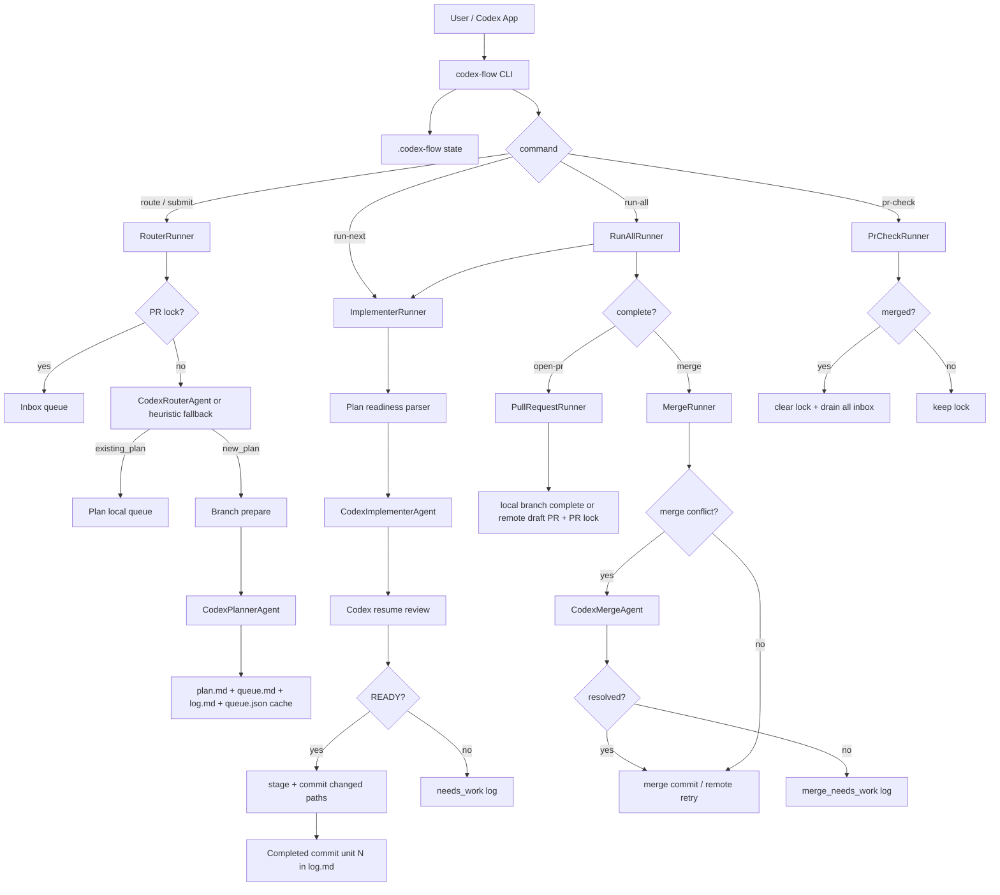

# Codex Flow Crack-CLI Agent Parity Implementation Plan

## Objective

Codex Flow already copied the outer command surface of Crack-CLI: `route`, `run-next`, `run-all`, `dashboard`, PR lock, `pr-check`, `drain`, and merge/PR finalize paths. The next upgrade must copy the deeper advantage: Crack-CLI is not just a queue. It is a role-separated Codex orchestration system.

This plan upgrades Codex Flow from a safe local queue into a Crack-CLI-comparable automatic development factory while keeping the repository Python-first, public-safe, and friendly to Korean Codex skill usage.

Target outcome:

- Router agent decides whether a request belongs in inbox, an existing plan, or a new plan.
- Planner agent writes commit-unit plans from repo context instead of using fixed `DEFAULT_UNITS`.
- Implementer agent runs one commit unit, then reviews the same session before Codex Flow commits.
- Merge agent resolves only active merge conflicts and stops cleanly when it cannot.
- Plan readiness is derived from readable Markdown plan/log records, with `queue.json` kept as a compatibility cache rather than the only source of truth.
- Inbox drain handles all queued requests in order, stopping only if a new PR lock appears.
- Remote PR and merge behavior is closer to Crack-CLI, including PR reuse and out-of-date retry.

## 검토용 결과물

## HTML 생략 보고서

- 판정: 생략 가능
- 생략 사유:
  - 이번 작업은 CLI orchestration, Codex agent harnesses, Markdown state files, GitHub PR/merge logic, tests, and documentation planning이다.
  - 화면, 레이아웃, 폼, 대시보드 UI 시각 디자인을 판단하는 작업이 아니므로 HTML artifact를 만들지 않는다.
- 대체 검토물:
  - 이 계획 MD 자체.
  - 구현 후 `python3 -m pytest`.
  - 구현 후 CLI smoke tests:
    - `python3 scripts/codex_flow.py --help`
    - `python3 scripts/codex_flow.py route --help`
    - `python3 scripts/codex_flow.py run-next --help`
    - `python3 scripts/codex_flow.py run-all --help`
    - `python3 scripts/codex_flow.py merge --help`
  - 구현 후 fake Codex/fake gh 기반 integration tests.
- 사용자가 바로 열어볼 링크:
  - 현재 문서: `docs/2026-05-12-codex-flow-crack-agent-parity-plan.md`

## Current Baseline

### Compared Revisions

| Project | Revision | Source |
| --- | --- | --- |
| Crack-CLI | `3d034bd` | `https://github.com/Royaltyprogram/Crack-CLI` |
| Codex Flow | `8ce8a02` | `https://github.com/everydy/codex-flow` |

### Current Codex Flow Structure

```text
codex_flow/
  agent.py       # one Codex exec wrapper, tolerant decision parsing
  briefs.py      # morning brief, review, PR dry-run helpers
  cli.py         # argparse command surface
  dashboard.py   # detailed dashboard renderer
  git_ops.py     # subprocess-backed git helpers
  plans.py       # ticket -> fixed DEFAULT_UNITS plan/queue.json
  pr.py          # PR dry-run, remote PR, PR lock, drain, merge
  runner.py      # run-next/run-all over queue.json units
  state.py       # .codex-flow path layout and dashboard summary
  tickets.py     # ticket frontmatter and inbox table
```

### Current Crack-CLI Structure To Borrow

```text
src/
  router-agent.ts       # Codex Router agent
  planner-agent.ts      # Codex Planner agent
  implementer-agent.ts  # Codex implementer + same-session review
  merge-agent.ts        # narrow merge conflict resolver
  router.ts             # routing state machine + branch prepare
  implementer.ts        # commit-unit parsing, run-next, commit
  run-all.ts            # repeat run-next, then PR or merge
  pr.ts                 # PR readiness, local/remote branch mode
  pr-check.ts           # PR lock inspection and drain
  inbox.ts              # ordered inbox drain
  merge.ts              # local/remote merge with retry/conflict agent
  dashboard.ts          # Markdown state + git dashboard
  state.ts              # .crack Markdown source of truth
```

## In-Scope System Picture



## Design Decisions To Lock

### 1. Keep Python, Borrow Architecture

Do not port Crack-CLI line-by-line from TypeScript. Implement the same role model in Python modules that match the current Codex Flow package.

Why:

- The public repo is already Python-packaged.
- Existing tests and skill docs use `python3 scripts/codex_flow.py`.
- Korean shortcut skill integration is already tied to Codex Flow commands.

### 2. Markdown Becomes Primary For Plan Progress

Crack-CLI uses readable `plan.md` + `log.md` as the progress source. Codex Flow currently uses `queue.json` status fields as source of truth. The parity upgrade should shift to:

- `plan.md`: canonical commit-unit list.
- `log.md`: canonical completed/needs_work history.
- `queue.md` or `requests.md`: plan-local follow-up request queue.
- `queue.json`: compatibility cache for dashboard, old commands, and tests during transition.

This avoids a hidden state mismatch where a human reads `plan.md` but the CLI follows `queue.json`.

### 3. Strict Agent Decisions

Current `parse_agent_decision` treats missing decision lines as ready. Crack-CLI fails when required final lines are missing. Codex Flow should become strict for agent phases:

- Router must return `ROUTE ...`.
- Planner must return `PLAN_WRITTEN path="..."`.
- Implementer review must return `COMMIT_UNIT_READY ...` or `COMMIT_UNIT_NEEDS_WORK ...`.
- Merge agent must return `MERGE_READY ...` or `MERGE_NEEDS_WORK ...`.

Fallback tolerance can remain only for legacy non-agent dry-run paths, not for production agent execution.

### 4. Local Safety Remains, Remote Operations Stay Explicit

Codex Flow may remain more conservative than Crack-CLI in external effects:

- Remote PR creation requires `--remote` or explicit command path.
- Remote merge requires `--remote --merge` or `merge --remote`.
- Dirty worktree auto-shelving remains available through `--auto-resolve`.

This is a deliberate Codex Flow difference, not a missing feature.

### 5. Branch Creation Moves Earlier

Crack-CLI prepares the branch when a new plan is created. Codex Flow currently records the branch in `queue.json` and prepares it later during execution. To match Crack-CLI, new plan creation should prepare or switch to the branch immediately, unless a new explicit safety flag disables it.

Proposed default:

- `route` creates/switches branch when it creates a new plan.
- `route --plan` does not switch branches.
- `route` to existing active plan does not switch unless the active plan branch is needed for planner refresh.
- Add `--no-branch` only if we need a safe compatibility escape hatch.

## Target File Changes

### New Modules

| File | Purpose |
| --- | --- |
| `codex_flow/codex_cli.py` | Shared Codex CLI execution wrapper, default model args, output-last-message handling, session id parsing, strict final-line helpers. |
| `codex_flow/router_agent.py` | `RouterAgent`, `CodexRouterAgent`, prompt builder, `parse_route_decision`, optional heuristic fallback for tests/offline mode. |
| `codex_flow/planner_agent.py` | `PlannerAgent`, `CodexPlannerAgent`, prompt builder, `parse_plan_written`. |
| `codex_flow/implementer_agent.py` | `ImplementerAgent`, two-step implementation/review flow, `parse_commit_unit_review`, session resume handling. |
| `codex_flow/merge_agent.py` | `MergeAgent`, merge-conflict prompt, `parse_merge_agent_result`. |
| `codex_flow/plan_readiness.py` | Parse `### Commit N:` units, branch/title from `plan.md`, completed units from `log.md`, readiness result. |
| `codex_flow/inbox.py` | Ordered inbox parsing/writing/drain-all logic. |
| `codex_flow/merge.py` | Local/remote merge runner, conflict resolution, PR reuse/out-of-date retry. |

### Existing Modules To Modify

| File | Change |
| --- | --- |
| `codex_flow/agent.py` | Either become a compatibility shim over `implementer_agent.py` or be reduced to generic parsing helpers. |
| `codex_flow/cli.py` | Wire RouterRunner, ImplementerRunner, RunAllRunner, PullRequestRunner, PrCheckRunner, InboxDrainer, MergeRunner. |
| `codex_flow/plans.py` | Replace fixed `DEFAULT_UNITS` planning path with planner-agent-generated plan; keep template fallback for offline tests. |
| `codex_flow/runner.py` | Move from queue-json-first unit execution to plan/log-first commit-unit execution. |
| `codex_flow/pr.py` | Split merge concerns into `merge.py`; keep PR creation/lock helpers; support plan/log readiness. |
| `codex_flow/git_ops.py` | Add reusable branch manager, committer, merge helpers, unmerged path detection, pending merge detection. |
| `codex_flow/state.py` | Add Markdown queue/inbox helpers or delegate to `inbox.py`; support active plan scan from `plan.md`/`log.md`. |
| `codex_flow/dashboard.py` | Read commit progress from `plan.md` + `log.md`, not only `queue.json`. |
| `codex_flow/briefs.py` | Update summaries to respect plan/log source of truth. |
| `README.md` | Document agent parity, execution model, branch/PR safety, and differences from Crack-CLI. |
| `skills/codex-flow/SKILL.md` | Update English skill to use agent-based route/run/merge commands. |
| `skills/코덱스플로우/SKILL.md` | Update Korean commands and operator rules. |

### Tests To Add Or Rewrite

| File | Coverage |
| --- | --- |
| `tests/test_codex_cli.py` | Codex CLI args, final message loading, session id parsing. |
| `tests/test_router_agent.py` | Router prompt, strict route parsing, invalid decision failure. |
| `tests/test_planner_agent.py` | Planner prompt, `PLAN_WRITTEN` parsing, plan path validation. |
| `tests/test_implementer_agent.py` | Two-step implement/review flow with fake Codex, strict decision parsing. |
| `tests/test_plan_readiness.py` | Commit unit parsing, completed unit detection, branch/title parsing. |
| `tests/test_inbox.py` | Drain all requests, stop on lock, preserve remaining requests. |
| `tests/test_merge_agent.py` | Merge prompt and strict parse. |
| `tests/test_merge_runner.py` | Local merge success, conflict resolution, merge_needs_work, remote retry, lock clearing. |
| `tests/test_crack_agent_parity.py` | End-to-end parity behaviors: route -> plan -> run-all -> PR/merge gates. |

Existing tests should be updated rather than deleted when their behavior remains relevant.

## Target Public API

### CLI Commands

Keep the current command names:

```bash
python3 scripts/codex_flow.py route "request"
python3 scripts/codex_flow.py route "request" --plan .codex-flow/plans/<slug>/plan.md
python3 scripts/codex_flow.py dashboard
python3 scripts/codex_flow.py run-next --plan .codex-flow/plans/<slug>/plan.md
python3 scripts/codex_flow.py run-all --plan .codex-flow/plans/<slug>/plan.md
python3 scripts/codex_flow.py run-all --plan .codex-flow/plans/<slug>/plan.md --remote
python3 scripts/codex_flow.py run-all --plan .codex-flow/plans/<slug>/plan.md --merge
python3 scripts/codex_flow.py open-pr --plan .codex-flow/plans/<slug>/plan.md --remote
python3 scripts/codex_flow.py merge --plan .codex-flow/plans/<slug>/plan.md
python3 scripts/codex_flow.py pr-check
python3 scripts/codex_flow.py drain
```

Compatibility decision:

- Keep current `--execute` and `--commit` flags for now.
- Add an internal runner shape that can support Crack-style default execution later.
- Skill docs should call `run-next/run-all` with `--execute --commit` when the user asks for actual automatic development.

Rationale: this avoids surprising external effects for users who installed the alpha public repo after the previous README. Crack parity is achieved by the skill/operator path first.

### Agent Final Lines

Router:

```text
ROUTE existing_plan planPath=".codex-flow/plans/<name>/plan.md" reason="..."
ROUTE new_plan branchName="codex/<name>" planTitle="..." reason="..."
ROUTE pause_for_pr_review reason="..."
```

Planner:

```text
PLAN_WRITTEN path=".codex-flow/plans/<name>/plan.md"
```

Implementer review:

```text
COMMIT_UNIT_READY title="..." summary="..."
COMMIT_UNIT_NEEDS_WORK reason="..."
```

Merge:

```text
MERGE_READY summary="..."
MERGE_NEEDS_WORK reason="..."
```

## Detailed Implementation Units

### Commit Unit 1: Shared Codex CLI Harness

Files:

- Add `codex_flow/codex_cli.py`.
- Modify `codex_flow/agent.py` to use or delegate to the new module.
- Add `tests/test_codex_cli.py`.

Implementation details:

1. Create dataclasses:

```python
@dataclass(frozen=True)
class CodexExecResult:
    status: int
    stdout: str
    stderr: str
    final_message: str
    output_path: Path
```

2. Add constants equivalent to Crack-CLI:

```python
CODEX_CLI_MODEL = "gpt-5.5"
CODEX_CLI_REASONING_EFFORT = "xhigh"
CODEX_CLI_SERVICE_TIER = "fast"
```

3. Add `codex_cli_default_args()` returning:

```text
--model gpt-5.5
--config model_reasoning_effort="xhigh"
--config service_tier="fast"
--config features.fast_mode=true
```

4. Add `run_codex_exec(prompt, repo, command="codex", sandbox="workspace-write", extra_args=None, resume_session_id=None)`:

- Creates temp output path.
- Calls `codex exec --json --cd <repo> --sandbox <sandbox> --output-last-message <path> ... -`.
- If `resume_session_id` is set, call `codex exec resume --json --output-last-message <path> <session-id> -`.
- Returns `CodexExecResult`.
- Raises `SystemExit` or custom `CodexCliError` with stderr/stdout details on non-zero status.

5. Add strict parsing helpers:

- `last_matching_line(text, prefix)`.
- `parse_key_values(text)`.
- `parse_session_id(jsonl)`.

Tests:

- Default args match expected flags.
- Fake `codex` script writes last message and exits 0.
- Non-zero fake `codex` raises with useful message.
- `parse_session_id` finds `session_id`, nested ids, and UUID fallback.

Acceptance:

- Existing `tests/test_agent_git_ops.py` still passes.
- New tests prove no real network/Codex call is needed.

### Commit Unit 2: Markdown Plan Readiness Layer

Files:

- Add `codex_flow/plan_readiness.py`.
- Modify `codex_flow/plans.py`.
- Modify `codex_flow/dashboard.py`.
- Modify `codex_flow/briefs.py`.
- Add `tests/test_plan_readiness.py`.

Implementation details:

1. Add dataclasses:

```python
@dataclass(frozen=True)
class CommitUnit:
    number: int
    title: str
    content: str

@dataclass(frozen=True)
class PlanReadiness:
    ready: bool
    reason: str
    total: int
    completed: set[int]
    next_unit: CommitUnit | None
```

2. Parse commit sections from Markdown:

- Match headings: `^### Commit\s+(\d+):\s*(.+)$`.
- Content continues until next `### Commit`.
- Ignore lower-level headings inside content.

3. Parse completed units from `log.md`:

- Match `Completed commit unit N`.
- Also support Codex Flow legacy log lines like `done unit-001` through a migration helper only when queue cache maps `unit-001 -> Commit 1`.

4. Parse branch/title from plan:

- `Branch: codex/<slug>`.
- `Title: ...`.
- Fallback to directory name if absent.

5. Add `check_plan_ready(plan_content, log_content)`.

6. Add `sync_queue_cache_from_plan(plan_dir)`:

- Reads `plan.md` + `log.md`.
- Writes/updates `queue.json` with derived unit statuses.
- Preserves request queue entries.
- Keeps backwards compatibility with current dashboard and tests.

7. Update dashboard:

- Prefer `plan_readiness` over raw `queue.json`.
- If `queue.json` missing but `plan.md` exists, still render plan.
- Show next commit unit title.

Tests:

- Commit parser handles 1, 2, 10.
- Readiness false when plan has no commit units.
- Completed log selects next commit.
- Dashboard can render a plan without `queue.json`.
- Legacy queue cache still works.

Acceptance:

- `queue.json` no longer being present must not break dashboard or PR readiness.
- Existing `test_crack_parity.py` may need updates to assert Markdown progress.

### Commit Unit 3: Router Agent And Planner Agent

Files:

- Add `codex_flow/router_agent.py`.
- Add `codex_flow/planner_agent.py`.
- Modify `codex_flow/plans.py`.
- Modify `codex_flow/cli.py`.
- Modify `codex_flow/git_ops.py`.
- Add `tests/test_router_agent.py`.
- Add `tests/test_planner_agent.py`.
- Update `tests/test_crack_parity.py`.

Implementation details:

1. Router agent:

```python
class RouterAgent(Protocol):
    def decide(self, input: RouterAgentInput) -> RouterAgentDecision: ...
```

Decision variants:

- `existing_plan(plan_path, reason)`.
- `new_plan(branch_name, plan_title, reason)`.
- `pause_for_pr_review(reason)`.

2. `CodexRouterAgent`:

- Uses `run_codex_exec(..., sandbox="read-only")`.
- Prompt includes:
  - user request
  - PR lock content
  - active plan paths, branch, plan.md, queue/request snippets
  - routing rules
- Requires exact `ROUTE ...` final line.

3. Heuristic fallback:

- For tests and offline use, keep current `choose_active_plan` behavior behind `HeuristicRouterAgent`.
- CLI should allow `--router heuristic` later if needed, but not necessary for first implementation.

4. Planner agent:

```python
class PlannerAgent(Protocol):
    def write_plan(self, input: PlannerAgentInput) -> PlannerAgentResult: ...
```

5. `CodexPlannerAgent`:

- Uses `run_codex_exec(..., sandbox="workspace-write")`.
- Prompt says:
  - edit only `plan.md`
  - do not edit source code
  - split into commit-sized units
  - follow current repo patterns
  - return `PLAN_WRITTEN path="..."`

6. Plan creation:

- Split current `create_plan_from_ticket` into:
  - `create_plan_shell(...)`: creates directory, initial plan, queue, log, request files.
  - `write_agent_plan(...)`: invokes planner.
  - `create_plan_from_ticket(..., planner=...)`: orchestrates branch prep + shell + planner + cache sync.

7. Branch preparation:

- Add `prepare_branch` call during new plan creation.
- Existing `runner.execute_unit` can still prepare branch defensively.

8. CLI route:

- Instead of fixed Python choice only:
  - PR lock: inbox unless `--auto-resolve` policy says stacked plan is acceptable.
  - explicit `--plan`: append request to that plan.
  - active plans: call RouterAgent.
  - new plan: branch prepare + PlannerAgent.

Important policy:

- Do not create a new branch while a PR lock exists unless `--auto-resolve` and the user explicitly wants stacked planning. Crack-CLI queues to inbox. Our previous behavior created a stacked plan under `--auto-resolve`; this should be narrowed because it weakens PR lock semantics.

Tests:

- Router strict parse success/failure.
- Router prompt includes active plans and PR lock.
- Planner strict parse success/failure.
- `route` with fake router `existing_plan` appends request.
- `route` with fake router `new_plan` creates/switches branch and invokes fake planner.
- `route` with PR lock appends to inbox and does not create plan.

Acceptance:

- New plan contains Codex-written commit units in `plan.md`.
- `queue.json` cache matches parsed plan units.

### Commit Unit 4: Implementer Agent Two-Pass Review

Files:

- Add `codex_flow/implementer_agent.py`.
- Modify `codex_flow/runner.py`.
- Modify `codex_flow/agent.py` compatibility layer.
- Add `tests/test_implementer_agent.py`.
- Rewrite relevant `tests/test_runner_brief.py`.

Implementation details:

1. `ImplementerAgent` protocol:

```python
class ImplementerAgent(Protocol):
    def implement(self, input: ImplementerAgentInput) -> ImplementerAgentResult: ...
```

2. `CodexImplementerAgent` flow:

- First call:
  - `codex exec --json --cd repo --sandbox workspace-write --output-last-message ... -`
  - Prompt: implement only selected commit unit, do not commit.
  - Capture session id from JSONL stdout.
- Second call:
  - `codex exec resume --json --output-last-message ... <session-id> -`
  - Prompt: review current unit, make focused fixes if needed, do not commit.
  - Require `COMMIT_UNIT_READY` or `COMMIT_UNIT_NEEDS_WORK`.

3. Runner changes:

- `run_next` selects next unit from `plan.md` + `log.md`, not `queue.json`.
- Before agent:
  - ensure clean working tree or auto-stash through existing `--auto-resolve`.
  - prepare branch from `plan.md`.
  - record `Started commit unit N`.
- After agent:
  - if needs_work: append reason to log, update cache.
  - if ready:
    - compare git status before/after.
    - commit changed paths if `--commit`.
    - append:
      - `Completed commit unit N.`
      - summary
      - commit hash when present
    - update `queue.json` cache.

4. Strictness:

- Missing `COMMIT_UNIT_*` after review is `needs_work` or error, not implicit ready.
- Keep old tolerant `parse_agent_decision` only for compatibility tests, not the new implementer path.

5. Prompt should include:

- Full plan content.
- Selected commit unit content.
- Previous commit summary.
- Git status before unit.
- Allowed paths if present in commit unit.
- Hard stop gates:
  - no remote PR
  - no deploy
  - no reset/revert unrelated changes
  - no secrets/accounts/payments/external posting

Tests:

- Fake codex emits JSONL session id and review ready.
- Runner commits after ready.
- Runner marks needs_work when review says needs_work.
- Missing decision line raises or records needs_work.
- Existing dry-run/prompt-only mode still works.

Acceptance:

- The implementation loop now mirrors Crack-CLI's implement-then-review structure.

### Commit Unit 5: Inbox Drain-All And PR Lock Compatibility

Files:

- Add `codex_flow/inbox.py`.
- Modify `codex_flow/tickets.py`.
- Modify `codex_flow/pr.py`.
- Modify `codex_flow/cli.py`.
- Add `tests/test_inbox.py`.
- Extend `tests/test_crack_parity.py`.

Implementation details:

1. Introduce a canonical Markdown inbox format that can represent multi-line prompts:

````md
# Codex Flow Inbox

## Request

- Received: 2026-05-12T...
- Reason: PR lock active.

```text
<prompt>
```
````

2. Maintain compatibility with the current ticket table:

- Existing table entries are still readable through `tickets.first_inbox_ticket`.
- New drain should prefer structured inbox requests, then ticket inbox fallback.

3. Implement `InboxDrainer`:

- Reads all inbox requests in order.
- If PR lock exists, returns locked and preserves inbox.
- Routes one request at a time through RouterRunner.
- After each successful route, removes that request.
- If a new PR lock appears during drain, stop and preserve remaining requests.

4. PR lock parser:

- Support current Codex Flow bullet format:
  - `- Branch: ...`
  - `- URL: ...`
  - `- Status: ...`
- Support Crack-style plain format:
  - `Branch: ...`
  - `PR: ...`
  - `Status: ...`

5. `pr-check`:

- If merged:
  - clear lock.
  - call drain-all.
  - report number drained and remaining.

Tests:

- Drain two requests with fake router.
- Drain stops when router creates a new PR lock mid-drain.
- PR lock parser handles both formats.
- `pr-check` clears lock and drains all, not only first ticket.

Acceptance:

- This closes one of the biggest functional gaps from Crack-CLI.

### Commit Unit 6: Pull Request Runner Cleanup

Files:

- Refactor `codex_flow/pr.py`.
- Optionally add `codex_flow/pull_request.py` if `pr.py` becomes too mixed.
- Add/extend `tests/test_pr.py`.

Implementation details:

1. Separate responsibilities:

- PR dry-run body.
- Remote draft PR creation.
- PR lock writing/clearing.
- PR status check.

2. Plan readiness:

- Use `plan_readiness.check_plan_ready(plan.md, log.md)`.
- Do not rely on all `queue.json` statuses being `done`.

3. Branch mode:

- `local`: no remote PR; return `local_branch`.
- `remote`: push branch, create draft PR, write PR lock.

4. PR creation:

- Use `gh pr create --draft --head <branch> --title <title> --body <body>`.
- Parse PR URL robustly.
- Do not create a new PR if PR lock exists.

5. PR body:

- Include plan path, branch, commit units, completed count, and generated-by footer.

Tests:

- Incomplete plan returns not_ready.
- Complete plan with local mode returns local_branch and logs.
- Complete plan with remote mode uses fake gh, writes PR lock.
- Existing lock blocks remote PR.

Acceptance:

- PR behavior is comparable to Crack-CLI while preserving explicit remote gate.

### Commit Unit 7: Merge Agent And Merge Runner

Files:

- Add `codex_flow/merge_agent.py`.
- Add `codex_flow/merge.py`.
- Modify `codex_flow/pr.py` to remove or delegate `merge_plan`.
- Modify `codex_flow/cli.py`.
- Add `tests/test_merge_agent.py`.
- Add `tests/test_merge_runner.py`.

Implementation details:

1. `MergeAgent`:

- Prompt:
  - resolve only current git merge conflicts.
  - do not implement features.
  - do not rewrite plan.
  - do not commit/push/open PR.
  - return `MERGE_READY` or `MERGE_NEEDS_WORK`.

2. `MergeRunner.merge_local`:

- Check plan ready via `plan_readiness`.
- Ensure working tree clean before merge, excluding `.codex-flow/` if policy allows.
- Switch to target branch.
- `git merge <source_branch>`.
- If success:
  - append plan log.
  - return merged.
- If conflict:
  - call `MergeAgent`.
  - check unmerged paths.
  - if clear and pending merge commit exists, `git commit --no-edit`.
  - append log.
  - if still conflicted, return `merge_needs_work`.

3. `MergeRunner.merge_remote`:

- Check plan ready.
- Push source branch.
- Reuse existing PR if present:
  - `gh pr list --head <source> --base <target> --state open --json url,title,isDraft --limit 1`.
- If draft, mark ready:
  - `gh pr ready <url>`.
- If none, create ready PR.
- Run `gh pr merge <url> --merge`.
- If merge fails due out-of-date:
  - fetch target.
  - merge `origin/<target>` into source locally.
  - use MergeAgent if conflict.
  - push source branch again.
  - retry `gh pr merge`.
- If lock branch equals merged source branch, clear lock.

4. CLI:

- `merge --plan ...` defaults local.
- `merge --remote` uses remote path.
- `run-all --merge --remote` delegates to `MergeRunner.merge_remote`.

Tests:

- Local merge success.
- Local merge conflict resolved by fake merge agent.
- Local merge conflict needs_work.
- Remote merge creates/reuses PR.
- Remote out-of-date retry path.
- Lock cleared only when source branch matches.

Acceptance:

- This is the second biggest Crack-CLI parity milestone after agent role split.

### Commit Unit 8: Run-All Orchestration

Files:

- Add or refactor `codex_flow/run_all.py`.
- Modify `codex_flow/cli.py`.
- Modify `codex_flow/runner.py`.
- Add/extend `tests/test_run_all.py`.

Implementation details:

1. Create `RunAllRunner`:

```python
class RunAllRunner:
    def run_all(self, plan_path, *, branch_mode="local", merge=False, max_units=None, ...): ...
```

2. Behavior:

- Repeatedly call `run_next`.
- Stop when:
  - no remaining units,
  - a unit returns needs_work,
  - max_units reached,
  - agent/CLI error.
- If complete:
  - no merge: call PR/open branch readiness path.
  - merge: call MergeRunner.

3. Status shape:

- `opened`
- `local_branch`
- `needs_work`
- `pr_locked`
- `pr_not_ready`
- `merged_local`
- `merged_remote`
- `merge_needs_work`
- `max_units_reached`

4. CLI output should be concise and parseable:

```text
committed unit 1: <hash> <message>
committed unit 2: <hash> <message>
local_branch: codex/<slug>; remote PR was not opened
```

Tests:

- Stops on needs_work.
- Completes and opens local branch.
- Completes and opens remote draft PR.
- Completes and merges.
- Max unit limit stops before finalization.

Acceptance:

- Codex Flow's run-all now mirrors Crack-CLI conceptually, while still respecting Codex Flow safety flags.

### Commit Unit 9: Dashboard, Briefs, README, Skills

Files:

- Modify `codex_flow/dashboard.py`.
- Modify `codex_flow/briefs.py`.
- Modify `README.md`.
- Modify `skills/codex-flow/SKILL.md`.
- Modify `skills/코덱스플로우/SKILL.md`.
- Add/extend `tests/test_dashboard.py`.

Implementation details:

1. Dashboard:

- Show:
  - PR lock status.
  - inbox request count.
  - dirty files.
  - active plans.
  - commit unit progress from plan/log.
  - next unit.
  - suggested command.
  - recent log.

2. Briefs:

- Morning brief uses plan/log progress.
- Review artifact lists uncompleted commit units and needs_work reasons.

3. README:

- Add "Agent Architecture" section.
- Add "Crack-CLI Similarities" and "Deliberate Differences".
- Update quick start to show skill-driven safe execution.
- Document remote gates.

4. Korean skill:

- Make `$코덱스플로우 라우트`, `다음실행`, `모두실행`, `PR체크`, `대시보드`, `병합` align with the new flow.
- Emphasize that Codex App users can say the natural command and let the assistant run CLI.

Tests:

- Dashboard renders without `queue.json`.
- Dashboard shows next commit from plan/log.
- Skill docs mention agent mode and remote gates.

Acceptance:

- User-facing docs match implemented behavior.

### Commit Unit 10: Migration And Final Verification

Files:

- Add `docs/2026-05-12-crack-cli-parity-completion-report.md` after implementation.
- Optional: add `codex_flow/migration.py` only if needed.
- Update tests as needed.

Implementation details:

1. Migration:

- Existing `.codex-flow/plans/*/queue.json` plans should keep working.
- If `plan.md` lacks Crack-style commit headings, either:
  - synthesize commit units from queue.json, or
  - return a clear migration-needed message.

Recommended approach:

- For public alpha, synthesize headings into a derived cache only when running dashboard.
- Do not rewrite user plan files unless a command explicitly asks for migration.

2. Verification commands:

```bash
python3 -m pytest
python3 scripts/codex_flow.py --help
python3 scripts/codex_flow.py route --help
python3 scripts/codex_flow.py run-next --help
python3 scripts/codex_flow.py run-all --help
python3 scripts/codex_flow.py merge --help
python3 scripts/codex_flow.py dashboard --help
git diff --check
rg -n "<private-pattern-set>" . -g '!**/.git/**' -g '!**/.codex/**' -g '!**/__pycache__/**' -g '!**/.pytest_cache/**'
```

3. Public safety:

- Do not commit `.codex/`.
- Do not commit `.codex-flow/` runtime state.
- Do not include private local paths in README/examples.

Acceptance:

- Full test suite passes.
- CLI help smoke passes.
- Privacy scan has no matches.
- README reflects actual behavior.

## Implementation Order

Recommended order:

1. `codex_cli.py`
2. `plan_readiness.py`
3. `router_agent.py` + `planner_agent.py`
4. Plan creation refactor
5. `implementer_agent.py`
6. Runner refactor
7. `inbox.py`
8. PR runner cleanup
9. `merge_agent.py` + `merge.py`
10. `run_all.py`
11. Dashboard/brief/doc/skill updates
12. Full verification

Why this order:

- Agent execution wrapper must exist before Router/Planner/Implementer/Merge.
- Plan readiness must exist before runner, PR, merge, and dashboard can share the same source of truth.
- Merge runner depends on plan readiness, PR helper cleanup, and merge agent.
- Docs should be last so they describe the final behavior.

## Compatibility Strategy

### Existing Commands

Do not remove:

- `init`
- `submit`
- `route`
- `status`
- `dashboard`
- `plan`
- `run-next`
- `run-all`
- `mark`
- `morning-brief`
- `review`
- `open-pr`
- `pr-check`
- `drain`
- `set-pr-lock`
- `clear-pr-lock`
- `merge`

### Existing Flags

Keep these initially:

- `--repo`
- `--auto-resolve`
- `--execute`
- `--commit`
- `--max-units`
- `--remote`
- `--merge`
- `--target`
- `--dry-run`

Potential future deprecation:

- `mark` may become less important once `log.md` is canonical.
- `queue.json` direct status editing should be discouraged after migration.

### Existing State

Current state layout:

```text
.codex-flow/
  tickets/
  plans/
  briefs/
  locks/
  logs/
  inbox.md
  dashboard.md
  config.md
```

Keep this layout. Do not rename `.codex-flow` to `.crack`. The goal is to borrow Crack's architecture, not its branding.

## Risk Register

| Risk | Impact | Mitigation |
| --- | --- | --- |
| Agent prompts edit too many files | Dirty/uncontrolled diffs | Use selected-unit prompt, allowed paths, branch prep, git status diff, strict review phase. |
| Markdown/log and queue.json diverge | Wrong next unit or wrong dashboard | Make plan/log primary and queue.json cache; add sync tests. |
| Branch switching surprises user | Worktree confusion | Check dirty tree before branch prep; auto-stash only with `--auto-resolve`; log branch changes. |
| Router creates too many branches | Merge overhead | CodexRouterAgent sees active plans; heuristic fallback uses term overlap only when agent disabled. |
| Missing decision line treated as success | Bad commits | Strict parser for all agent phases. |
| Merge agent over-edits | Feature drift | Merge prompt explicitly forbids feature work; verify unmerged paths only. |
| Remote merge accidentally visible | External side effect | Keep `--remote` explicit; local default remains local branch/PR dry-run. |
| Tests become slow if real Codex is called | CI unusable | All tests use fake codex/fake gh by default; any real Codex e2e stays opt-in. |
| Public repo leaks local context | Privacy issue | Run privacy scan before commit/push. |

## Open Questions And Decisions

### Decision: Should Codex Flow default to executing `run-next` without `--execute`?

Decision for this implementation: no.

Reason:

- Current public README documents explicit `--execute --commit`.
- Codex App skill can call the explicit command when the user says "실행".
- Keeping the flag preserves safety for early public users.

Future option:

- Add `codex-flow run-next --agent-default` or change defaults in a `0.2.0` breaking release.

### Decision: Should `.codex-flow` state be Markdown-only?

Decision for this implementation: no.

Reason:

- Existing code and tests use `queue.json`.
- Machine-readable cache is useful for Python dashboard and scripts.
- But plan/log must become canonical for progress.

### Decision: Should Codex Flow use the exact Crack-CLI model defaults?

Decision for this implementation: yes, as defaults with override.

Defaults:

- `gpt-5.5`
- `model_reasoning_effort="xhigh"`
- `service_tier="fast"`
- `features.fast_mode=true`

Override:

- Existing `--codex-arg` should still append or override where possible.

## Verification Plan

### Unit Tests

Run:

```bash
python3 -m pytest
```

Expected coverage:

- Codex CLI wrapper.
- Router parser/prompt.
- Planner parser/prompt.
- Implementer two-step flow.
- Plan readiness parser.
- Inbox drain-all.
- PR lock parser.
- PR open/local/remote modes.
- Merge local/remote paths.
- Dashboard plan/log progress.

### CLI Smoke

Run:

```bash
python3 scripts/codex_flow.py --help
python3 scripts/codex_flow.py init --help
python3 scripts/codex_flow.py route --help
python3 scripts/codex_flow.py dashboard --help
python3 scripts/codex_flow.py run-next --help
python3 scripts/codex_flow.py run-all --help
python3 scripts/codex_flow.py open-pr --help
python3 scripts/codex_flow.py merge --help
python3 scripts/codex_flow.py pr-check --help
python3 scripts/codex_flow.py drain --help
```

### Fake End-To-End Scenario

Use a temp git repo and fake Codex executable:

1. `init`.
2. `route "Add demo feature"` with fake planner writing two commit units.
3. `dashboard` shows two units, next commit 1.
4. `run-next --execute --commit` with fake implementer modifying a file and review ready.
5. `run-all --execute --commit` completes remaining unit.
6. `open-pr --dry-run` writes PR dry run.
7. `merge --plan ... --target main` local merge in temp repo.

Expected:

- No real network.
- No real Codex call.
- Git commits created only in temp repo.
- Plan log records completed units.

### Fake GitHub Scenario

Use fake `gh` executable:

1. Remote PR creation outputs a PR URL.
2. PR lock is written.
3. `pr-check` sees merged JSON.
4. Lock clears.
5. Inbox drains all queued requests.

Expected:

- Lock lifecycle matches Crack-CLI.
- Drain result reports exact count.

### Privacy Scan

Run before public commit/push:

```bash
rg -n "<private-pattern-set>" . -g '!**/.git/**' -g '!**/.codex/**' -g '!**/__pycache__/**' -g '!**/.pytest_cache/**'
```

Expected:

- No matches.

## Done Definition

This upgrade is done when:

- Router/Planner/Implementer/Merge are separate Python agent modules.
- `route` can create real Codex-written plans or route to existing plans through RouterAgent.
- `run-next` implements one Markdown commit unit and reviews before commit.
- `run-all` repeats `run-next` and finalizes to local branch, remote draft PR, or merge path.
- `merge` can resolve conflicts through MergeAgent or stop with `merge_needs_work`.
- `pr-check` clears merged PR lock and drains all inbox requests.
- Dashboard reads plan/log progress accurately.
- README and skills describe the new architecture.
- Full tests pass.
- CLI smoke passes.
- Privacy scan passes.

## Next Execution Prompt

Use this exact prompt to begin implementation:

```text
Implement <repo-root>/docs/2026-05-12-codex-flow-crack-agent-parity-plan.md from Commit Unit 1 through Commit Unit 10.

Rules:
- Use the checked-out `codex-flow` repository as the working repo.
- Keep Python-first architecture.
- Do not port Crack-CLI line-by-line.
- Preserve current public commands unless the plan explicitly changes behavior.
- Keep remote PR and remote merge externally visible actions explicit.
- Use fake codex and fake gh in tests; do not call real Codex/GitHub in tests.
- Update README and both skill docs after implementation behavior is real.
- Run python3 -m pytest, CLI help smoke, git diff --check, and privacy scan before final.
- Do not commit .codex/ or .codex-flow/ runtime state.
```
