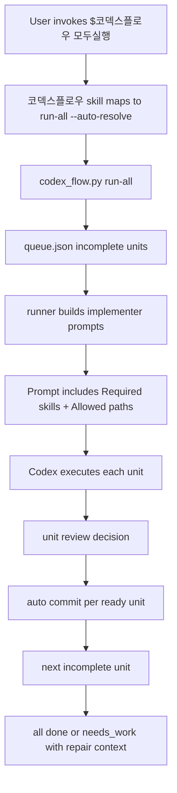

# Run-all default and scope repair plan

## 검토용 결과물

- 계획 MD: `docs/plans/2026-05-14-run-all-default-and-scope-repair-plan.md`
- 상태: verified
- 실제 동작:
  - Codex Flow의 `모두실행` 계약, 현재 생성 산출물, runner/planner 코드의 불일치를 구현 전 수준으로 고정한다.
  - 다음 패치가 수정해야 할 파일, 함수, 테스트, 성공 기준을 명시한다.
- Mock:
  - 없음.

## HTML 생략 보고서

- 판정: 생략 가능
- 생략 사유:
  - 이번 작업은 UI/UX 화면이 아니라 Codex Flow CLI 계획 생성, handoff 문구, allowed path, prompt routing 정책 수정이다.
- 대체 검토물:
  - 이 계획 MD
  - `python -m pytest` 기반 회귀 테스트
  - `run-all --preview` 또는 fixture 기반 CLI 테스트 산출물
- 사용자가 바로 열어볼 링크:
  - `/Users/moonsoo/projects/codex-flow/docs/plans/2026-05-14-run-all-default-and-scope-repair-plan.md`

## 문제 요약

이번 사진 등록 작업에서 사용자의 의도는 `$코덱스플로우 모두실행`이었다. 즉 현재 plan의 남은 commit unit 전체를 `run-all --auto-resolve`로 끝까지 돌리고, 각 unit을 자동 커밋하는 흐름이 기본이어야 했다.

하지만 실제 산출물은 다음처럼 어긋났다.

- `.codex-flow/.../handoff.md`가 `run-next` 재개 명령만 제안한다.
- `.codex-flow/.../log.md`에는 `Prompted commit unit 1`만 남아 있어 `run-all` 흐름이 끝까지 돈 증거가 없다.
- `queue.json`의 `unit-002` allowed paths가 `scripts/**`, `tools/**`, `docs/**`뿐이라 실제 프런트 구현 대상인 `frontend/**`를 수정할 수 없다.
- 리뷰 closeout에서 `run-next 한 번 더 확인`을 다음 task로 제안했는데, 이는 `$코덱스플로우 모두실행` 계약과 다르다.

## 근거

- `/Users/moonsoo/projects/codex-skills-user/코덱스플로우/SKILL.md`
  - `$코덱스플로우 모두실행`은 현재 plan의 incomplete commit unit들을 `run-all --auto-resolve`로 끝까지 실행한다고 정의한다.
- `/Users/moonsoo/projects/codex-flow/codex_flow/plans.py`
  - `write_plan_files()`의 handoff 문구가 항상 `run-next`만 쓴다.
  - `DEFAULT_UNITS[1].allowed_paths`가 앱 구현에 필요한 일반 코드 경로를 포함하지 않는다.
- `/Users/moonsoo/projects/kubs-equipment-calendar/.codex-flow/plans/사진-등록-화면을-대여-반납-공용-절차로-리팩터링하고-반납-사진-등록-모바일-페이지를-실제-앱에-추가/queue.json`
  - `unit-001`만 `prompted`, `unit-002/003`은 `ready`다.
  - `unit-002.allowed_paths`가 `scripts/**`, `tools/**`, `docs/**`로 제한되어 있다.

## In-scope 시스템 그림



## Target Files

- `/Users/moonsoo/projects/codex-flow/codex_flow/plans.py`
  - `DEFAULT_UNITS`
  - `write_plan_files()`
  - `render_plan_md()`
  - any helper added for default run command or allowed path policy
- `/Users/moonsoo/projects/codex-flow/codex_flow/dashboard.py`
  - Suggested command output should continue to prefer `run-all --auto-resolve` for active plans.
- `/Users/moonsoo/projects/codex-flow/codex_flow/runner.py`
  - No behavioral rewrite expected, but tests should prove generated prompts for every run-all unit include Required skills and usable allowed paths.
- `/Users/moonsoo/projects/codex-flow/tests/test_plans.py`
  - Plan creation, queue generation, handoff, default allowed paths.
- `/Users/moonsoo/projects/codex-flow/tests/test_runner_brief.py`
  - `run-all` prompt generation and per-unit skill manifest inclusion.
- `/Users/moonsoo/projects/codex-skills-user/코덱스플로우/SKILL.md`
  - Clarify that `run-next` is a single-unit/manual repair command and must not be recommended as the next step after a user invoked `모두실행`, except when run-all reports a specific failed repair unit.
- `/Users/moonsoo/projects/codex-skills-user/codex-flow/SKILL.md`
  - Same canonical wording if the body skill needs parity with the Korean alias.

## Required Behavior

1. `$코덱스플로우 모두실행` remains mapped to:
   - `/Users/moonsoo/projects/codex-flow/scripts/codex_flow.py --repo <repo> run-all --plan <plan.md> --auto-resolve`
2. Newly created plan handoff must not imply `run-next` is the default continuation.
   - Preferred handoff copy:
     - `Resume all units: run-all --plan <plan.md> --auto-resolve`
     - `Single unit repair/manual step: run-next --plan <plan.md> --auto-resolve`
3. Default implementation unit allowed paths must include realistic app code paths.
   - Minimum default candidates:
     - `frontend/**`
     - `backend/**`
     - `functions/**`
     - `src/**`
     - `app/**`
     - `server/**`
     - `tests/**`
     - `docs/**`
     - `scripts/**`
     - `tools/**`
     - package/config files needed by common JS/Vite projects
4. `run-all` generated prompts must include each unit's Skill Routing Manifest entry.
   - At least `Required skills:` must be visible in every generated implementer prompt.
5. Review closeout guidance must distinguish:
   - all-run confirmation: inspect `run-all` generated prompt/log for all intended units
   - run-next confirmation: only for explicit next-unit or repair flows

## Implementation Order

1. Add failing tests first.
   - `test_create_plan_from_ticket_writes_run_all_handoff`
   - `test_default_implementation_unit_allows_common_app_paths`
   - `test_run_all_preview_or_execution_generates_required_skills_for_multiple_units`
2. Patch `DEFAULT_UNITS[1].allowed_paths`.
3. Patch `write_plan_files()` handoff text to make `run-all` the primary resume path.
4. If dashboard already suggests `run-all`, keep it unchanged and add a regression assertion if not covered.
5. Patch `코덱스플로우/SKILL.md` and body `codex-flow/SKILL.md` wording so assistant closeouts do not suggest `run-next` after `모두실행`.
6. Run tests.
7. Re-run a preview/smoke on a temp fixture or the existing sample plan to confirm prompts include:
   - `Required skills`
   - `plan-first-implementation`
   - app-code allowed paths for implementation units

## Verification Commands

Run from `/Users/moonsoo/projects/codex-flow`:

```bash
python3 -m pytest tests/test_plans.py tests/test_runner_brief.py
python3 -m pytest
```

Targeted smoke, using a temp repo or fixture:

```bash
python3 scripts/codex_flow.py --repo <fixture-repo> route "사진 등록 화면을 대여/반납 공용 절차로 리팩터링하고 반납 사진 등록 모바일 페이지를 실제 앱에 추가" --router heuristic --planner template
python3 scripts/codex_flow.py --repo <fixture-repo> run-all --plan <fixture-repo>/.codex-flow/plans/<slug>/plan.md --preview
```

Assertions:

- `handoff.md` contains `run-all --plan <plan.md> --auto-resolve`.
- `handoff.md` still mentions `run-next` only as single-unit repair/manual fallback.
- `queue.json` implementation unit allowed paths include at least one common app code path such as `frontend/**` or `src/**`.
- Every generated run-all prompt includes a `Required skills:` line.
- Implementation unit prompt includes `plan-first-implementation`.
- Existing tests that assert manifest repair still pass.

## Success Criteria

- A new routed plan no longer leads a user toward `run-next` as the default continuation.
- `$코덱스플로우 모두실행` and generated handoff/dashboard guidance point to `run-all --auto-resolve`.
- Implementation units can actually edit app code in common repo layouts.
- Skill Routing Manifest remains visible in generated prompts.
- The photo-registration style request would produce a plan that can proceed through all units without manual conversion from run-next to run-all.

## Commit Unit

Single commit is acceptable:

- `Repair Codex Flow run-all defaults and implementation scope`

Do not include unrelated `kubs-equipment-calendar` app changes in this commit.

## Stop Conditions

- Stop if changing default allowed paths would cause tests to allow destructive repo-wide writes without a bounded pattern.
- Stop if `run-all --preview` mutates queue state unexpectedly; document the mutation and add a separate bug task.
- Stop if skill docs and CLI behavior disagree after patching.

## Verification Result

- `python3 -m pytest tests/test_plans.py::test_create_plan_from_ticket_writes_plan_queue_and_handoff tests/test_plans.py::test_default_implementation_unit_allows_common_app_paths tests/test_runner_brief.py::test_run_all_respects_max_units`: pass
- `python3 -m pytest tests/test_plans.py tests/test_runner_brief.py`: pass, 26 tests
- `python3 -m pytest`: pass, 61 tests
- `git diff --check -- .`: pass
- `git -C /Users/moonsoo/projects/codex-skills-user diff --check -- 코덱스플로우/SKILL.md codex-flow/SKILL.md`: pass
- CLI smoke with a temp repo:
  - `run-all --preview` generated `unit-001`, `unit-002`, and `unit-003` prompts.
  - `handoff.md` uses `run-all --plan <plan.md> --auto-resolve` as the primary resume command.
  - `unit-002.md` includes `frontend/**` in Allowed Paths.
  - generated prompts include `Required skills`, including `plan-first-implementation` for implementation units.
