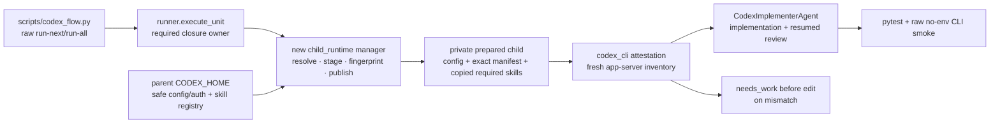

# Codex Flow Managed Child Runtime Plan

## Goal

Codex Flow의 raw `run-next`/`run-all` 실행이 호출자 환경변수 준비 여부와 무관하게 필요한 exact skill closure를 안전하게 준비·검증·재사용하고, 기존 fail-closed attestation과 no-edit 경계를 그대로 유지하도록 canonical runtime 책임을 완성한다.

## Requested Outcome

- `prepared child home is required in CODEX_FLOW_CHILD_HOME` 반복 실패를 임시 env 주입이 아니라 구조적으로 제거한다.
- 명시적 prepared override는 호환성을 유지한다.
- isolation, exact manifest, fresh app-server inventory, plan/runtime/plugin/CLI/TTL/nonce binding을 약화하지 않는다.
- 계획 → 사전 리뷰 → 해결전략검토 → Commit/Phase 순차 구현 → 사후 리뷰·테스트 체인을 따른다.
- Commit 2가 self-preparation wiring을 완료할 때까지만 기존 explicit prepared pair를 bootstrap에 사용하고, Commit 3과 최종 검증은 env pair 없는 raw canonical command로 실제 동작을 증명한다.

## Codebase Evidence

- `Confirmed`: `codex_flow/codex_cli.py:552-567`이 기본 child-home 생성 로직에 도달하기 전에 env pair 부재를 거부한다.
- `Confirmed`: `codex_flow/runner.py:262-320`은 required closure 계산과 attestation을 모든 실제 unit 실행의 공통 pre-edit boundary에서 수행한다.
- `Confirmed`: `child_runtime_environment()`는 private repo-namespaced home, sanitized config, auth symlink, target trust를 이미 소유한다.
- `Confirmed`: manifest loader와 app-server inventory는 exact closure와 path ownership을 검증하며, nonce replay/TTL/plan hash no-edit gate가 테스트로 고정돼 있다.
- `Confirmed`: Chronica prepared-child precedent는 private staging → manifest → fresh discovery → atomic publish가 가능함을 보여주지만 caller-owned fixed plugin closure라 canonical raw CLI 해결책은 아니다.
- `Inferred`: preparation manager가 runner의 shared boundary에 들어가고 prepared paths가 함수 인자로 끝까지 전달되면 raw CLI, wrapper, programmatic runner가 동시에 해결된다.
- `Unverified`: 현재 Codex CLI가 주입하는 ambient namespaced/external skill 집합이 모든 머신에서 동일한 ownership path를 제공하는지는 fresh inventory exact-set 검증으로만 채택한다.

연구 근거: [research.md](research.md)

## System Visualization



- changed nodes: managed preparation manager, explicit runtime parameter plumbing, runner diagnostic boundary, regression tests/docs.
- preserved nodes: source-plan binding, execution worktree, exact manifest validation, review gate, commit/finalize behavior.
- diagram notes: manager는 attestation을 대체하지 않고 그 precondition을 canonical runtime이 충족하게 한다.

## Related Files

- `codex_flow/child_runtime.py` (new): prepared runtime source resolution, cache key, lock, staging, publish, explicit override validation.
- `codex_flow/codex_cli.py`: reusable inventory records, explicit prepared-home parameters, child exec environment.
- `codex_flow/runner.py`: manager invocation, diagnostics, attestation/agent runtime threading.
- `codex_flow/implementer_agent.py`: implementation/review가 attested home을 그대로 사용하도록 전달.
- `tests/test_child_runtime.py` (new): resolver, cache, invalidation, symlink/path, explicit override, concurrency.
- `tests/test_child_attestation.py`: no-env managed preparation success와 failure-before-edit oracle.
- `tests/test_codex_cli.py`: explicit runtime parameter and environment compatibility.
- `README.md`, `skills/구현커밋/SKILL.md`: 실제 default/override/cache 계약.

## Current Behavior

`child_runtime_environment()`은 env가 없을 때 repo-hash 기본 home과 sanitized config를 만들 수 있지만 manifest/required skill closure를 준비하지 않는다. 반면 attestation generator와 verifier는 이 함수보다 앞에서 explicit env pair를 요구한다. 따라서 문서상 default path는 attested execution에서 사실상 unreachable이고, 사용자는 매 run마다 수동으로 prepared pair를 주입해야 한다.

## Change Map

- likely files to edit: 위 Related Files 전체.
- functions to touch: `generate_child_attestation`, `verify_child_attestation`, `child_runtime_environment`, `run_codex_exec`, `execute_unit`, `CodexImplementerAgent.__init__/implement`.
- new API: `PreparedChildRuntime`, `ensure_prepared_child_runtime`, machine-readable inventory record function.
- state/data dependencies: parent `CODEX_HOME/skills`, safe config fields, auth symlink, `CODEX_CHILD_RUNTIME_ROOT`, required skill ids, Codex CLI version, ambient external ids.
- side effects: repo-external private cache only; runner log event 추가; target repo는 attestation pass 전 무변경.
- remaining narrow unknowns: managed builder는 plugin을 새로 선택/설치하지 않는다. staged child inventory에 실제 활성화된 plugin만 path ownership으로 분류하고, child cache payload는 tree-hash-bound한다.

## Planned Changes

- env pair가 모두 있으면 validation-only explicit override로 유지한다.
- 둘 중 하나만 있으면 precise configuration error로 fail-closed한다.
- 둘 다 없으면 parent skill registry에서 required standalone source만 resolve/copy한다. 그 뒤 provisional child app-server inventory의 실제 path를 standalone/plugin/external ownership으로 분류하고, hash-bound plugin payload와 최소 external exact ids를 고정한다.
- cache key는 repo identity, normalized required/resolved ids, source tree hashes, external ids, sanitized config digest, Codex CLI version, manifest schema를 포함한다.
- unique private staging + process/thread-safe per-key lock + atomic rename으로 publish한다.
- prepared home/manifest는 process-global env를 바꾸지 않고 attestation, verifier, implementation, resumed review까지 명시 전달한다.
- preparation/attestation 실패는 기존과 같이 implementer/branch/dirty handling 전에 `needs_work`, `changed_paths=[]`로 끝난다.

## Review Notes

- risk: provisional inventory와 attestation inventory의 ambient external set이 다르면 managed build가 실패할 수 있다. exact mismatch는 허용하지 않고 diagnostic event로 원인을 노출한다.
- risk: symlink copy가 source scope를 확장할 수 있다. top-level registry symlink만 canonical source로 resolve하고 source 내부 symlink는 거부한다.
- risk: active cache replacement. content-addressed directory의 attested closure payload(`config.toml`, `skills/`, declared plugin payloads, manifest)는 immutable하게 취급하되 Codex 자체의 logs/session/sqlite/cache 생성은 허용한다. 같은 key의 invalid existing closure는 자동 덮어쓰지 않고 deny한다.
- assumption: parent `CODEX_HOME/skills/<id>`는 standalone skill registry의 canonical pointer다.
- unanswered question: external path tree hash까지 바인딩하는 manifest v2는 후속 hardening으로 보류한다.

## Plan Quality Check

- Alternative considered: env pair가 없으면 attestation 안에서 즉석 준비. evidence generation과 mutable provisioning이 결합되고 implementer runtime 전달 문제가 남아 기각.
- Alternative considered: wrapper/CLI preflight. raw/programmatic runner bypass가 남아 기각.
- Why this plan: required closure를 처음 확정하는 shared pre-edit boundary에 독립 manager를 두면 기존 security oracle을 재사용하면서 모든 entrypoint를 동시에 고친다.
- Tradeoff: 새 cache/provision module과 explicit parameter plumbing 비용이 생기지만, process-global env race와 매번 수동 bootstrap을 제거한다.
- What this plan may still miss: plugin payload 자체를 private child에 설치·hash-bound하는 v2 hardening.
- When to stop and revise: required source resolution이 모호하거나, current CLI inventory가 ownership path를 제공하지 않거나, no-edit oracle이 preparation failure에서 깨지거나, same-home concurrent use가 atomic하게 증명되지 않을 때.

## Skill Routing Manifest

| Phase | Required skills | Optional skills | Evidence |
| --- | --- | --- | --- |
| Commit 1: Build deterministic managed child preparation | `plan-first-implementation`, `review-all-in-one` | `qa-gate` | `research.md`, current isolation/manifest helpers, prepared-child precedent, focused builder tests |
| Commit 2: Thread the prepared runtime through attestation and execution | `plan-first-implementation`, `review-all-in-one` | `qa-gate` | runner pre-edit boundary, no-edit oracle, implementer/review child calls |
| Commit 3: Lock the operational contract with diagnostics, docs, and raw CLI proof | `plan-first-implementation`, `review-all-in-one`, `qa-gate` | `테스트` | no-env raw command, full suite, docs/runtime consistency |
| Final Gate | `review-all-in-one`, `qa-gate`, `테스트` | `plain-language-closeout` | scoped diff, focused/full tests, raw no-env CLI smoke, git/package handoff |

## Implementation Plan

### Commit 1: Build deterministic managed child preparation

- target files:
  - `codex_flow/child_runtime.py` (new)
  - `codex_flow/codex_cli.py`
  - `tests/test_child_runtime.py` (new)
- changes:
  - add immutable `PreparedChildRuntime(home, manifest, source, cache_key, reused)` result.
  - expose app-server inventory as id/path records before ownership validation so preparation can classify copied standalone skills, child-cache plugin payloads, and truly external namespaced skills.
  - resolve required standalone skills from parent `CODEX_HOME/skills/<id>`; reject missing, duplicate/ambiguous, repo-local, or internally symlinked sources.
  - generate sanitized config/auth in unique private staging and copy only resolved required standalone trees.
  - run provisional inventory only inside the staged child. Write v1 manifest using existing `path_tree_hash`/`load_child_closure_manifest`: copied skill paths become `skills`, every observed `child_home/plugins/cache/.../<version>` owner becomes a hash-bound `plugins` entry, and only paths outside the child become `external_skill_ids`.
  - reject any enabled record whose path cannot be mapped deterministically to one owner; do not query the broad parent inventory or allowlist unrelated personal standalone skills.
  - after exact staged discovery, remove volatile logs/session/memory/app-cache artifacts and retain only config, auth symlink, required skills, plugin payload/cache metadata needed by Codex, and the manifest before publish.
  - compute content-addressed cache key and publish once under a per-key thread + file lock using atomic rename.
  - validate and reuse exact explicit override pair without mutation; reject half-pairs.
- code snippets:
  - proposed API, `codex_flow/child_runtime.py`:

    ```python
    runtime = ensure_prepared_child_runtime(
        repo=repo,
        required_skills=required_skills,
        command=codex_command,
        extra_args=codex_args,
    )
    # runtime.home and runtime.manifest are immutable inputs downstream.
    ```

- tradeoff:
  - chosen: standalone required skill copy + path-classified hash-bound plugin payloads + minimal observed external exact ids.
  - alternative: install/copy every plugin payload.
  - cost/risk: Codex-owned plugin cache may contain several enabled payloads, so initial preparation is heavier.
  - why acceptable: every child-cache plugin payload becomes tree-hash-bound instead of being silently treated as external; only runtime paths outside the child retain current v1 external-id semantics.
  - revisit when: external paths can be safely tree-hash-bound in a manifest v2 or Codex exposes an official per-run plugin disable/select contract.
- verification:
  - `python3 -m pytest tests/test_child_runtime.py -q`: explicit pair, half-pair, private permission, exact copy, source-change invalidation, reuse, symlink/path rejection, two concurrent callers same winner.
  - `python3 -m pytest tests/test_codex_cli.py -q`: inventory refactor does not break isolated config/exec behavior.
- success criteria:
  - no-env call returns a validated repo-external prepared home and manifest; inventory ownership is complete and non-overlapping.
  - same inputs reuse same content-addressed runtime; changed source/config/external/CLI input yields a different key.
  - partial staging is never returned.
- stop conditions:
  - app-server inventory cannot produce stable id/path records.
  - source registry has ambiguous ownership or internal symlink.
  - concurrency test observes different/nonvalidated winners.

### Commit 2: Thread the prepared runtime through attestation and execution

- target files:
  - `codex_flow/codex_cli.py`
  - `codex_flow/runner.py`
  - `codex_flow/implementer_agent.py`
  - `tests/test_child_attestation.py`
  - related mock fixtures in `tests/test_runner_*.py`, `tests/test_execution_worktree.py`
- changes:
  - call `ensure_prepared_child_runtime()` immediately after `required_review_skills()` and before dirty/branch/agent work.
  - parameterize generate/verify/environment/exec with `prepared_home`/manifest while preserving env fallback for direct API compatibility.
  - pass the same home into both implementation and resumed review calls.
  - extend unique namespaced suffix satisfaction only across exact manifest plugin/external ids; ambiguity remains failure.
  - replace the old “missing env must fail” regression with “managed preparation succeeds without env”; add missing source, tampered manifest, stale source, and child inventory mismatch no-launch/no-edit cases.
  - append structured runner log events for prepare/reuse/deny without auth/token/config payloads.
- code snippets:
  - proposed explicit threading, `runner.py`/`implementer_agent.py`:

    ```python
    attestation = generate_child_attestation(
        repo=repo,
        plan_path=attested_plan,
        child_home=runtime.home,
        manifest_path=runtime.manifest,
    )
    agent = CodexImplementerAgent(..., child_home=runtime.home)
    ```

- tradeoff:
  - chosen: explicit parameters with env compatibility fallback.
  - alternative: temporary `os.environ` context.
  - cost/risk: several signatures and test doubles change.
  - why acceptable: removes cross-thread/process global state race and makes attested/used runtime identity auditable.
  - revisit when: a public caller cannot accept optional parameters; keep default fallback rather than breaking it.
- verification:
  - `python3 -m pytest tests/test_child_attestation.py tests/test_runner_brief.py tests/test_runner_repair_edges.py tests/test_execution_worktree.py -q`: same-home implementation/review, no-env success, failure-before-edit.
  - assert fake implementer launch marker is absent for every preparation/attestation negative case and Git oracle is unchanged.
- success criteria:
  - raw/programmatic runner without env pair reaches fixture implementation after managed attestation.
  - explicit override still works exactly.
  - manifest/source/inventory mismatch cannot launch implementer.
- stop conditions:
  - implementation or resumed review can select a home different from attestation.
  - any negative case mutates HEAD/index/worktree or starts implementer.

### Commit 3: Lock the operational contract with diagnostics, docs, and raw CLI proof

- target files:
  - `README.md`
  - `skills/구현커밋/SKILL.md`
  - `docs/plans/codex-flow-managed-child-runtime/*` review/test artifacts
  - focused integration test only if raw CLI proof needs a reusable fixture
- changes:
  - document managed default cache layout `<repo-hash>/<closure-hash>`, explicit-pair override, half-pair failure, profile/custom-provider exception, invalidation inputs, auth-symlink boundary, diagnostic events.
  - remove wording that implies a repo-hash config-only directory is already a prepared exact closure.
  - run a disposable raw canonical CLI scenario with both env variables unset and capture prepare → attest → fixture execute evidence.
  - run full suite and diff/static checks.
- code snippets:
  - code snippet: not needed; this unit locks documentation and executable evidence for APIs implemented in Commits 1–2.
- tradeoff:
  - chosen: CLI log/test artifact instead of a UI artifact.
  - alternative: manual-only verification.
  - cost/risk: disposable fixture maintenance.
  - why acceptable: recurring failure is operational and must be reproducible without the original chat/env.
  - revisit when: raw CLI fixture depends on machine credentials/network; replace with local fake Codex integration while keeping actual CLI version smoke separate.
- verification:
  - `env -u CODEX_FLOW_CHILD_HOME -u CODEX_FLOW_CHILD_MANIFEST python3 scripts/codex_flow.py run-next ...`: output/log contains managed prepare/reuse and no missing-home error.
  - `python3 -m pytest -q`: full regression suite.
  - `python3 scripts/codex_flow.py --help`: CLI import/surface smoke.
  - `git diff --check`: whitespace/patch integrity.
  - `rg -n "prepared child home is required" README.md skills/구현커밋/SKILL.md`: stale operator instruction absence; code error may remain for half-pair/explicit-only cases.
- success criteria:
  - no-env raw CLI proof is reproducible.
  - docs accurately separate managed default from explicit override.
  - full suite passes and no scoped review finding remains.
- stop conditions:
  - raw command still needs caller env, silently disables isolation, or uses a non-attested child.
  - full suite or no-edit oracle fails.

## Operator 결정 필요 사항

- 상태: 없음
- 결정 1: managed default ownership
  - 맥락: canonical runtime과 wrapper 중 어디가 preparation을 소유하는지가 재발 여부를 결정한다.
  - A: runner shared boundary의 core manager.
  - B: attestation 내부 즉석 준비.
  - C: wrapper-only env injection.
  - 추천안: A. raw CLI/programmatic runner까지 동일하게 해결하고 process-global env race를 피한다.
  - 기본값: A.
  - 보류 시 영향: 매 실행의 수동 env 주입과 같은 실패가 계속된다.

## 검토용 결과물

- HTML: 해당 없음
- 계획 MD: [plan.md](plan.md)
- 연구: [research.md](research.md)
- 테스트 링크:
  - Localhost: 해당 없음 — CLI/backend runtime 작업.
  - Deploy: 해당 없음 — 배포 요청 아님.
- 상태: planned
- 실제 동작: 구현 후 pytest와 raw no-env CLI log로 검증.
- Mock: fake Codex app-server/exec fixture는 외부 모델 호출 없이 closure/launch oracle을 검증하는 test double이다.

## 후행 실행

- 기본 실행: 구현커밋
- 계획 경로 처리: 구현커밋이 직전 대화, 계획 링크, active plan context에서 자동 탐지
- 모호할 때: 후보 목록을 보여주고 Operator에게 선택 요청
- 이번 요청은 사전 리뷰와 해결전략검토에서 blocker가 없으면 본 문서를 승인된 실행 기준으로 간주한다.
- 구현 단계는 Commit 1 → Commit 2 → Commit 3 순차 실행하며 `run-all`을 사용하지 않는다.

## HTML 생략 보고서

- 판정: 생략 가능
- 생략 사유: CLI/backend child-runtime 준비·attestation·execution 계약 수정이며 시각/UI 판단 표면이 없다.
- 대체 검토물: 이 계획 MD, research.md, pytest 결과, raw no-env CLI log, attestation JSON.
- 테스트 링크:
  - Localhost: 해당 없음.
  - Deploy: 해당 없음.
- 사용자가 바로 열어볼 링크: [계획 문서](plan.md)

## 구현 후 검토 리스트

- 회귀 확인:
  - explicit prepared pair, profile/custom-provider fail-closed, no-edit failures, nonce/TTL/hash/path ownership, implementation/review same session/runtime.
- 검증 확인:
  - focused builder/attestation/runner suites, full pytest, raw no-env CLI smoke, diff check.
- 리뷰 관점:
  - cache key omissions, symlink/path escape, lock/atomicity, ambient external over-allowlist, global env race, sensitive diagnostic leakage.
- Operator 재확인:
  - 없음. 실제 raw command evidence와 최종 한글 요약만 확인하면 된다.

## Validation

- manual checks: manifest/home paths are repo-external, mode 0700/0600, auth is symlink only, copied skills equal required standalone set.
- lint/build/test scope: focused pytest after each commit, full pytest final, CLI help, diff check.
- scenario-to-surface checks:
  - no env + resolvable closure → prepare/attest/execute.
  - explicit exact pair → validate/reuse.
  - half pair/missing source/symlink/tamper/inventory mismatch → needs_work before edit.
  - same input twice → reuse; source/config/ambient/CLI change → new cache key.
  - concurrent same input → one validated published runtime.
