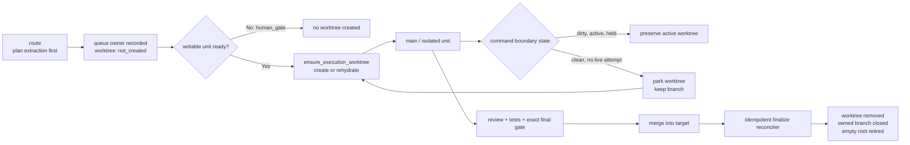

# Codex Flow Worktree Lifecycle Convergence Plan

## Goal

`구현커밋`의 격리 실행 안전성은 유지하면서 Codex Flow가 실행 가능성 판정 전에 worktree를 만들거나, clean한 보류·완료 worktree를 불필요하게 계속 점유하는 문제를 없앤다. 생성은 첫 실제 write 직전까지 지연하고, 보류 시에는 branch를 보존한 채 worktree만 주차하며, 검증·병합 완료 시에는 worktree와 owned branch를 멱등적으로 정리한다.

## Requested Outcome

사용자는 `구현커밋` 스킬과 Codex Flow의 worktree 생성 동작을 조사하고 다음 중 더 안전한 방향으로 바꾸기 위한 계획을 요청했다.

- worktree 생성 기능을 비활성화하거나
- 작업이 끝난 worktree를 자동으로 제거하도록 lifecycle을 보강

이번 요청은 `$요청개선`, `$research`, `$plan-first-implementation` 아티팩트와 계획 수립까지만 포함한다. 런타임 패치, 스킬 계약 수정, 기존 worktree 삭제·prune, branch/commit/push는 범위 밖이다.

## Codebase Evidence

- `Confirmed`:
  - `route`는 항상 `prepare_git_branch=True`로 external worktree를 먼저 만든다 (`codex_flow/cli.py:250-269`).
  - worktree 생성은 extraction과 `human_gate` 판정보다 앞선다 (`codex_flow/plans.py:176-229`, `254-294`).
  - successful merge 후 안전한 자동 cleanup은 이미 존재한다 (`codex_flow/merge.py:194-235`).
  - current cleanup은 dirty worktree와 unmerged branch 삭제를 거부한다 (`codex_flow/git_ops.py:230-267`).
  - main-first unit도 source repo가 아니라 queue의 `execution_repo`를 사용한다 (`codex_flow/main_unit.py:97-103`).
  - held candidate는 명시적 cleanup/rollback 승인 전까지 보존해야 한다 (`구현커밋/references/recovery.md:21-32`).
  - focused baseline은 2026-07-22에 `28 passed in 8.24s`였다.
- `Inferred`:
  - 사용자 환경에서 반복 plan slug와 `cleanup_state=active`가 함께 남은 주원인은 eager route 생성과 merge-only cleanup의 비대칭이다.
  - 전면 in-place 기본값은 누적 폴더를 없애지만 dirty source와 recovery candidate 간섭을 다시 만든다.
- `Unverified`:
  - fault-injection 뒤 cleanup 재개가 새 상태 기계에서 실제로 수렴하는지.
  - remote merge, non-main target, Unicode/space path, stale registration의 전체 회귀 결과.
  - 설치 정본과 runtime repo mirror를 동기화하는 최종 배포 방식.

상세 근거: [research.md](research.md)

## System Visualization



- changed nodes: route ordering, queue lifecycle schema, execution repo ensure/park/rehydrate, finalization reconciler, dashboard cleanup visibility, skill/wrapper contract.
- preserved nodes: exact HEAD evidence, allowed-path guard, held candidate preservation, dirty/unmerged refusal, read-only status/dashboard, local/remote merge authorization.
- diagram notes: `park`는 branch를 삭제하지 않으며 `finalize`만 merged owned branch를 닫는다.

## Related Files

- `codex_flow/cli.py`: route/run/cleanup/reconcile command boundary.
- `codex_flow/plans.py`: queue ownership, lifecycle metadata, active/cleanup-needed projection.
- `codex_flow/git_ops.py`: Git worktree low-level ownership and remove primitives.
- `codex_flow/worktree_lifecycle.py`: proposed lifecycle coordinator; 새 파일 후보.
- `codex_flow/runner.py`: isolated/default unit execution 전 ensure와 command return result.
- `codex_flow/main_unit.py`: main transaction open/complete/hold lifecycle hook.
- `codex_flow/run_all.py`: intermediate stop와 terminal finalization boundary.
- `codex_flow/merge.py`: local/remote merge 뒤 idempotent finalize.
- `codex_flow/dashboard.py`: read-only cleanup-needed/blocked display.
- `tests/test_execution_worktree.py`: lifecycle integration and fault injection 중심 테스트.
- `tests/test_inbox_merge.py`, `tests/test_route_plan_first_source.py`, `tests/test_crack_parity.py`: merge/route/remote compatibility.
- `skills/구현커밋/SKILL.md`: runtime repo mirror contract.
- `/Users/moonsoo/projects/codex-skills-user/구현커밋/SKILL.md`: installed canonical user-facing contract.
- `/Users/moonsoo/projects/codex-skills-user/scripts/codex_flow_entrypoint.py`: runtime compatibility probe.

## Current Behavior

현재 route는 plan이 실제로 실행 가능한지 알기 전에 hidden sibling worktree를 만든다. `human_gate`나 extraction failure가 나도 이미 물리 worktree가 존재할 수 있다. 모든 unit이 끝나도 final review/test evidence와 merge가 같은 실행에서 완결되지 않으면 cleanup은 호출되지 않는다.

cleanup 자체는 안전하지만 단일 transaction이 아니다. worktree remove, branch ref delete, queue save 사이에 실패하면 물리 Git 상태와 `cleanup_state`가 어긋날 수 있다. terminal queue인데 cleanup이 active인 plan은 active-plan 목록에서도 사라질 수 있다.

## Change Map

- likely files to edit:
  - runtime: `codex_flow/cli.py`, `plans.py`, `git_ops.py`, `runner.py`, `main_unit.py`, `run_all.py`, `merge.py`, `dashboard.py`
  - new runtime owner: `codex_flow/worktree_lifecycle.py`
  - tests: `tests/test_execution_worktree.py`, `test_inbox_merge.py`, `test_route_plan_first_source.py`, `test_crack_parity.py`
  - docs/contracts: `README.md`, `skills/구현커밋/SKILL.md`
  - installed contract repo: `/Users/moonsoo/projects/codex-skills-user/구현커밋/**`, `scripts/codex_flow_entrypoint.py`, related tests
- likely functions/APIs:
  - `create_plan_from_source`, `save_queue`, `execution_context_for_plan`
  - `prepare_execution_worktree`, `cleanup_execution_worktree`
  - proposed `ensure_execution_worktree`, `park_execution_worktree`, `reconcile_execution_worktree`
  - `execute_unit`, `begin_main_unit`, `complete_main_unit`, `hold_main_unit`
  - `MergeRunner.finalize_source_branch`, `list_active_plans`, `render_dashboard`
- state dependencies:
  - queue `execution_context`, unit status, attempt ledger status, exact HEAD/final gate, target branch ancestry.
- side effects to preserve:
  - no force cleanup, no unrelated worktree prune, no hidden mutation from status/dashboard.
- remaining narrow unknowns before patch:
  - exact compatibility projection lifetime for legacy `cleanup_state`.
  - whether experimental `in_place` flag ships in the first release or remains documented-only.

## Planned Changes

- Route plan extraction and queue ownership before physical worktree creation.
- Default to `worktree_mode=managed` with lifecycle `not_created`.
- Create or rehydrate the plan-owned worktree only immediately before a writable unit opens.
- Split cleanup into branch-preserving `park` and merged-branch `finalize`.
- Persist lifecycle transitions atomically and reconcile partial cleanup without force.
- Auto-park only at command boundaries when the worktree is clean and no open/committing/held attempt exists.
- Auto-finalize after successful local/remote merge and on terminal resume when final evidence still matches.
- Add explicit ownership-scoped legacy reconciliation; status/dashboard remain read-only.
- Sync runtime mirror and installed `구현커밋` contracts only after runtime tests pass.

Constraints:

- dirty, active, committing, held, ownership-mismatched, unverified, or unmerged state is never auto-deleted.
- plan branch survives park; only verified merge finalization may delete it.
- no global `git worktree prune`; stale registration cleanup must match recorded path, branch, and common Git directory.
- source repository changes and unrelated worktrees remain untouched.

## Review Notes

- Risk: lazy creation changes assumptions in final-gate and prompt rendering paths that currently expect `execution_repo` to exist.
- Risk: automatic park after a public `run-next` must not run while a main transaction remains open.
- Risk: remote merge and local target convergence can succeed while local cleanup fails; this must remain `branch_finalization_blocked`, not false success.
- Risk: installed skill repo is already dirty in unrelated paths; later implementation must isolate or partial-stage only exact owned files.
- Assumption: branch storage is sufficient to preserve clean committed work when the worktree leaf is parked.
- Assumption: time-based daemon GC is unnecessary if every mutating command boundary reconciles its owned plan.

## Plan Quality Check

- Alternative considered: make in-place execution the default. Rejected because it reintroduces source dirty-state and branch-switching interference.
- Alternative considered: keep eager creation and only strengthen merge cleanup. Rejected as incomplete because human gates and interrupted plans still accumulate.
- Why this plan: lazy managed isolation removes unnecessary creation while park/finalize preserves the safety model already encoded in worktree guards and recovery contracts.
- Tradeoff:
  - chosen: typed lifecycle with lazy create, park/rehydrate, idempotent finalize.
  - alternative: one cleanup function after merge only.
  - cost/risk: more state transitions and fault-injection tests.
  - why acceptable: lifecycle complexity already exists implicitly; making it explicit reduces orphaned physical state and makes recovery auditable.
  - revisit when: command-boundary parking causes measurable checkout overhead or main-unit resume ambiguity.
- What this plan may still miss: externally deleted directories with severely corrupted Git metadata, manually renamed worktrees, and concurrent two-process mutation without a plan-level lock.
- When to stop and revise: if attempt ledger cannot reliably distinguish live/held state, or if queue transition atomicity cannot be guaranteed without a broader state-store redesign.

## Skill Routing Manifest

| Phase | Required skills | Optional skills | Evidence |
| --- | --- | --- | --- |
| Commit 1: Route ownership and typed lazy lifecycle | `plan-first-implementation`, `구현커밋` | 없음 | `cli.py`, `plans.py`, `git_ops.py`, route/worktree tests define creation order and compatibility state. |
| Commit 2: Safe park, rehydrate, and candidate preservation | `plan-first-implementation`, `구현커밋` | `review-all-in-one` | `runner.py`, `main_unit.py`, attempt ledger and recovery contract determine when a worktree may be removed without losing evidence. |
| Commit 3: Idempotent finalization, reconciliation, and visibility | `plan-first-implementation`, `구현커밋` | `qa-gate` | local/remote merge, partial cleanup, dashboard and stale-registration tests define convergence. |
| Phase 4: Installed skill and wrapper contract synchronization | `plan-first-implementation`, `구현커밋` | `content-sync-auditor` | runtime mirror and `/Users/moonsoo/projects/codex-skills-user/구현커밋` are separate, currently non-identical contracts. |
| Final Gate | `review-all-in-one`, `qa-gate`, `테스트` | `review-swarm` | focused/full pytest, exact diff, runtime smoke, installed wrapper probe, cross-repo contract comparison. |

## Implementation Plan

### Commit 1: Route ownership and typed lazy lifecycle

- target files:
  - `codex_flow/plans.py`
  - `codex_flow/git_ops.py`
  - `codex_flow/cli.py`
  - `codex_flow/worktree_lifecycle.py` (new)
  - `tests/test_route_plan_first_source.py`
  - `tests/test_execution_worktree.py`
- changes:
  - extract and persist the plan/queue before any physical worktree creation.
  - add `worktree_mode=managed` and a typed lifecycle record; start new plans at `not_created`.
  - keep legacy `cleanup_state` as a derived compatibility projection for one release.
  - make queue writes used by lifecycle transitions atomic with temp-file + `os.replace`.
  - accept an explicit future-facing `--worktree-mode managed|in-place`, but keep `managed` as default; `in-place` must fail closed on dirty source or conflicting active plan.
- code snippets:
  - proposed schema in `plans.py` / `worktree_lifecycle.py`:

```python
queue["worktree_lifecycle"] = {
    "mode": "managed",
    "state": "not_created",
    "path": str(managed_path),
    "branch": branch,
    "target": "main",
    "last_error": None,
}
```

  - proposed route order in `create_plan_from_source()`:

```python
source_snapshot = extract_and_build_queue(source)
persist_owned_plan(source_snapshot, lifecycle="not_created")
return source_snapshot  # Route performs no git worktree add.
```

- tradeoff:
  - chosen: lazy managed default with guarded opt-in in-place mode.
  - alternative: remove worktree support.
  - cost/risk: existing tests expecting route-time path existence must change.
  - why acceptable: plan ownership becomes durable before the first Git side effect.
  - revisit when: an existing public wrapper depends on immediate physical worktree availability after route.
- verification:
  - `python -m pytest tests/test_route_plan_first_source.py tests/test_execution_worktree.py -q`: route creates queue but no worktree; first writable ensure creates exactly one owner-matched worktree.
  - fault injection after queue ownership save and before/after `git worktree add`: no ownerless worktree remains and retry converges.
  - dirty source + `in-place`: fail closed without branch switch or queue corruption.
- success criteria:
  - `human_gate` plans create zero worktree directories.
  - repeated route failures leave no ownerless Git registration.
  - legacy queue loading remains compatible.
- stop conditions:
  - source plan extraction requires files that exist only in a checked-out task branch.
  - atomic queue write changes unrelated attempt-ledger semantics.

### Commit 2: Safe park, rehydrate, and candidate preservation

- target files:
  - `codex_flow/worktree_lifecycle.py`
  - `codex_flow/git_ops.py`
  - `codex_flow/runner.py`
  - `codex_flow/main_unit.py`
  - `codex_flow/run_all.py`
  - `tests/test_execution_worktree.py`
  - `tests/test_main_unit.py`
- changes:
  - introduce `ensure_execution_worktree()` before any writable main/isolated unit opens.
  - rehydrate `parked` worktrees from the exact recorded branch after common-dir and branch identity validation.
  - introduce `park_execution_worktree()` that removes only a clean worktree leaf and never deletes the branch.
  - reconcile at public mutating command boundaries, not between units inside one run-all loop.
  - block park when any attempt is open, running, committing, held, cancelled-with-candidate, dirty, or ownership-mismatched.
  - retain worktree root only while it contains another managed leaf; remove it when empty.
- code snippets:
  - proposed safety predicate:

```python
def may_park(plan, ledger, git_state) -> bool:
    return (
        ledger.status not in {"open", "running", "committing", "held"}
        and git_state.clean
        and git_state.owner_matches(plan.execution_context)
    )
```

  - proposed separation:

```python
park(plan)      # git worktree remove; keep refs/heads/<plan-branch>
rehydrate(plan) # git worktree add <recorded-path> <recorded-branch>
```

- tradeoff:
  - chosen: park clean inactive leaves and preserve branch continuity.
  - alternative: keep every incomplete plan checked out.
  - cost/risk: later resume pays checkout I/O and needs explicit state reconciliation.
  - why acceptable: disk/folder accumulation drops without deleting committed or held work.
  - revisit when: repositories with very large checkouts show unacceptable rehydrate latency.
- verification:
  - public `run-next` success: clean worktree becomes `parked`, branch remains, next run rehydrates same HEAD.
  - `run-all` two units: no park occurs between units; command exit parks only once if merge/finalize is not reached.
  - main unit open: no park; complete clean: park allowed; hold/dirty: preserved.
  - Unicode/space paths and non-main target fixtures pass.
- success criteria:
  - no clean, inactive worktree leaf remains after a command boundary unless explicitly retained.
  - every dirty or held candidate remains physically accessible and reported.
  - rehydrate never creates a new branch or loses unique commits.
- stop conditions:
  - active attempt detection is ambiguous between queue and ledger.
  - park can race with a live child or main transaction.

### Commit 3: Idempotent finalization, reconciliation, and visibility

- target files:
  - `codex_flow/worktree_lifecycle.py`
  - `codex_flow/git_ops.py`
  - `codex_flow/plans.py`
  - `codex_flow/merge.py`
  - `codex_flow/cli.py`
  - `codex_flow/dashboard.py`
  - `tests/test_execution_worktree.py`
  - `tests/test_inbox_merge.py`
  - `tests/test_crack_parity.py`
- changes:
  - replace one-shot cleanup with staged, idempotent reconciliation: `finalize_pending -> worktree_removed -> branch_removed -> finalized`.
  - after every physical step, atomically persist enough identity to resume without force.
  - invoke the same reconciler after successful local/remote merge and when resuming a terminal plan with matching final evidence.
  - add explicit `reconcile-worktree --plan ... --execute` and read-only dry-run output for legacy plans.
  - allow ownership-scoped stale registration repair only after path, branch, source common-dir, and queue identity match.
  - show terminal cleanup-needed and cleanup-blocked plans in dashboard without mutating them.
  - keep `branch_finalization_blocked` as a failing action when convergence cannot be proven.
- code snippets:
  - proposed resumable state transition:

```python
for step in (remove_leaf, delete_merged_branch, retire_empty_root):
    if not step.already_satisfied(observed_git_state):
        step.apply_without_force()
    persist_atomic(step.next_state(observed_git_state))
```

- tradeoff:
  - chosen: per-plan ownership-scoped reconciler.
  - alternative: global `git worktree prune` or filesystem age-based deletion.
  - cost/risk: more metadata and fault-injection cases.
  - why acceptable: unrelated worktrees and recovery candidates remain outside the deletion scope.
  - revisit when: Git exposes a stronger transactional worktree API or plan-level locking is added.
- verification:
  - inject failure after leaf remove, branch delete, queue save, and root retirement; a second reconcile converges.
  - remote merge E2E proves actual worktree removal rather than stubbing finalization.
  - dirty/unmerged/held/human_gate/needs_work cases are retained with exact blocked reason.
  - stale registration repair touches only the plan-owned entry; unrelated worktree inventory is byte-for-byte unchanged.
  - terminal cleanup-needed plan appears in dashboard; dashboard command makes no filesystem/Git/queue change.
- success criteria:
  - successful merge cannot be reported complete while owned worktree/branch finalization remains unresolved.
  - retrying reconciliation is safe and convergent.
  - an empty managed root is removed; non-empty roots and unrelated leaves remain.
- stop conditions:
  - plan ownership cannot be established from queue plus Git common-dir.
  - final gate identity no longer matches execution branch HEAD.

### Phase 4: Installed skill and wrapper contract synchronization

- target:
  - runtime repo commit:
    - `skills/구현커밋/SKILL.md`
    - `README.md`
  - separate `codex-skills-user` repo commit:
    - `/Users/moonsoo/projects/codex-skills-user/구현커밋/SKILL.md`
    - `/Users/moonsoo/projects/codex-skills-user/구현커밋/references/recovery.md`
    - `/Users/moonsoo/projects/codex-skills-user/scripts/codex_flow_entrypoint.py`
    - related implementation-commit wrapper tests
- work:
  - document `managed lazy` as the default, `park` versus `finalize`, and candidate-preserving blocked states.
  - require new lifecycle/reconcile command support in the installed runtime compatibility probe.
  - preserve `status`/`dashboard` read-only contract and automatic-safe branch finalization language.
  - execute as two separate repository transactions; do not make one Codex Flow unit write across repo boundaries.
- code snippets:
  - proposed default contract:

```yaml
worktree_mode: managed_lazy
park_clean_inactive: true
finalize_after_verified_merge: true
preserve_held_or_dirty: true
```

- tradeoff:
  - chosen: separate runtime and installed-skill commits with explicit parity checks.
  - alternative: copy one whole skill tree over the other.
  - cost/risk: two repository commits require ordered activation.
  - why acceptable: unrelated dirty changes and divergent release contracts are not overwritten.
  - revisit when: one canonical package/distribution pipeline owns both locations.
- verification:
  - codex-flow full pytest passes before contract activation.
  - installed wrapper probe rejects a runtime that lacks lifecycle/reconcile capability.
  - `content-sync-auditor` or exact section comparison confirms no contradiction in defaults, recovery, and finalization.
- success criteria:
  - runtime behavior and installed instructions describe the same lifecycle.
  - the installed symlink continues to resolve to `codex-skills-user/구현커밋`.
- stop conditions:
  - either repo has overlapping uncommitted changes in target files.
  - activation would require broad overwrite or non-fast-forward replacement.

## Operator 결정 필요 사항

- 상태: 없음
- 결정 1: 기본 worktree 정책
  - 맥락: 폴더 누적을 줄이면서 dirty source와 held candidate를 보호해야 한다.
  - A: `managed_lazy` — 첫 write 직전 생성, clean inactive 상태는 branch-preserving park, verified merge 뒤 finalize.
  - B: `managed_eager` — 현재처럼 route 시 생성하고 cleanup만 보강.
  - C: `in_place` — source repo에서 직접 실행하며 clean/single-plan 조건을 요구.
  - 추천안: A. 사용자에게 보이는 누적 원인을 줄이면서 기존 격리 안전성을 유지한다.
  - 기본값: A. 별도 선택이 없으면 계획 실행 시 `managed_lazy`를 적용한다.
  - 보류 시 영향: 계획은 A 기준으로 구현 가능하며, C는 experimental opt-in 또는 후속 범위로 남긴다.
- 결정 2: clean incomplete plan의 자동 park 시점
  - 맥락: background timer는 live process 오판 위험이 있고 command boundary는 ledger 상태를 정확히 안다.
  - A: mutating command boundary에서만 park.
  - B: 시간 기반 daemon GC.
  - C: 수동 cleanup만 유지.
  - 추천안: A. deterministic하고 테스트 가능하다.
  - 기본값: A.
  - 보류 시 영향: background daemon 없이도 대부분의 누적을 제거할 수 있다.

## 검토용 결과물

- HTML: 해당 없음
- 문서:
  - [research.md](research.md)
  - [plan.md](plan.md)
- 테스트 링크:
  - Localhost: 해당 없음. CLI/Git lifecycle 계획이다.
  - Deploy: 해당 없음. 배포를 수행하지 않는다.
- 상태: planned
- 실제 동작: 아직 변경하지 않음. 현재 코드 경로와 baseline test만 검증함.
- Mock: 없음.

## 후행 실행

- 기본 실행: 구현커밋
- 계획 경로 처리: 구현커밋이 직전 대화, 계획 링크, active plan context에서 자동 탐지
- 모호할 때: 후보 목록을 보여주고 Operator에게 선택 요청
- 실행 경계: Commit 1~3은 `/Users/moonsoo/projects/codex-flow`에서 순차 실행한다. Phase 4의 installed contract sync는 runtime 검증 후 `/Users/moonsoo/projects/codex-skills-user`의 별도 repository transaction으로 실행한다.

## HTML 생략 보고서

- 판정: 생략 가능
- 생략 사유:
  - 이번 요청은 계획만이며 대상은 CLI, Git lifecycle, queue metadata와 복구 계약이다. 시각 UI나 인터랙션 설계가 없다.
- 대체 검토물:
  - 본 계획 문서, `research.md`, focused pytest 결과와 제안 state diagram.
- 테스트 링크:
  - Localhost: 해당 없음.
  - Deploy: 해당 없음.
- 사용자가 바로 열어볼 링크:
  - [계획 문서](/Users/moonsoo/projects/codex-flow/docs/plans/codex-flow-worktree-lifecycle/plan.md)

## 구현 후 검토 리스트

- 회귀 확인:
  - dirty source repo와 unrelated changes가 그대로 보존되는가.
  - held/committing candidate를 자동 park/finalize하지 않는가.
  - local/remote merge, non-main target, PR lock과 exact final gate가 유지되는가.
  - source repo 또는 unrelated worktree를 삭제하지 않는가.
- 검증 확인:
  - focused lifecycle/route/merge tests와 full pytest.
  - fault-injection 재개, stale registration, Unicode/space path, empty root scenarios.
  - read-only `status`/`dashboard` 전후 Git/queue/filesystem digest 동일성.
  - installed wrapper compatibility smoke.
- 리뷰 관점:
  - state transition 누락, false cleanup success, broad prune, queue/physical-state drift, cross-repo contract divergence.
- Operator 재확인:
  - 실제 프로젝트에서 route-only human gate가 worktree를 만들지 않는지.
  - clean incomplete plan 종료 뒤 leaf가 사라지고 branch/queue로 재개 가능한지.

## Validation

- manual checks:
  - 신규 plan route 후 `git worktree list --porcelain`에 변화가 없는지 확인.
  - first writable unit 직전 한 개만 생성되는지 확인.
  - park 후 branch는 남고 worktree leaf와 빈 root만 사라지는지 확인.
  - final merge 후 branch와 worktree가 모두 정리되는지 확인.
- lint/build/test scope:
  - `/Users/moonsoo/projects/Chat-Bot/.venv/bin/python -m pytest tests/test_execution_worktree.py tests/test_inbox_merge.py tests/test_route_plan_first_source.py tests/test_main_unit.py tests/test_crack_parity.py -q`
  - `/Users/moonsoo/projects/Chat-Bot/.venv/bin/python -m pytest -q`
  - `python3 -m compileall codex_flow scripts`
  - `git diff --check`
- scenario-to-surface checks:
  - route/human_gate → no worktree
  - run-next success → parked branch-preserving state
  - held/dirty → preserved active state
  - resume → same branch/HEAD rehydration
  - verified merge → finalized and root retired
  - partial cleanup crash → repeated reconcile converges
  - dashboard → cleanup state visible, no mutation
