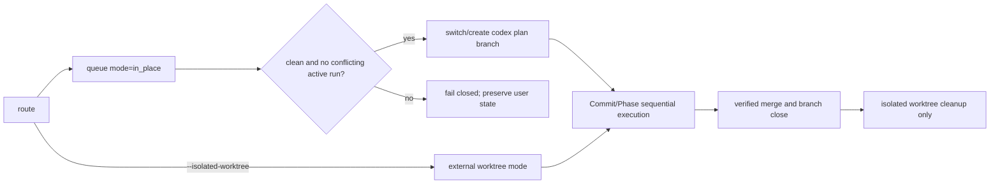

# Codex Flow Worktree Opt-In Plan

## Goal

Codex Flow의 기본 실행을 기존 저장소의 단일 working tree와 전용 branch를 사용하는 `in_place` 방식으로 바꾼다. 추가 Git worktree는 사용자가 격리를 명시적으로 요청할 때만 생성하고, in-place 실행은 dirty 상태나 동시에 진행 중인 다른 plan을 감지하면 branch를 바꾸기 전에 실패하도록 한다.

## Requested Outcome

- `route`만으로 hidden sibling worktree가 생기지 않아야 한다.
- Commit/Phase는 기존 저장소에서 `codex/<plan>` branch를 순차 실행해야 한다.
- 사용자 변경이 있는 저장소를 자동 stash하거나 다른 branch로 옮기지 않아야 한다.
- 병렬 작업이나 물리 격리가 필요할 때만 `--isolated-worktree`로 기존 외부 worktree 방식을 선택해야 한다.
- 격리 worktree의 기존 merge 후 안전 정리는 유지해야 한다.

## Codebase Evidence

- `route`는 현재 `prepare_git_branch=True`를 강제해 모든 source plan에 외부 worktree를 만든다 (`codex_flow/cli.py`).
- `create_plan_from_source()`는 이미 `prepare_git_branch=False`일 때 source repo를 execution repo로 기록할 수 있다 (`codex_flow/plans.py`).
- isolated runner는 실행 직전에 `prepare_branch()`를 호출하지만 main-unit 경로는 외부 worktree가 이미 branch를 준비했다는 전제에 의존한다.
- local merge는 source repo에서 target branch로 전환한 뒤 plan branch를 병합하고 branch를 닫을 수 있다 (`codex_flow/merge.py`).
- 기존 cleanup은 source repo 자체를 삭제하지 않도록 방어하며, 격리 worktree에 대해서만 clean/merged 검증 후 제거한다 (`codex_flow/git_ops.py`).
- 상세 조사: [research.md](research.md)

## System Visualization

## Related Files

- `codex_flow/cli.py`: route execution-mode option and validation.
- `codex_flow/git_ops.py`: execution context mode and safe branch preparation.
- `codex_flow/plans.py`: mode persistence, legacy inference, active-plan conflict guard, cleanup no-op.
- `codex_flow/runner.py`: isolated/in-place dirty-state behavior.
- `codex_flow/main_unit.py`: main-agent branch preparation before opening a transaction.
- `codex_flow/final_gate.py`: execution mode in terminal identity.
- `codex_flow/merge.py`: in-place branch close and isolated cleanup behavior.
- `tests/test_execution_worktree.py`, `tests/test_main_unit.py`, `tests/test_final_gate.py`: behavior and regression tests.
- `README.md`, `skills/구현커밋/SKILL.md`: runtime-facing contract.
- `/Users/moonsoo/projects/codex-skills-user/구현커밋/SKILL.md`: installed canonical contract.

## Current Behavior

`route`가 항상 외부 worktree를 생성한다. 반면 ticket 기반 plan과 일부 main-first 경로는 source repo를 execution repo로 표현할 수 있어 실행 모델이 일관되지 않다. main-unit은 in-place context에서 plan branch를 준비하지 않으며, isolated runner의 `--auto-resolve`는 dirty 파일을 stash할 수 있어 source repo 기본 실행에 그대로 적용하기에는 위험하다.

## Change Map

- public contract: `route --isolated-worktree`를 opt-in으로 추가하고 기본값을 `in_place`로 고정한다.
- persisted contract: `execution_mode`을 `in_place | isolated_worktree`로 저장한다.
- compatibility: mode가 없는 기존 queue는 `execution_repo == source_repo` 여부로 추론한다.
- safety: branch 변경 전 dirty source와 다른 in-place plan의 `in_progress` unit을 차단한다.
- recovery: 이미 plan branch에 있는 held candidate는 branch 전환 없이 보존한다.
- cleanup: in-place plan의 cleanup은 source repo 삭제를 시도하지 않는 명시적 no-op이다.

## Planned Changes

- 기본 route에서 `prepare_execution_worktree()`를 호출하지 않는다.
- `--worktree-root`는 `--isolated-worktree`와 함께 사용할 때만 허용한다.
- 실행 context에 mode를 기록하고 final gate identity에도 포함한다.
- in-place branch 준비 helper가 현재 branch, dirty 상태, 다른 plan의 active transaction을 검증한다.
- runner와 main-unit 모두 동일 helper를 사용한다.
- in-place dirty 상태에서 `--auto-resolve`가 자동 stash하지 못하게 한다. 명시적 `--allow-dirty`는 이미 plan branch에 있는 복구 작업에서만 기존 범위 검사를 따른다.
- isolated mode의 생성, 실행, merge 후 cleanup 계약은 유지한다.

## Review Notes

- 가장 강한 반대 근거: source repo를 사용하면 사용자의 현재 checkout을 바꾸므로 외부 worktree보다 격리성이 낮다.
- 대응: 실행 전 clean gate와 active execution conflict gate를 두고, 격리가 필요하면 명시적 opt-in을 제공한다.
- 회귀 위험: main-unit 테스트가 지금까지 현재 branch를 암묵적으로 사용했기 때문에 전용 branch 전환을 반영해야 한다.
- 회귀 위험: legacy queue에 mode가 없어도 기존 isolated worktree를 in-place로 오인하면 안 된다.
- kill criteria: dirty 상태에서 branch 전환이나 stash가 발생하거나, source repo를 cleanup 대상으로 제거하려는 경로가 남으면 구현을 중단한다.

## Plan Quality Check

- Alternative considered: `managed_lazy`로 첫 write 직전에 worktree를 생성. 격리는 유지하지만 추가 worktree 자체가 기본이라는 복잡성이 남아 최신 사용자 결정과 맞지 않아 기각한다.
- Why this plan: single-agent, Commit/Phase 순차 실행에는 branch가 이력 분리를 담당하고 기존 working tree 하나면 충분하다.
- Tradeoff: 폴더 누적과 lifecycle 복잡성은 줄지만, 실행 중 사용자의 checkout을 Codex Flow branch가 점유한다.
- What this plan may still miss: 별도 프로세스가 queue 상태를 갱신하지 않은 채 같은 저장소를 직접 수정하는 경쟁 조건.
- When to stop and revise: queue 기반 conflict guard가 실제 동시 실행을 판별하지 못하거나, 기존 remote merge가 in-place branch 상태에서 수렴하지 않으면 plan-level lock 설계로 재계획한다.

## Skill Routing Manifest

| Phase | Required skills | Optional skills | Evidence |
| --- | --- | --- | --- |
| Commit 1: Make additional worktrees explicit opt-in | `구현커밋` | `plan-first-implementation` | route, context metadata, compatibility and CLI tests. |
| Commit 2: Guard safe in-place execution | `구현커밋` | `review-all-in-one` | runner/main-unit branch and dirty/conflict tests. |
| Commit 3: Preserve finalization and document the contract | `구현커밋` | `content-sync-auditor` | merge/cleanup/final-gate tests and runtime docs. |
| Phase 4: Synchronize the installed implementation skill | `구현커밋` | `content-sync-auditor` | canonical skill and wrapper compatibility tests in the separate repository. |
| Final Gate | `review-all-in-one`, `테스트` | `qa-gate` | focused/full pytest, compileall, diff review, exact commit and push evidence. |

## Implementation Plan

### Commit 1: Make additional worktrees explicit opt-in

- target files:
  - `codex_flow/cli.py`
  - `codex_flow/git_ops.py`
  - `codex_flow/plans.py`
  - `codex_flow/final_gate.py`
  - `tests/test_execution_worktree.py`
  - `tests/test_final_gate.py`
- changes:
  - add `ExecutionWorktreeContext.mode` with `in_place` and `isolated_worktree` values.
  - route defaults to in-place and accepts `--isolated-worktree` for the legacy external worktree path.
  - reject `--worktree-root` without isolation opt-in.
  - infer mode for legacy queues and bind it into final evidence identity.
- verification:
  - default route changes no `git worktree list --porcelain` inventory.
  - isolated route creates one external worktree and preserves a dirty source checkout.
  - legacy contexts infer the correct mode.
- success criteria:
  - route-only and human-gate plans create no additional worktree by default.
  - explicit isolation behavior remains backward compatible.
- stop conditions:
  - any default route creates or registers a worktree.

### Commit 2: Guard safe in-place execution

- target files:
  - `codex_flow/plans.py`
  - `codex_flow/runner.py`
  - `codex_flow/main_unit.py`
  - `tests/test_execution_worktree.py`
  - `tests/test_main_unit.py`
- changes:
  - add a shared in-place preflight that refuses branch switching when non-flow files are dirty.
  - refuse execution when another in-place plan has an `in_progress` unit.
  - prepare the plan branch for both isolated runner and direct main-unit paths.
  - prevent `--auto-resolve` from stashing source-repo dirty state in in-place mode.
  - allow recovery to continue without switching when already on the plan branch.
- verification:
  - clean in-place run switches to the plan branch and commits only allowed paths.
  - dirty source and active-plan conflict fail before branch mutation.
  - isolated mode retains its existing dirty-source isolation.
- success criteria:
  - no normal in-place unit commits to `main`.
  - user dirty state is preserved byte-for-byte on failure.
- stop conditions:
  - a guard requires destructive cleanup, reset, or implicit stash.

### Commit 3: Preserve finalization and document the contract

- target files:
  - `codex_flow/plans.py`
  - `codex_flow/cli.py`
  - `codex_flow/merge.py`
  - `README.md`
  - `skills/구현커밋/SKILL.md`
  - related merge/worktree tests
- changes:
  - make in-place cleanup an explicit no-op while keeping isolated clean/merged cleanup.
  - verify local finalization merges the plan branch, returns to target, and closes the branch.
  - document default in-place ownership, preflight failure behavior, and isolation opt-in.
- verification:
  - in-place merge leaves no plan branch and never removes the source directory.
  - isolated merge still removes only its owned clean worktree and branch.
  - README and runtime skill describe the same default.
- success criteria:
  - both modes converge without broad prune or force deletion.
- stop conditions:
  - merge success can be reported while the owned branch remains open without a blocked result.

### Phase 4: Synchronize the installed implementation skill

- target repository: `/Users/moonsoo/projects/codex-skills-user`
- target files:
  - `구현커밋/SKILL.md`
  - wrapper compatibility tests or probes affected by route flags
- changes:
  - update the installed canonical contract to state in-place default and explicit isolated worktree opt-in.
  - keep runtime mirror and installed contract semantically aligned without overwriting unrelated dirty files.
- verification:
  - installed wrapper resolves the updated runtime and route help exposes `--isolated-worktree`.
  - exact-path diff and repository tests pass.
- success criteria:
  - future Codex sessions no longer describe automatic worktree creation as the default.
- stop conditions:
  - unrelated changes overlap the exact contract lines and cannot be safely separated.

## Operator 결정 필요 사항

- 상태: 없음.
- 확정된 기본값: `in_place`.
- 격리 실행 선택지: 필요할 때만 `--isolated-worktree`.
- production deploy: 범위 밖이며 승인되지 않음.

## 검토용 결과물

- [이 계획 문서](plan.md)
- [조사 근거](research.md)
- UI 변경이 없는 CLI/Git contract 작업이므로 HTML은 생략한다.

## 후행 실행

- 실행자: `구현커밋` main agent.
- 순서: Commit 1 → Commit 2 → Commit 3 → Phase 4 → Final Gate.
- 병렬 구현: 사용하지 않는다.

## HTML 생략 보고서

- 판정: 생략.
- 사유: CLI 옵션, Git branch/worktree 상태와 queue metadata가 검토 표면이며 시각 UI가 없다.
- 테스트 링크: localhost/deploy 해당 없음. pytest와 CLI smoke output을 최종 증거로 사용한다.

## 구현 후 검토 리스트

- default route의 worktree inventory가 변하지 않는가.
- dirty source에서 branch, stash, queue execution state가 바뀌지 않는가.
- main-unit과 isolated runner가 모두 plan branch를 소유하는가.
- legacy isolated queue가 mode 없이도 정상 cleanup되는가.
- final gate가 execution mode 변경을 stale evidence로 판정하는가.
- status/dashboard가 read-only로 유지되는가.
- README, runtime skill mirror, installed canonical skill이 같은 정책을 설명하는가.

## Validation

- focused tests:
  - `/Users/moonsoo/projects/Chat-Bot/.venv/bin/python -m pytest tests/test_execution_worktree.py tests/test_main_unit.py tests/test_final_gate.py tests/test_inbox_merge.py tests/test_route_plan_first_source.py -q`
- full suite:
  - `/Users/moonsoo/projects/Chat-Bot/.venv/bin/python -m pytest -q`
- static checks:
  - `python3 -m compileall codex_flow scripts`
  - `git diff --check`
- manual smoke:
  - `codex-flow route <plan.md>` leaves worktree inventory unchanged.
  - `codex-flow route <plan.md> --isolated-worktree` creates one owned external worktree.
  - in-place merge returns to target branch and closes `codex/<plan>`.
