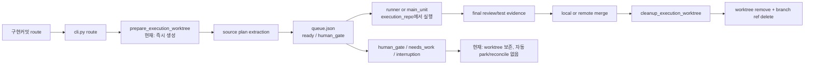

# Research

## Goal

`구현커밋`과 Codex Flow가 생성하는 보조 Git worktree가 실행 전부터 누적되거나, 중단·보류·최종화 실패 뒤 남는 원인을 규명하고 안전한 기본 정책을 선택한다. 조사 결과는 worktree 격리의 사용자 변경 보호와 복구 증거를 유지하면서 생성량과 잔존량을 줄이는 plan-first 구현 계획의 근거가 된다.

선택 모드: `Pre-Plan Research Gate`.

## Scope And Entry Points

조사 범위:

- `/Users/moonsoo/projects/codex-flow`의 route, plan, run, final gate, merge, worktree lifecycle 코드와 테스트
- `/Users/moonsoo/projects/codex-skills-user/구현커밋`의 main-first, recovery, branch finalization 계약
- `/Users/moonsoo/projects/고연전 중계`에 남은 반복 plan/worktree를 통한 제한적 현장 대조

주요 진입점:

- `codex_flow.cli:main()`의 `route`, `run-all`, `cleanup-worktree`, `merge`
- `codex_flow.plans:create_plan_from_source()`
- `codex_flow.git_ops:prepare_execution_worktree()`와 `cleanup_execution_worktree()`
- `codex_flow.runner:execute_unit()`과 `codex_flow.main_unit` transaction
- `codex_flow.merge:MergeRunner.finalize_source_branch()`

외부 웹 조사는 사용하지 않았다. 이 문제의 정본은 현재 로컬 런타임과 테스트이며, Git 일반론보다 실제 상태 전이와 호출 순서가 설계를 결정한다.

## Relevant Files

- `codex_flow/cli.py`: route가 `prepare_git_branch=True`를 강제하고, run-all merge 기본값과 수동 `cleanup-worktree` 명령을 정의한다.
- `codex_flow/plans.py`: plan slug, queue, execution context, active-plan 판정과 cleanup metadata를 소유한다.
- `codex_flow/git_ops.py`: worktree 생성·재사용·dirty/merged guard·제거·branch ref 삭제를 수행한다.
- `codex_flow/runner.py`: queue의 `execution_repo`에서 unit을 실행하고 결과를 기록한다.
- `codex_flow/main_unit.py`: main-first unit도 `execution_context.execution_repo`에서 transaction을 수행한다.
- `codex_flow/run_all.py`: terminal unit 뒤 final gate와 merge를 연결한다.
- `codex_flow/final_gate.py`: exact HEAD, plan digest, queue revision 기반 terminal evidence를 요구한다.
- `codex_flow/merge.py`: 성공한 local/remote merge 뒤 worktree와 branch finalization을 시도한다.
- `codex_flow/dashboard.py`: active plan은 표시하지만 cleanup-needed terminal plan 표면은 없다.
- `tests/test_execution_worktree.py`: 외부 worktree 생성, dirty/unmerged 거부, local merge 후 cleanup을 검증한다.
- `tests/test_inbox_merge.py`: branch finalization 실패의 fail-closed 결과를 검증한다.
- `tests/test_route_plan_first_source.py`: source plan route와 queue projection을 검증한다.
- `/Users/moonsoo/projects/codex-skills-user/구현커밋/SKILL.md`: main-first, final-only review, automatic-safe branch finalization의 설치 정본이다.
- `/Users/moonsoo/projects/codex-skills-user/구현커밋/references/recovery.md`: dirty/held candidate와 recovery evidence 보존을 요구한다.

## Current Behavior

### Confirmed facts

1. `route`는 선택 옵션 없이 `create_plan_from_source(..., prepare_git_branch=True)`를 호출한다 (`codex_flow/cli.py:250-269`).
2. `create_plan_from_source()`는 plan extraction과 `human_gate` 판정보다 먼저 `prepare_execution_worktree()`를 호출한다 (`codex_flow/plans.py:176-229`).
3. 기본 생성 위치는 source repo의 형제 hidden root인 `.<repo>-codex-flow-worktrees/<plan-id>`다 (`codex_flow/git_ops.py:180-185`).
4. 동일 경로가 없고 동일 branch가 이미 존재하면 그 branch로 worktree를 다시 붙인다 (`codex_flow/git_ops.py:189-209`).
5. low-confidence 또는 external path plan이 `human_gate`가 되는 판정은 worktree 생성 뒤에 일어난다 (`codex_flow/plans.py:254-294`).
6. main-first는 source repo 직접 수정을 뜻하지 않는다. main transaction과 isolated runner 모두 queue의 `execution_repo`를 사용한다 (`codex_flow/main_unit.py:97-103`, `codex_flow/runner.py:368-373`).
7. 정상 자동 정리는 이미 존재하지만 successful merge finalization에서만 호출된다 (`codex_flow/merge.py:194-235`).
8. 정리는 worktree가 clean하고 branch가 target에 병합된 경우에만 `git worktree remove` 후 branch ref를 삭제한다 (`codex_flow/git_ops.py:230-267`).
9. `human_gate`, `needs_work`, missing final gate, `--no-merge`, dirty source/worktree, unmerged branch, interrupted finalization에서는 worktree를 의도적으로 또는 결과적으로 보존한다.
10. 모든 unit이 `done`이어도 `cleanup_state=active`이면 `list_active_plans()`에서 사라진다. active 판정이 unit status만 보기 때문이다 (`codex_flow/plans.py:900-918`).

### Empirical local observation

`/Users/moonsoo/projects/고연전 중계/.codex-flow/plans/`에는 같은 제목에서 파생된 `계획`, `계획-2`, `계획-3`이 있고 세 queue 모두 `cleanup_state=active`였다. 상태 조합은 각각 `human_gate,ready,human_gate`, `human_gate,needs_work,human_gate`, `done,done,human_gate`였다. 2026-07-22 확인 당시 Git registry에는 `계획-3` worktree만 남아 있었다. 이 사례는 route-time 선생성, 반복 route의 `unique_slug()` 증가, human gate 보존, cleanup metadata와 물리 상태의 분리가 함께 나타날 수 있음을 보여준다.

이 현장 관찰은 일반화된 빈도 통계가 아니라 현재 사용자 환경의 재현 사례로만 사용한다.

## Data Flow And Control Flow

핵심 비대칭은 route-time eager creation과 merge-only cleanup이다. 실행 가능성 판정 전에 물리 worktree가 생기지만, 종료 외 상태에서는 clean worktree를 branch-preserving 방식으로 내려놓는 `park` 상태가 없다.

## Existing Abstractions And Boundaries

- `ExecutionWorktreeContext`는 source/execution repo, worktree path, plan/branch identity, cleanup state를 이미 묶는다.
- `prepare_execution_worktree()`는 same branch/common-dir ownership을 검증한다.
- `cleanup_execution_worktree()`는 destructive force 없이 dirty와 unmerged 상태를 차단한다.
- queue와 attempt ledger는 execution ownership, exact HEAD, held candidate, final evidence의 정본 경계를 가진다.
- `status`와 `dashboard`는 설치된 skill 계약상 read-only여야 하므로 garbage collection을 숨겨 실행하면 안 된다.
- installed skill과 repo mirror는 별도 저장소에 있으며 현재 파일 내용도 동일하지 않다. runtime 변경과 사용자-facing 계약 변경은 별도 repo transaction으로 취급해야 한다.

## Side Effects And Integration Points

- route 순서 변경은 plan extraction failure, unique slug, branch naming과 queue metadata 생성 순서에 영향을 준다.
- lazy creation은 `runner`, `main_unit`, `final_gate`, review/test evidence가 물리 execution repo를 요구하는 시점을 명시해야 한다.
- park/rehydrate는 branch commit을 보존하면서 worktree path만 제거·복구해야 한다.
- full finalization은 target merge, final gate, branch deletion, queue persistence와 원자적으로 수렴해야 한다.
- `open-pr`, remote merge, `--no-merge`, non-main target, active PR lock도 같은 lifecycle 상태를 읽어야 한다.
- wrapper와 installed skill이 새 mode/state/command를 모르면 stale runtime을 정상으로 오인할 수 있다.

## Risk To Surrounding Systems

- worktree를 전면 비활성화하면 dirty source repo, 사용자 미커밋 변경, 동시 plan, branch switching이 서로 간섭한다.
- `human_gate`나 `needs_work`라는 이유만으로 삭제하면 dirty candidate와 held evidence 보존 계약을 위반할 수 있다.
- 현재 cleanup은 worktree remove → branch ref delete → queue save 순서가 하나의 transaction이 아니다. 중간 실패 시 `cleanup_state=active`인데 path는 없거나 branch만 남을 수 있다.
- route는 worktree를 만든 뒤 plan directory/queue를 쓰므로 후속 extraction/write 실패 시 owner metadata 없는 orphan을 만들 수 있다.
- broad `git worktree prune`은 queue ownership과 common-dir 검증 없이 다른 사용자의 worktree까지 건드릴 위험이 있다.
- empty root cleanup이 없으면 leaf가 없어져도 hidden container가 남아 사용자에게 누적으로 보일 수 있다.

## Do Not Duplicate Or Bypass

- 별도 ad-hoc worktree manager로 기존 guard를 우회하지 않는다. `ExecutionWorktreeContext`, `prepare_execution_worktree()`, `cleanup_execution_worktree()`를 lifecycle owner 아래에서 재사용·분리한다.
- attempt ledger의 held/committing/completed 상태를 queue status만으로 추측하지 않는다.
- final gate와 merge ancestry를 생략한 branch deletion을 허용하지 않는다.
- `status`/`dashboard`에 mutation을 넣지 않는다.
- arbitrary 경로나 repository-wide prune을 사용하지 않는다. plan-owned path와 Git common-dir가 모두 일치해야 한다.
- runtime repo mirror를 설치 정본에 덮어쓰지 않는다. 두 repo의 변경을 검증 가능한 별도 commit으로 동기화한다.

## Open Questions

1. 명시적 in-place mode를 첫 구현에 포함할지 여부. 권고 기본값은 포함하되 experimental opt-in으로 제한하거나 후속 작업으로 보류하는 것이다.
2. clean-but-incomplete plan의 자동 park 시점. 권고 기본값은 command boundary에서 active/committing/held attempt가 없을 때이며, 시간 기반 background daemon은 도입하지 않는다.
3. legacy `cleanup_state`를 유지할 기간. 권고는 새 `worktree_lifecycle` 구조를 정본으로 추가하고 `cleanup_state`를 한 release 동안 호환 projection으로 유지하는 것이다.

이 질문들은 계획에 안전한 기본값을 둘 수 있으므로 현재 plan 작성의 blocker는 아니다.

## Solution Options

### Option A: worktree를 전면 해제하고 source repo에서 직접 실행

- Operating principle: route와 unit 실행이 source repo의 현재 checkout을 직접 사용한다.
- Supporting evidence: queue는 이미 `execution_repo=source_repo`, `cleanup_state=not_applicable` 형태를 표현할 수 있다.
- Fit conditions: clean repo, 단일 plan, branch switching 충돌이 없는 짧은 수동 작업.
- Failure modes: dirty 사용자 변경과 충돌, 동시 실행 불가, branch switching, held candidate와 source 상태 혼합.
- Implementation implication: strict clean/no-active-plan gate와 opt-in flag가 필요하다.
- Adoption judgment: `Reject as default`, `Watch as explicit opt-in`.

### Option B: eager worktree를 유지하고 terminal cleanup만 보강

- Operating principle: 현재 route-time 생성을 유지하고 merge 뒤 cleanup을 crash-resumable하게 만든다.
- Supporting evidence: local happy-path cleanup은 이미 테스트되고 있다.
- Fit conditions: 거의 모든 plan이 즉시 실행되어 final gate와 merge까지 끝나는 환경.
- Failure modes: 실행 전 human gate, repeated route, 중단·보류 plan의 worktree 누적을 해결하지 못한다.
- Implementation implication: 변경 범위는 작지만 사용자가 본 주요 누적 원인이 남는다.
- Adoption judgment: `Reject as sufficient solution`; finalization hardening 요소만 Option C에 채택.

### Option C: lazy managed worktree + park/rehydrate + idempotent finalize

- Operating principle: plan/queue를 먼저 만들고 첫 writable unit 직전에 격리 worktree를 생성한다. command 종료 시 clean하고 live/held attempt가 없으면 worktree leaf만 `park`하여 branch는 보존한다. 재개 시 같은 branch로 rehydrate한다. final gate와 merge가 끝나면 branch까지 안전하게 제거한다.
- Supporting evidence: 현재 context와 branch reuse code가 이 모델의 identity를 이미 제공하며, held candidate 계약은 dirty worktree 보존으로 유지할 수 있다.
- Fit conditions: human gate, interruption, main-first, isolated child, local/remote merge가 섞인 일반 운영.
- Failure modes: lifecycle state와 physical Git state의 reconcile이 부정확하면 missing path나 stale registration을 만들 수 있다.
- Implementation implication: typed lifecycle state, atomic queue transitions, ownership-scoped reconciler, fault-injection tests가 필요하다.
- Adoption judgment: `Adopt`.

### Option D: commit unit마다 새 ephemeral worktree 생성

- Operating principle: 각 unit 종료 후 worktree를 없애고 다음 unit마다 새 checkout을 만든다.
- Supporting evidence: commit graph는 branch에 남으므로 기술적으로 가능하다.
- Fit conditions: 완전히 독립적이고 dirty candidate가 없는 deterministic unit.
- Failure modes: attempt evidence와 repair candidate 연속성이 약해지고 I/O와 상태 전이가 크게 늘어난다.
- Implementation implication: 현재 per-plan context를 per-attempt로 재설계해야 한다.
- Adoption judgment: `Reject`.

External evidence breadth: `threshold intentionally narrowed`. 내부 런타임의 정확한 lifecycle 문제이므로 10-platform/20-item 외부 조사는 이전 가능한 근거가 아니며, local code, tests, queue, Git registry를 우선했다.

## Plan Implications

### Operator decision update — 2026-07-23

후속 대화에서 Operator는 Commit/Phase가 순차 실행되고 branch가 이미 이력을 분리한다는 점을 근거로 추가 worktree를 기본 생성하지 않는 방향을 선택했다. 따라서 채택안은 Option C에서 **guarded Option A**로 변경한다.

- 기본값: source repo의 기존 working tree에서 전용 `codex/<plan>` branch를 사용하는 `in_place`.
- 안전 조건: branch 전환 전 non-flow dirty 상태와 다른 in-place plan의 active transaction을 차단한다.
- 금지 조건: in-place 기본 경로에서 자동 stash, reset, force cleanup을 하지 않는다.
- opt-in: 병렬 실행이나 물리 격리가 필요한 경우에만 `--isolated-worktree`로 기존 external worktree 방식을 사용한다.
- 보존 계약: explicit isolated mode의 dirty/held candidate 보호와 merge 후 cleanup은 그대로 유지한다.

최신 계획은 [plan.md](plan.md)를 정본으로 사용한다. 아래 Option C 내용은 최초 조사 당시 권고안과 비교 근거로 보존한다.

초기 조사 권고 계획은 Option C를 기본으로 했다.

1. route가 extraction/queue ownership을 먼저 확정하고 `worktree_mode=managed`, lifecycle `not_created`로 시작하게 한다.
2. 첫 unit transaction이 execution repo를 요구할 때 owner-validated `ensure_execution_worktree()`가 create/rehydrate한다.
3. low-level remove를 `park`(worktree만 제거, branch 유지)와 `finalize`(merged branch까지 제거)로 분리한다.
4. lifecycle을 `not_created`, `creating`, `active`, `park_pending`, `parked`, `finalize_pending`, `worktree_removed`, `finalized`, `cleanup_blocked`처럼 명시하고 queue 저장을 atomic하게 만든다.
5. active/committing/held attempt, dirty worktree, ownership mismatch는 자동 park/finalize를 금지한다.
6. local/remote merge 성공, terminal resume, explicit `reconcile-worktrees`가 같은 idempotent reconciler를 사용한다. read-only status/dashboard는 관찰만 한다.
7. terminal-but-cleanup-active plan과 blocked reason을 dashboard에 표시한다.
8. installed `구현커밋` 계약과 wrapper compatibility probe를 새 lifecycle/default에 맞춰 별도 repo commit으로 동기화한다.

## Source Evaluation

- Strongest evidence: local runtime source and focused tests. Adoption: `Adopt`.
- Empirical evidence: current `고연전 중계` queue/worktree registry. Adoption: `Pilot evidence`; 한 환경 사례이므로 빈도 일반화에는 사용하지 않음.
- Installed skill contract: user-facing safety and recovery boundary. Adoption: `Adopt as policy constraint`.
- External/community sources: 사용하지 않음. Adoption: `Not needed`.
- Missing proof: 새 lifecycle 설계의 fault-injection, remote merge, stale registration, Unicode/space path, unrelated worktree protection 테스트는 구현 후 필요하다.

## Evidence

### Files and lines

- `/Users/moonsoo/projects/codex-flow/codex_flow/cli.py:250-281`
- `/Users/moonsoo/projects/codex-flow/codex_flow/plans.py:176-238`
- `/Users/moonsoo/projects/codex-flow/codex_flow/plans.py:254-327`
- `/Users/moonsoo/projects/codex-flow/codex_flow/plans.py:827-879`
- `/Users/moonsoo/projects/codex-flow/codex_flow/plans.py:900-918`
- `/Users/moonsoo/projects/codex-flow/codex_flow/git_ops.py:165-267`
- `/Users/moonsoo/projects/codex-flow/codex_flow/runner.py:368-376`
- `/Users/moonsoo/projects/codex-flow/codex_flow/main_unit.py:97-103`
- `/Users/moonsoo/projects/codex-flow/codex_flow/run_all.py:54-96`
- `/Users/moonsoo/projects/codex-flow/codex_flow/merge.py:194-246`
- `/Users/moonsoo/projects/codex-flow/tests/test_execution_worktree.py:137-360`
- `/Users/moonsoo/projects/codex-flow/tests/test_inbox_merge.py:30-104`
- `/Users/moonsoo/projects/codex-skills-user/구현커밋/SKILL.md:20-58`
- `/Users/moonsoo/projects/codex-skills-user/구현커밋/references/recovery.md:21-32`

### Commands and results

- `rg -n -S 'worktree|cleanup_state|execution_repo' codex_flow tests docs README.md`
- `git -C '/Users/moonsoo/projects/고연전 중계' worktree list --porcelain`
- three relevant `queue.json` files inspected with `jq`
- `/Users/moonsoo/projects/Chat-Bot/.venv/bin/python -m pytest tests/test_execution_worktree.py tests/test_inbox_merge.py tests/test_route_plan_first_source.py -q`
  - Result on 2026-07-22: `28 passed in 8.24s`
- System `python3 -m pytest ...` could not run because the system interpreter has no `pytest`; no package installation was performed.
