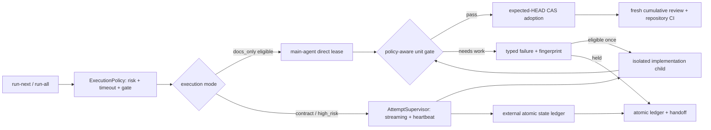

# Implementation Commit Adaptive Execution Plan

## Goal

Issue #141에서 확인된 구현커밋/Codex Flow의 긴 blind wait, 전 unit full review, 전체 attempt 재실행, stale 상태와 실패 경로의 HEAD 검증 누락을 구조적으로 개선한다. 고위험 작업의 격리·fail-closed·최종 독립 리뷰는 유지하면서 저위험/표준 작업의 불필요한 제어 비용을 줄이고, 실패한 attempt를 안전하게 관측·중단·인계할 수 있는 적응형 실행기를 만든다.

## Requested Outcome

- 모든 attempt를 streaming supervisor와 원자적 attempt ledger가 소유한다.
- child 출력이 없어도 supervisor 생존 여부와 현재 단계가 보이며, 무응답과 정상 장기 실행을 구분한다.
- timeout/nonzero를 포함한 모든 종료 경로에서 process cleanup, expected HEAD, 변경 scope를 검사한다.
- `docs_only`, `contract`, `high_risk` 실행 profile에 따라 실행 주체와 unit gate를 차등 적용한다.
- `docs_only`는 안전 기반이 통과한 뒤 메인 에이전트 직접 실행을 지원하고, `contract`는 unit 검증+누적 diff review, `high_risk`는 격리 child+unit별 독립 review를 유지한다.
- 같은 실패를 무조건 반복하지 않고 typed failure와 fingerprint로 재시도 가능성을 제한한다.
- repo-local `.codex-flow` 오염을 줄이되 기존 plan과 증거는 삭제하지 않고 읽기/마이그레이션할 수 있다.
- exact evidence key가 같은 집중 검증만 재사용하고 최종 독립 리뷰와 CI는 항상 새 HEAD에서 다시 수행한다.
- repo mirror skill을 정본으로 두고 설치된 skill과의 drift를 검출하는 안전한 동기화 계약을 만든다.

## Codebase Evidence

- `Confirmed`:
  - `codex_flow/implementer_agent.py`는 한 attempt에서 implementation child와 resumed review child를 직렬로 실행한다.
  - `codex_flow/cli.py`의 기본 child timeout은 900초이며 두 child에 각각 적용된다.
  - `codex_flow/git_ops.py`는 종료까지 `capture_output=True`로 기다려 실행 중 heartbeat를 전달하지 않는다.
  - `codex_flow/runner.py`의 timeout/nonzero 반환은 정상-return HEAD 검사를 우회할 수 있다.
  - queue는 lease/owner/heartbeat/expected HEAD 없이 `in_progress`를 기록하고 JSON은 직접 덮어쓴다.
  - Issue #141의 확인 가능한 Flow 제어 비용 하한은 21분 41초이며, dangling review를 포함한 추정 상한은 33분 14초다.
  - repo mirror와 현재 설치된 `구현커밋` skill 내용이 다르다.
- `Inferred`:
  - Issue #141 Unit 3은 child가 commit한 뒤 Flow review/adoption 기록 없이 수동으로 수렴한 것으로 보인다.
  - supervisor heartbeat와 typed adoption이 있었다면 no-output retry와 dangling state의 상당 부분을 조기에 구분할 수 있었다.
- `Unverified`:
  - 실제 Codex CLI JSON event의 모든 장기 작업 패턴과 process-tree 종료 동작은 구현 단계의 fixture/통합 실험으로 확인해야 한다.
  - repo 밖 state root로 이동할 때 dashboard와 모든 legacy auto-discovery 경로가 동일하게 동작하는지는 회귀 테스트가 필요하다.

## System Visualization

- changed nodes: execution policy, attempt supervisor, unit gate selection, failure taxonomy, atomic ledger, evidence keying, skill drift check.
- preserved nodes: disposable execution worktree, child runtime attestation, allowed-path checks, `ReviewGate`, non-force cleanup, final independent review와 repository CI.
- diagram notes: Commit 1~3 안전 기반까지는 기존 child implementation을 유지한다. `docs_only` parent-direct는 transactional adoption이 증명된 뒤 Commit 4에서 opt-in canary로 열고, `run-all` unattended fallback은 child를 유지한다.

## Related Files

- `codex_flow/cli.py`: policy/timeout CLI entry와 safe default.
- `codex_flow/run_all.py`: unit 직렬 실행과 local/remote finalize 전 final gate 연결.
- `codex_flow/runner.py`: attempt lifecycle, repair, HEAD/scope 검사, commit/adoption 소유자.
- `codex_flow/implementer_agent.py`: implementation/review child 호출 계약.
- `codex_flow/reviewer_agent.py`: 구조화 review 결과와 gate 판정.
- `codex_flow/codex_cli.py`: Codex subprocess invocation과 diagnostics.
- `codex_flow/git_ops.py`: process 실행 및 git invariant helper.
- `codex_flow/state.py`: state root와 plan state discovery.
- `codex_flow/plans.py`: queue/log/handoff serialization.
- `codex_flow/plan_readiness.py`: next-unit와 stale 상태 판정.
- `tests/test_codex_cli.py`: streaming, timeout, process termination 계약.
- `tests/test_runner_brief.py`: gate, retry, post-failure HEAD, adoption 계약.
- `tests/test_execution_worktree.py`: isolated worktree와 cleanup 안전성.
- `tests/test_state.py`: external/legacy state와 atomic ledger.
- `tests/test_route_plan_first_source.py`: plan discovery 호환성.
- `README.md`, `skills/구현커밋/SKILL.md`: 사용자/에이전트 실행 계약 정본.
- `/Users/moonsoo/projects/codex-skills-user/구현커밋/SKILL.md`: 별도 저장소의 설치본; 구현 완료·병합 뒤 명시적 sync phase에서만 변경.

## Current Behavior

현재는 모든 unit이 같은 900초 child timeout과 full `review-all-in-one`을 사용한다. review가 `needs_work`를 내면 새 session에서 implementation과 review를 함께 반복하며, ordinary failure는 대체로 retryable이다. 실행 중 output/heartbeat가 없어 진행과 stall을 구분할 수 없고, failure catch에서 HEAD invariant를 놓칠 수 있다. queue/log/handoff는 하나의 transaction이 아니며 stale `in_progress`의 소유권을 안전하게 회수하는 계약이 없다.

## Change Map

- likely files to edit: 위 `codex_flow/*`, 관련 tests, `README.md`, repo mirror skill.
- likely functions/classes: `run_codex_exec`, process runner, `CodexImplementerAgent.implement`, `execute_unit`, repair loop, queue/handoff writers, state discovery.
- state dependencies: plan id, unit id, attempt id, expected HEAD, execution worktree, child session id, review gate, changed-path digest.
- side effects to preserve: child process termination, git commit ownership, worktree cleanup, plan archive, PR/merge exact-HEAD rules.
- likely new files: `codex_flow/execution_policy.py`, `codex_flow/attempt_supervisor.py`, `codex_flow/attempt_ledger.py`, corresponding test modules, skill drift check script.
- remaining narrow unknowns: Codex JSON event cadence와 macOS process-group termination semantics; fixture로 증명하기 전 timeout을 stdout-silence 기준으로 줄이지 않는다.

## Planned Changes

- expected behavior changes:
  - profile은 `docs_only < contract < high_risk` 순서이며 missing metadata는 `contract`; `effective_profile = max(declared_or_contract, inferred_lower_bound)`로 자동 classifier는 위험도를 올릴 수만 있다.
  - `docs_only`는 메인 에이전트 direct lease + unit smoke, `contract`는 격리 실행 + unit test + cumulative diff review, `high_risk`는 격리 실행 + read-only full post-unit review를 사용한다.
  - review는 파일을 수정하지 않는다. finding 수정은 별도 implementer repair attempt가 담당한다.
  - generic runtime은 명시 호출형 `review-all-in-one`을 자동 호출하지 않는다. 대신 별도 내부 read-only `FinalReviewGate`를 모든 위험도에서 새 HEAD로 실행한다.
  - active plan이나 현재 사용자 요청이 `review-all-in-one`을 명시한 경우에만 그 결과를 별도 external review evidence로 요구한다.
  - `run-all`, `open-pr`, `create-pr`, `merge --auto-resolve`는 exact HEAD의 `FinalGateRecord`가 없거나 stale/failed면 finalize하지 않는다.
  - supervisor heartbeat와 child-output age를 분리 기록하고, 무출력만으로 kill하지 않는다.
  - supervisor heartbeat는 30초마다 기록한다. child progress가 60초 없으면 `slow`, 120초 없으면 `stalled_diagnostic`을 남긴다. `docs_only`는 180초 동안 progress·diff 증가가 모두 없고 liveness check 두 번이 실패한 경우에만 안전 종료 후 main-agent takeover로 넘긴다. `high_risk`는 silence만으로 종료하지 않고 900초 hard cap을 유지한다.
  - failure path도 `finally`에서 process cleanup과 HEAD/scope invariant를 검사한다.
  - 동일 failure fingerprint는 자동 재시도하지 않는다.
  - 새 plan state는 외부 state root를 쓰고 legacy repo-local state는 보존·호환한다.
- constraints to preserve:
  - force cleanup, silent fallback, broad exception suppression, review assertion 약화 금지.
  - 최종 review/CI evidence reuse 금지.
  - 외부 설치 skill은 codex-flow 변경과 같은 커밋으로 다루지 않는다.
- execution order: 안전 policy/spec → ledger/supervisor → transactional adoption/retry → runtime final gate → 위험도별 unit gate → state migration → evidence reuse → 문서/skill drift → 독립 최종 검증.

## Seven-solution Adoption Matrix

| # | 제안 | 플랜 반영 | 도입 계약 |
| --- | --- | --- | --- |
| 1 | 매 Commit `review-all-in-one` 제거 | `채택` | unit에는 typed `VerificationSpec` 기반 gate를 사용하고, `review-all-in-one`은 사용자가 명시한 구현 전/최종 검토에만 사용한다. generic runtime 최종 gate는 별도 read-only `FinalReviewGate`다. |
| 2 | `docs_only` / `contract` / `high_risk` 분류 | `채택` | missing은 `contract`, classifier는 상향만 가능. `docs_only` main-direct, `contract` unit test+cumulative diff, `high_risk` 격리 child+unit별 review. |
| 3 | 900초 blind wait 제거 | `채택` | 30초 supervisor heartbeat, 60초 slow, 120초 stalled diagnostic, docs-only 180초 안전 takeover, high-risk 900초 hard cap. stdout silence 단독 kill은 금지한다. |
| 4 | 같은 오류 재시도 금지 | `채택` | typed failure와 canonical fingerprint를 사용하고 동일 fingerprint는 0회 재시도. transient만 1회, scope mismatch는 재계획, test/review finding은 허용 범위 안에서만 1회 repair. |
| 5 | `.codex-flow` 외부 이동 | `채택` | `~/.codex/state/codex-flow/<repo_id>/`; git common-dir UUID로 repo identity를 고정하고 legacy는 shadow-copy/parity/no-delete한다. |
| 6 | review 전 HEAD 고정 | `채택·실행 가능하게 분리` | local preflight는 base sync→branch/worktree/HEAD freeze→tests→independent review→attestation. remote merge는 같은 PR HEAD의 CI pass를 추가 요구한다. HEAD 변경 시 모두 무효화한다. |
| 7 | merge 상태 문서 중복 기록 제거 | `채택` | 저장소 문서는 안정적 기능 계약/영구 링크, GitHub Issue·PR은 현재 상태·정확 SHA, main CI는 post-merge 결과를 소유한다. “병합 기록만 위한 후속 PR”은 생성하지 않는다. |

### Deliberate safety refinements

- 3번의 180초 takeover는 단순 stdout 무응답이 아니라 `child progress 없음 + scoped diff 증가 없음 + 두 번의 liveness 실패`가 모두 맞을 때만 실행한다.
- 6번은 PR 생성 전에는 remote CI가 존재하지 않는 현실을 반영해 local preflight와 merge preflight로 나눈다. merge 시점의 최종 순서는 `fetch → base sync → expected branch/worktree/HEAD → tests → independent review → attestation → same-HEAD CI → merge`다.
- 2번의 main-agent direct mode는 `docs_only` absence oracle과 transactional lease/adoption을 모두 통과한 interactive 실행에서만 허용한다. unattended `run-all`은 안전한 child fallback을 사용한다.

## Review Notes

- risks:
  - 위험도 오분류가 full review를 건너뛰게 만들 수 있다.
  - stdout silence를 stall로 오판하면 정상 장기 작업을 죽일 수 있다.
  - state migration이 legacy resume를 깨뜨릴 수 있다.
  - evidence key가 느슨하면 stale green을 재사용할 수 있다.
- assumptions:
  - existing execution worktree와 child attestation은 유지·확장 가능하다.
  - plan metadata는 위험도를 명시적으로 높이는 입력으로 사용할 수 있다.
- unanswered questions: Operator blocking question 없음. CLI event/process-tree 세부는 Commit 2의 실험이 통과하지 않으면 다음 commit으로 진행하지 않는다.

## Pre-implementation Review Findings Applied

- `Blocker resolved in plan`: `FinalGateRecord`를 `run-all`, `open-pr`, `create-pr`, `merge --auto-resolve` finalize 경로에 배선하고 exact HEAD가 바뀌면 무효화한다.
- `Blocker resolved in plan`: plan의 임의 shell 문자열을 실행하지 않는다. repo-owned allowlist에서 해석되는 typed `VerificationSpec`만 허용하고 shell/cwd escape를 금지한다.
- `Blocker resolved in plan`: generic runtime은 명시 호출형 `review-all-in-one`을 자동 호출하지 않는다. 내부 read-only `FinalReviewGate`와 명시적으로 요청된 external review evidence를 분리한다.
- `Important resolved in plan`: transactional adoption을 gate 완화보다 먼저 구현하고 feature flag가 준비되기 전에는 기존 strict gate가 계속 동작한다.
- `Important resolved in plan`: manual adoption CLI, risk metadata persistence, stable repo identity, ledger-derived view 복구, canonical failure fingerprint/evidence key를 구체화했다.
- `Important resolved in plan`: legacy integration parity, descendant process, secret redaction, crash recovery와 deterministic metric fixture를 테스트 표면에 추가했다.

## Plan Quality Check

- Alternative considered: heartbeat만 추가하는 최소 수정, 모든 child/review 제거, persistent child session.
- Why this plan: 현재 확인된 병목과 안전 결함을 동시에 겨냥하면서 기존 격리·attestation·final review를 재사용한다.
- Tradeoff: 작은 timeout 조정보다 구현량이 크지만 실패 후 HEAD 변조와 stale ownership까지 닫을 수 있다.
- What this plan may still miss: 실제 Codex CLI가 장시간 아무 JSON도 내지 않는 정상 패턴과 OS별 descendant process 종료 차이.
- When to stop and revise: supervisor가 child tree를 확실히 종료하지 못하거나, legacy state auto-discovery 호환을 증명하지 못하거나, classifier가 high-risk fixture를 contract/docs-only로 낮추면 중단한다.

## Skill Routing Manifest

| Phase | Required skills | Optional skills | Evidence |
| --- | --- | --- | --- |
| Commit 1: 정책·검증 명세·실패 분류 | `구현커밋`, `plan-first-implementation` | `superpowers:test-driven-development` | broad retry, missing risk policy, raw command risk |
| Commit 2: ledger 기반 streaming supervisor | `구현커밋`, `superpowers:systematic-debugging` | `superpowers:test-driven-development` | blocking capture, 900초 blind wait, non-atomic attempt state |
| Commit 3: transactional adoption | `구현커밋`, `superpowers:systematic-debugging` | `superpowers:test-driven-development` | failure catch의 HEAD guard 우회, stale retry |
| Commit 4: runtime final gate와 위험도별 unit gate | `구현커밋`, `review-all-in-one` 계약 참조 | `superpowers:test-driven-development` | finalize fail-open과 모든 unit 강제 full review |
| Commit 5: atomic external state | `구현커밋` | `superpowers:test-driven-development` | direct JSON write, repo-local state 오염 |
| Commit 6: exact evidence reuse | `구현커밋` | `superpowers:test-driven-development` | 반복 focused verification과 exact-HEAD 정책 |
| Commit 7: 문서·skill drift contract | `구현커밋` | `content-sync-auditor` | repo mirror/설치본 drift |
| Phase 8: 설치본 동기화 | `구현커밋` | 없음 | 별도 dirty 저장소 경계와 merge 후 source-of-truth 필요 |
| Final Gate | `review-all-in-one`, `테스트` | `qa-gate` | fresh cumulative review와 전체 test evidence |

## Implementation Plan

### Commit 1: Fail-safe policy, typed verification spec와 failure taxonomy

- target files:
  - `codex_flow/execution_policy.py` (new)
  - `codex_flow/runner.py`
  - `codex_flow/cli.py`
  - `codex_flow/plans.py`
  - `codex_flow/plan_readiness.py`
  - `tests/test_execution_policy.py` (new)
  - `tests/test_runner_brief.py`
- changes:
  - `ExecutionProfile(docs_only|contract|high_risk)`, `ExecutionMode(parent_direct|isolated_child)`, `UnitGate(smoke|contract|full)`, `FailureKind`, `VerificationSpec`와 retry eligibility를 명시한다.
  - plan/queue unit schema의 `execution_policy.declared_profile`을 읽되 없으면 `contract`; `max(declared_or_contract, inferred_lower_bound)`만 허용한다.
  - inference reason, policy version, effective profile과 selected execution mode를 queue/ledger/handoff에 남긴다.
  - auth/security/schema migration/native UI/external publish/deploy는 항상 `high_risk`로 올린다.
  - `docs_only` eligibility는 allowed path가 documentation extension/known docs directory뿐이고 code/config/lockfile/executable/generated bundle/native/external effect가 모두 없다는 absence oracle을 통과해야 한다. 하나라도 불명확하면 `contract`로 올린다.
  - protocol/auth-config/scope-mismatch/head-drift는 non-retryable, test/review finding은 수정 가능한 경우 한 번만 retryable로 둔다.
  - `VerificationSpec`은 raw shell이 아니라 repo-owned allowlist key에서 argv tuple로 해석한다. 기본은 `shell=False`, execution repo cwd, network-denied-capable runner 또는 `network=unsupported` fail-closed, declared artifact paths만 허용한다.
- code snippets:
  - `execution_policy.py`: `effective_profile = max(declared_profile or CONTRACT, infer_lower_bound(unit))`.
  - `VerificationSpec(argv, cwd, timeout_seconds, network, mutation_paths)`; plan text는 executable argv가 아니다.
  - `FailureRecord`: `kind`, `phase`, `fingerprint`, `retryable`, `attempt_id`, `expected_head`, `observed_head`.
  - fingerprint canonical fields: `kind + phase + normalized exit/signature + expected_head + scoped_diff_digest + policy_version`; timestamp/path/nonce는 제거한다.
- tradeoff:
  - chosen: lowering-safe classifier + contract default.
  - alternative: plan 작성자가 직접 risk를 전부 지정.
  - cost/risk: 일부 docs unit이 contract로 보수 분류될 수 있다.
  - why acceptable: 안전 review를 잘못 생략하는 것보다 일시적 과검증이 낫다.
  - revisit when: 실제 fixture에서 false-high-risk 비율이 계측된 뒤.
- verification:
  - `python3 -m pytest tests/test_execution_policy.py tests/test_runner_brief.py -q`: missing/docs-only/contract/high-risk, metadata spoof, docs-only absence oracle, inference persistence, failure retry matrix, shell metacharacter/arbitrary executable/cwd escape/network/dependency install/undeclared mutation 거부.
- success criteria:
  - high-risk fixture는 어떤 metadata로도 낮아지지 않고, 불명확한 docs unit은 contract로 승격되며, 같은 fingerprint는 자동 retry 대상이 아니다.
- stop conditions:
  - 기존 plan schema를 migration 없이 깨뜨리거나 unknown profile을 docs-only로 처리하면 중단.

### Commit 2: Atomic attempt ledger 기반 streaming supervisor와 안전한 종료

- target files:
  - `codex_flow/attempt_supervisor.py` (new)
  - `codex_flow/attempt_ledger.py` (new)
  - `codex_flow/codex_cli.py`
  - `codex_flow/git_ops.py`
  - `codex_flow/implementer_agent.py`
  - `tests/test_attempt_supervisor.py` (new)
  - `tests/test_attempt_ledger.py` (new)
  - `tests/test_codex_cli.py`
- changes:
  - `Popen` 기반 스트리밍으로 stdout/stderr를 bounded buffer와 `events.jsonl`에 기록한다.
  - supervisor heartbeat, child-output age, phase, pid/process-group, elapsed를 분리한다.
  - supervisor heartbeat를 30초마다 atomic ledger에 쓴다. child progress age 60초에서 `slow`, 120초에서 `stalled_diagnostic`을 기록한다.
  - `docs_only`는 180초 동안 progress event와 scoped diff 증가가 모두 없고 두 번의 liveness probe가 실패한 경우에만 process group TERM→grace→KILL 후 `main_takeover_ready`로 전이한다.
  - `contract`와 `high_risk`는 silence만으로 죽이지 않고 policy hard deadline과 explicit cancellation에서 종료한다. `high_risk` phase의 기본 hard cap은 900초다.
  - 예외/timeout/nonzero를 포함한 `finally`에서 process-tree cleanup 증거를 남긴다.
  - 이 Commit부터 attempt ledger를 단일 정본으로 사용한다. queue/log/handoff는 같은 ledger revision에서 파생하며 mismatch 시 재생성한다.
  - ledger는 temp write + fsync + atomic rename + revision CAS를 사용한다. crash로 잘린 `events.jsonl`의 마지막 불완전 record는 무시하고 recovery event를 기록한다.
  - structured event는 allowlisted field만 직렬화한다. prompt와 last-message 원문은 저장하지 않고 digest와 redacted summary만 남긴다.
  - stdout/stderr는 write 전에 bearer/auth header, token/key/password/secret 패턴과 현재 process의 secret-named env value를 치환한 뒤 크기 제한·회전한다. redactor가 실패하면 payload를 버리고 `diagnostic_redaction_failed` metadata만 남기며 raw fallback은 금지한다.
- code snippets:
  - `AttemptSupervisor.run`: `while process.poll() is None: drain_events(); write_heartbeat(every=30); classify_progress(60,120); enforce_docs_takeover(180); enforce_hard_deadline()`.
  - event fields: `attempt_id`, `unit_id`, `phase`, `event`, `elapsed_ms`, `child_output_age_ms`, `ledger_revision`; free-form payload field는 허용하지 않는다.
  - diagnostic artifacts: `prompt_digest`, bounded redacted stdout/stderr, redacted last-message summary. credential 원문과 secret env value는 저장하지 않는다.
  - 기존 app-server discovery의 `Popen`/reader-thread 패턴을 일반화하되 별도 process runner를 중복 생성하지 않는다.
- tradeoff:
  - chosen: supervisor 생존과 child 활동을 분리.
  - alternative: 900초를 300초로 단순 축소.
  - cost/risk: subprocess/process-group 코드가 복잡해진다.
  - why acceptable: 정상 장기 테스트를 silence 때문에 오판하지 않으면서 blind wait를 제거한다.
  - revisit when: platform별 process-tree fixture가 안정화된 뒤 hard deadline 조정.
- verification:
  - `python3 -m pytest tests/test_attempt_supervisor.py tests/test_attempt_ledger.py tests/test_codex_cli.py -q`: 30/60/120/180 simulated-clock transitions, progress reset, diff-growth reset, two-probe requirement, high-risk 900 hard cap, malformed/oversized event, timeout, cancel race, TERM 무시 grandchild, stdout pipe holder, parent early-exit, descendant cleanup, atomic crash/CAS/idempotency, bounded diagnostics.
  - 같은 suite의 secret fixtures: prompt/stdout/stderr/last-message/events 각각에 bearer, auth header, API key, token, password와 secret env canary를 주입해 원문 0건, digest/redacted marker 존재, redactor exception 시 payload drop을 검증한다.
- success criteria:
  - 출력 없는 fixture에서도 heartbeat가 갱신되고, hard timeout 뒤 descendant가 남지 않으며 종료 reason이 typed되고 ledger와 derived view revision이 일치한다. 모든 diagnostic sink에서 secret canary 원문은 0건이다.
- stop conditions:
  - macOS에서 descendant cleanup 또는 output redaction을 증명하지 못하면 Commit 3으로 진행하지 않는다.

### Commit 3: 모든 종료 경로의 transactional adoption과 bounded retry

- target files:
  - `codex_flow/attempt_ledger.py`
  - `codex_flow/runner.py`
  - `codex_flow/plans.py`
  - `codex_flow/plan_readiness.py`
  - `codex_flow/cli.py`
  - `tests/test_attempt_ledger.py`
  - `tests/test_runner_brief.py`
- changes:
  - attempt 시작 시 expected HEAD와 scoped diff digest를 고정한다.
  - success/error/timeout 모두 동일한 finalize 경로에서 observed HEAD, scope, process cleanup을 검사한다.
  - child가 commit 후 failure한 상태는 자동 성공/rollback하지 않고 `held_adoption_required`로 보존한다.
  - 같은 canonical failure fingerprint는 자동 재시도하지 않고, retryable finding도 새 implementer attempt 한 번으로 제한한다.
  - `adopt-attempt --attempt <id> --expected-revision <n> --evidence <path>` CLI를 추가한다. stale revision, evidence/HEAD/scope mismatch는 nonzero로 거부한다.
- code snippets:
  - `finalize_attempt(record): assert_process_closed(); compare_head(); compare_scope(); ledger.compare_and_set(...)`.
  - `adopt_attempt`은 삭제/rollback 없이 existing candidate를 검증하고 adoption record만 원자 추가한다.
- tradeoff:
  - chosen: gate 완화 전에 하나의 finalize/adoption state machine.
  - alternative: timeout catch마다 개별 보강.
  - cost/risk: runner state transition 리팩터 범위가 넓다.
  - why acceptable: 성공/실패 분기별 invariant drift와 실패 candidate 유실을 먼저 막는다.
  - revisit when: state machine이 독립 package로 분리할 만큼 커질 때.
- verification:
  - `python3 -m pytest tests/test_attempt_ledger.py tests/test_runner_brief.py -q`: commit-then-timeout/nonzero, worktree-only diff, child HEAD move, stale in-progress, duplicate fingerprint, manual adopt stale revision/evidence mismatch.
- success criteria:
  - 어떤 종료 reason에서도 HEAD/scope 검사 결과가 ledger에 있고 실패 candidate는 삭제·숨김 처리되지 않는다.
- stop conditions:
  - 기존 partial-change evidence를 잃거나 automatic rollback이 생기면 중단.

### Commit 4: Runtime final gate, profile별 실행과 review gate

- target files:
  - `codex_flow/final_gate.py` (new)
  - `codex_flow/implementer_agent.py`
  - `codex_flow/reviewer_agent.py`
  - `codex_flow/runner.py`
  - `codex_flow/run_all.py`
  - `codex_flow/cli.py`
  - `codex_flow/pr.py`
  - `codex_flow/merge.py`
  - `codex_flow/child_runtime.py`
  - `skills/구현커밋/SKILL.md`
  - `tests/test_final_gate.py` (new)
  - `tests/test_runner_brief.py`
- changes:
  - `docs_only`는 interactive orchestrating agent가 `lease-direct-unit`으로 unit/expected HEAD/allowed paths를 임대받아 직접 수정하고, smoke/diff-check 후 `adopt-attempt`로 반환한다. CLI `run-all` unattended에서는 isolated child로 fallback한다.
  - `contract`는 isolated implementation + trusted `VerificationSpec` unit tests를 실행하고 unit별 full AI review 대신 누적 diff review 대상으로 기록한다.
  - `high_risk`만 별도 read-only unit review child를 실행하며 review prompt에서 파일 수정과 자동 repair 권한을 제거한다.
  - generic runtime의 내부 `FinalReviewGate`는 모든 unit 종료 후 exact HEAD에서 fresh read-only cumulative review를 수행한다.
  - `FinalGateRecord(head, policy_version, review, verification, created_at)`가 pass하지 않으면 `run-all`, `open-pr`, `create-pr`, `merge --auto-resolve` 모두 finalize하지 않는다.
  - `review-all-in-one`은 runtime 내부 엔진 이름으로 사용하지 않는다. active plan/현재 요청이 명시한 경우에만 external evidence로 추가 요구한다.
  - gate 완화는 feature flag 뒤에 두고 Commit 1~3이 pass하기 전에는 기존 strict behavior를 유지한다.
- code snippets:
  - `mode = select_mode(profile, interactive)`; `DOCS_ONLY+interactive -> lease_direct_unit()`, `CONTRACT -> verify_unit_contract(specs)`, `HIGH_RISK -> run_read_only_unit_review()`.
  - `require_final_gate(head): record = load_final_gate(); reject if record.head != head or not record.pass`.
- tradeoff:
  - chosen: profile별 실행/gate + internal fresh final gate.
  - alternative: 모든 unit full review 유지.
  - cost/risk: docs-only absence oracle나 contract gate가 불완전하면 early finding을 놓칠 수 있다.
  - why acceptable: lowering-safe classifier, typed verification, transactional adoption, exact-HEAD final gate가 함께 활성화된다.
  - revisit when: final review에서 docs-only/contract 누락 finding 비율이 임계치를 넘을 때.
- verification:
  - `python3 -m pytest tests/test_final_gate.py tests/test_runner_brief.py tests/test_child_runtime.py -q`: docs-only interactive lease/adopt, unattended child fallback, contract cumulative diff, high-risk review, profile escalation, review non-mutation, final gate missing/failed/stale HEAD 차단, 네 finalize 명령의 fresh pass 허용.
- success criteria:
  - 어떤 finalize path도 exact-HEAD final review/verification 없이 진행하지 않고 `review-all-in-one` 명시 호출 계약을 침범하지 않는다.
- stop conditions:
  - review child가 파일을 바꾸거나 finalize 우회 경로가 하나라도 있으면 중단.

### Commit 5: Atomic external state와 legacy 호환

- target files:
  - `codex_flow/state.py`
  - `codex_flow/plans.py`
  - `codex_flow/plan_readiness.py`
  - `codex_flow/dashboard.py`
  - `tests/test_state.py`
  - `tests/test_route_plan_first_source.py`
  - `tests/test_crack_parity.py`
  - `tests/test_plans.py`
- changes:
  - git common dir에 atomic 생성한 non-secret UUID 파일을 stable `repo_id`로 사용한다. source repo와 worktree는 공유하고, 별도 clone은 충돌하지 않으며 working-tree rename/symlink에 영향받지 않는다.
  - 새 plan 기본 state를 `~/.codex/state/codex-flow/<repo_id>/`에 저장한다.
  - Commit 2의 atomic ledger를 새 root로 shadow-copy한 뒤 parity가 확인된 plan만 쓰기 정본을 전환한다.
  - 기존 `.codex-flow`는 read/migrate-only로 자동 발견하며 원본을 삭제하지 않고 provenance mapping을 남긴다.
  - queue/log/handoff는 ledger snapshot에서 파생해 동일 revision을 기록하며 mismatch/corruption 시 ledger에서 재생성한다.
- code snippets:
  - `atomic_write_json(path, payload, expected_revision)`; `repo_id`는 git common-dir UUID; legacy resolver returns provenance `legacy_repo_local`.
- tradeoff:
  - chosen: 외부 정본 + legacy 보존.
  - alternative: `.git/codex-flow` 또는 repo-local ignore 강화.
  - cost/risk: state discovery와 backup 경로가 하나 늘어난다.
  - why acceptable: generated evidence가 lint/worktree를 오염시키지 않고 기존 resume를 깨뜨리지 않는다.
  - revisit when: multi-host 공유 state가 필요해질 때.
- verification:
  - `python3 -m pytest tests/test_state.py tests/test_route_plan_first_source.py tests/test_crack_parity.py tests/test_plans.py -q`: crash-safe write, CAS conflict, source/worktree identity, symlink/rename/separate clone/no-remote/collision, legacy absolute-path resume, no deletion, status/dashboard/morning-brief/review/open-pr/create-pr/merge/cleanup parity.
- success criteria:
  - 새 run은 repo를 dirty하게 만들지 않고 legacy plan은 원본을 보존한 채 resume된다.
- stop conditions:
  - legacy plan이 자동 발견되지 않거나 state root collision이 발생하면 중단.

### Commit 6: Exact-key focused evidence reuse와 exact-HEAD freeze

- target files:
  - `codex_flow/evidence.py` (new)
  - `codex_flow/runner.py`
  - `codex_flow/run_all.py`
  - `codex_flow/git_ops.py`
  - `codex_flow/pr.py`
  - `codex_flow/merge.py`
  - `tests/test_evidence.py` (new)
  - `tests/test_runner_brief.py`
- changes:
  - tracked tree + declared untracked input digest, config/lockfile, argv/cwd, resolved executable hash/version, child manifest, policy version, platform과 allowlisted environment contract를 evidence key로 쓴다.
  - 같은 key의 deterministic focused check만 reuse한다.
  - final cumulative review, remote CI, security/auth/native/manual acceptance는 reuse 금지한다.
  - commit/review/CI 전 exact HEAD를 freeze하고 HEAD가 바뀌면 이전 attestation을 폐기한다.
  - local finalize preflight는 `fetch (remote policy가 있을 때) → target base sync → expected branch/worktree/HEAD 검증 → local tests → independent review → attestation` 순서를 강제한다.
  - remote merge preflight는 같은 PR HEAD의 required CI가 모두 pass했는지 추가 확인한 뒤 merge한다. PR 생성 전에는 remote CI가 없으므로 CI를 거짓으로 선행 완료 처리하지 않는다.
  - 각 stage가 `preflight_id`, exact HEAD, base SHA와 evidence hash를 공유하며 어느 단계에서든 HEAD가 바뀌면 tests부터 다시 시작한다.
- code snippets:
  - `EvidenceKey(tree, declared_inputs, config, lockfiles, argv, cwd, executable, runtime, child_manifest, policy, platform, env_contract_digest)`.
  - environment는 이름 allowlist와 비복원 digest만 기록하고 값/secret 원문은 저장하지 않는다.
- tradeoff:
  - chosen: conservative positive allowlist.
  - alternative: command 문자열 기반 일반 cache.
  - cost/risk: cache hit가 낮을 수 있다.
  - why acceptable: stale green보다 안전하며 실제 hit data로 확장 가능하다.
  - revisit when: miss telemetry로 안전한 추가 kind가 증명될 때.
- verification:
  - `python3 -m pytest tests/test_evidence.py tests/test_runner_brief.py tests/test_crack_parity.py -q`: fetch/base-sync/freeze/tests/review/attestation 순서, same-HEAD CI merge gate, stage 사이 HEAD drift restart, untracked/config/lockfile/executable/runtime/policy/platform/env 변화별 miss, secret 비노출, final review/CI non-reuse.
- success criteria:
  - key 구성 요소 하나만 달라도 reuse하지 않고 final gate는 항상 fresh다.
- stop conditions:
  - native/manual/remote CI evidence가 cache hit 될 수 있으면 중단.

### Commit 7: 사용자 계약·skill drift check·benchmark regression

- target files:
  - `README.md`
  - `skills/구현커밋/SKILL.md`
  - `scripts/check-installed-skill-sync.py` (new)
  - `scripts/validate_status_ownership.py` (new)
  - `tests/test_skill_contract.py` (new)
  - `tests/fixtures/issue141_timing.json` (new, 비밀 없는 축약 fixture)
- changes:
  - risk/gate/retry/heartbeat/adoption/state/evidence 계약과 운영 runbook을 문서화한다.
  - repo mirror를 정본으로 선언하고 설치본 drift를 `--check` 기본 read-only 명령으로 검출한다.
  - write sync는 repo merge 뒤 별도 명시적 phase에서만 허용한다.
  - Issue #141 계측 fixture로 child-call 수, heartbeat 최대 age, duplicate fingerprint retry 수와 simulated-clock supervisor overhead를 비교한다. wall-clock 단독 assertion은 쓰지 않는다.
  - 상태 소유권을 고정한다: repository docs는 안정적 기능 계약과 GitHub permalink, GitHub Issue/PR은 진행 상태와 exact SHA, main CI는 post-merge 결과를 소유한다.
  - `validate_status_ownership.py --check`는 일반 계획/runbook 문서에 transient `merged/pending/current HEAD` 복제 필드가 새로 생기는 것을 막되 immutable release attestation과 historical evidence는 명시 marker로 허용한다.
  - finalize는 merge 결과를 기록하기 위한 후속 branch/PR을 생성하지 않고 GitHub Issue/PR update와 main CI evidence link로 닫는다.
- code snippets:
  - `check-installed-skill-sync.py --check`; `--sync`는 exact target path, clean ownership, explicit invocation을 요구.
  - `validate_status_ownership.py --check`; allowed markers: `historical_evidence`, `immutable_release_attestation`.
- tradeoff:
  - chosen: drift detection과 sync를 분리.
  - alternative: runtime이 매번 사용자 skill을 자동 덮어씀.
  - cost/risk: 설치본 sync가 별도 단계다.
  - why acceptable: 다른 dirty 저장소와 사용자 변경을 침범하지 않는다.
  - revisit when: signed installer/update channel이 생길 때.
- verification:
  - `python3 -m pytest tests/test_skill_contract.py -q`
  - `python3 scripts/check-installed-skill-sync.py --check`: drift를 정확히 fail로 보고하되 파일을 바꾸지 않음.
  - `python3 scripts/validate_status_ownership.py --check`: stable docs/Issue-PR/main-CI ownership fixture와 “merge 기록용 후속 PR 없음” 계약.
- success criteria:
  - docs/runtime/test가 같은 정책을 말하고 두 validator는 read-only이며 merge 기록만 위한 후속 PR 경로가 없다.
- stop conditions:
  - check 명령이 외부 파일을 수정하거나 repo mirror보다 설치본을 정본으로 삼으면 중단.

### Phase 8: Merge 후 설치된 구현커밋 skill 동기화

- target:
  - `/Users/moonsoo/projects/codex-skills-user/구현커밋/SKILL.md`
- work:
  - codex-flow Commit 1~7이 독립 review와 전체 검증을 통과하고 merge된 exact SHA에서만 sync한다.
  - 외부 저장소 dirty 변경을 다시 확인하고 해당 파일의 사용자 변경과 충돌하면 자동 수정하지 않는다.
  - sync 전후 hash와 source SHA를 기록하며 다른 파일은 건드리지 않는다.
- code snippets:
  - 구현 단계에서 확정한 `python3 scripts/check-installed-skill-sync.py --sync --source-sha <merged-sha>`만 사용.
- tradeoff:
  - chosen: cross-repo 변경을 별도 phase로 격리.
  - alternative: Commit 7에서 동시에 수정.
  - cost/risk: 한 번의 운영 단계가 추가되지만 dirty worktree 보호가 명확하다.
- verification:
  - 두 파일 byte/hash equality, 외부 repo `git status --short`에서 예상 파일만 변경됨.
- success criteria:
  - 설치본이 merged source와 일치하고 unrelated dirty 파일은 그대로다.
- stop conditions:
  - 설치 파일에 독립 사용자 변경이 있거나 merged source SHA가 불명확하면 보류.

### Phase 9: Fresh cumulative review, full tests, benchmark와 rollout 판단

- target:
  - Commit 1~7의 exact final HEAD와 Phase 8 sync 결과.
- work:
  - 현재 요청/plan이 명시한 fresh `review-all-in-one`, 내부 `FinalReviewGate`, repository 전체 lint/build/typecheck/test, state migration fixture, process cleanup 통합 테스트를 수행한다.
  - 기존 strict mode와 adaptive mode를 같은 fixture에서 비교해 안전 assertion 동일성과 시간/child-call 감소를 측정한다.
  - 첫 rollout은 opt-in/canary로 열고 safe-disable로 기존 strict policy를 선택할 수 있게 한다.
- code snippets:
  - 코드 추가가 아니라 검증 phase이므로 해당 없음.
- tradeoff:
  - chosen: canary + strict safe-disable.
  - alternative: 즉시 기본 전환.
  - cost/risk: rollout 기간 동안 두 policy를 유지한다.
  - why acceptable: classifier와 supervisor의 실제 동작 증거를 확보한다.
  - revisit when: 연속 canary plan에서 invariant violation 0건, 동일 final finding 품질, control overhead 목표 달성.
- verification:
  - repo 규칙의 전체 검증 명령, exact final HEAD review, benchmark report.
- success criteria:
  - blocker/important finding 0, invariant regression 0, supervisor heartbeat age가 정책 주기+허용 jitter 이내, orphan 0, 중복 동일 failure retry 0, Issue #141 simulated fixture의 child/review 호출 수 50% 이상 감소 또는 원인별 목표 미달 설명.
- stop conditions:
  - final review finding 증가, process leak, state loss, high-risk gate skip, stale evidence reuse 중 하나라도 발생하면 기본 전환 금지.

## Operator 결정 필요 사항

- 상태: 없음
- 결정 1: 초기 rollout 기본값
  - 맥락: 구현 전 현재 계획에서 안전한 기본을 잠가야 한다.
  - A: adaptive 즉시 기본.
  - B: canary opt-in 후 기준 충족 시 기본 전환.
  - C: strict 영구 유지.
  - 추천안: B. 새로운 classifier/supervisor의 실제 증거를 얻으면서 strict safe-disable을 보존한다.
  - 기본값: B.
  - 보류 시 영향: 기본값 B로 구현 가능하므로 blocking하지 않는다.

## 검토용 결과물

- HTML: 해당 없음
- 테스트 링크:
  - Localhost: CLI/backend 실행기 계획이라 필요 없음.
  - Deploy: 배포 대상 UI가 없어 해당 없음.
- 상태: planned
- 실제 동작: 아직 구현되지 않음. 현재 산출물은 구현 계약과 검증 oracle이다.
- Mock: Issue #141 timing fixture는 비밀 없는 축약 기록만 사용한다.

## 후행 실행

- 기본 실행: `구현커밋`
- 계획 경로 처리: 이 문서를 active plan으로 명시하고 Commit 1부터 순차 실행한다.
- 모호할 때: 다른 runtime plan과 섞지 말고 이 경로와 `research.md`, pre-implementation review, strategy review만 정본으로 사용한다.

## HTML 생략 보고서

- 판정: 생략 가능
- 생략 사유:
  - CLI/backend orchestration 계획이며 시각 UI나 사용자 interaction surface 변경이 아니다.
- 대체 검토물:
  - `research.md`, pre-implementation review, strategy review, 구현 후 command/test/benchmark 로그.
- 테스트 링크:
  - Localhost: 필요 없음.
  - Deploy: 해당 없음.
- 사용자가 바로 열어볼 링크:
  - 이 plan 문서와 같은 디렉터리의 검토 artifact.

## 구현 후 검토 리스트

- 회귀 확인:
  - execution worktree isolation, child attestation, allowed paths, non-force cleanup, high-risk full review, final independent review, exact-HEAD CI.
- 검증 확인:
  - timeout/nonzero 후 HEAD 검사, descendant cleanup, stale in-progress recovery, legacy state resume, atomic write crash, risk lowering 방지, evidence invalidation.
  - `run-all/open-pr/create-pr/merge`의 stale/missing final gate 차단, VerificationSpec shell/network/cwd/symlink/undeclared mutation 차단.
- 리뷰 관점:
  - fail-open 경로, review mutation, cache stale-green, state loss, retry amplification, secret-bearing diagnostics.
- Operator 재확인:
  - canary 결과가 기본 전환 조건을 충족하는지와 strict safe-disable 유지 기간.

## Validation

- manual checks:
  - 모든 Commit이 research의 causal chain과 직접 연결되는지 확인.
  - repo mirror/설치본 cross-repo 경계와 legacy evidence 보존 확인.
- lint/build/test scope:
  - Commit별 focused pytest 후 final full repository suite와 fresh review.
- scenario-to-surface checks:
  - child commit 후 timeout → held adoption + HEAD evidence.
  - 정상 장기 silence → heartbeat 유지, silence-only kill 없음.
  - high-risk metadata spoof → full gate 유지.
  - stale `in_progress` → 증거 보존 + CAS takeover.
  - final HEAD 변경 → focused cache 및 이전 review/CI 무효화.
