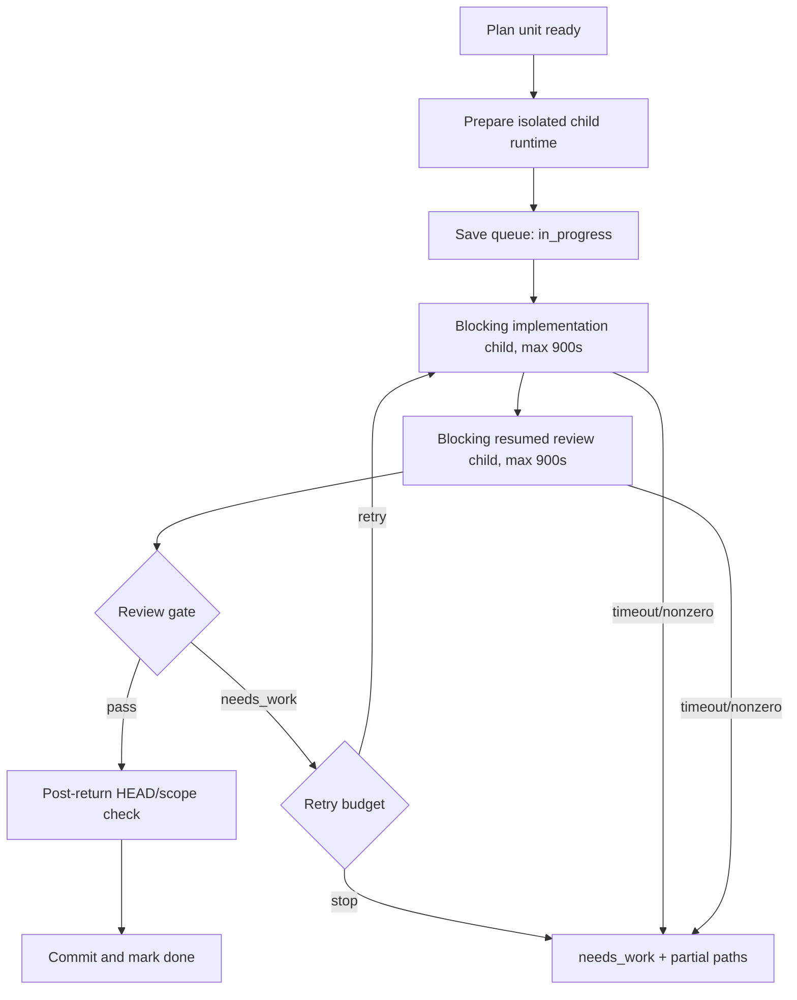

# Research — Implementation Commit Adaptive Execution

## Goal

Captionflow Issue #141에서 관측된 구현커밋/Codex Flow 지연을 실제 실행 기록과 현재 런타임 코드로 추적하고, 검증 강도를 낮추지 않으면서 불필요한 child 실행·중복 리뷰·무응답 대기·잘못된 repair·상태 오염을 제거할 구현 근거를 만든다.

조사 기준 HEAD는 `a2384f07ae61f3e7fc95fa5de93a4318a41f1d93`이다.

## Scope And Entry Points

조사 범위:

- `run-next` / `run-all`의 commit-unit 실행 경로
- child Codex implementation과 resumed review 실행
- post-unit `review-all-in-one` gate와 repair loop
- timeout, diagnostics, queue/log/handoff 상태
- execution worktree 및 `.codex-flow` 상태 위치
- Issue #141 실제 실행 시간선과 후행 PR/CI 구간
- repo mirror와 설치된 구현커밋 skill의 계약 정합성

주요 진입점:

```text
cli.py run-next/run-all
  -> runner.run_next()/run_all()
    -> runner.execute_unit()
      -> child runtime preparation + attestation
      -> CodexImplementerAgent.implement()
        -> run_codex_exec(implementation)
        -> run_codex_exec(resumed review)
      -> review gate parsing
      -> repair or commit
      -> queue/log/handoff update
```

## Relevant Files

- `codex_flow/cli.py`: 900초 기본 timeout과 기본 repair budget.
- `codex_flow/run_all.py`: unit 직렬 실행과 stop/finalize 흐름.
- `codex_flow/runner.py`: worktree 준비, child 실행, repair, HEAD/scope 확인, commit과 queue 전이.
- `codex_flow/implementer_agent.py`: 구현 child와 resumed review child의 한 attempt 직렬 구성.
- `codex_flow/reviewer_agent.py`: post-unit review evidence와 allowed-path 판정.
- `codex_flow/codex_cli.py`: Codex CLI argument, diagnostics와 timeout 처리.
- `codex_flow/git_ops.py`: `subprocess.run(..., capture_output=True)`와 HEAD/status/diff helpers.
- `codex_flow/state.py`: repo-local `.codex-flow` 상태 루트.
- `codex_flow/plans.py`: queue/log/handoff 작성.
- `codex_flow/plan_readiness.py`: log 기반 완료 판정과 next-unit 선택.
- `tests/test_codex_cli.py`: timeout/failure diagnostics 테스트.
- `tests/test_runner_brief.py`: review, repair, stash, timeout, 정상-return HEAD 이동 테스트.
- `tests/test_execution_worktree.py`: 별도 execution worktree와 cleanup guard 테스트.
- `README.md`, `skills/구현커밋/SKILL.md`: repo runtime 계약.
- `/Users/moonsoo/projects/codex-skills-user/구현커밋/SKILL.md`: 현재 설치된 사용자-facing 계약.
- `/Users/moonsoo/projects/codex-skills-user/review-all-in-one/SKILL.md`: 명시 호출·읽기 전용 review 계약.
- Issue #141 archived `queue.json`, `log.md`, `attempts/`: 실제 시각과 dangling attempt 근거.

## Current Behavior

### Confirmed facts

1. `run-next`와 `run-all`의 child timeout 기본값은 각각 900초다.
2. 한 attempt는 implementation child를 실행한 뒤 그 session을 resume하여 review child를 다시 실행한다. 두 호출에는 같은 timeout이 각각 적용된다.
3. child subprocess는 종료 또는 timeout 전까지 stdout/stderr를 `capture_output`으로 모으며, 실행 중 progress/heartbeat를 소비하거나 사용자에게 전달하는 경로가 없다.
4. 모든 executable unit의 review closure에 `review-all-in-one`이 강제로 들어가며 위험도·변경 종류에 따른 gate 차등이 없다.
5. 일반 `needs_work`는 기본적으로 retryable이며, repair는 review만 재개하지 않고 implementation과 review 전체를 새 session에서 다시 실행한다.
6. queue에는 `in_progress`와 갱신 시각만 있고 attempt lease, owner, heartbeat, expected HEAD, adoption 상태가 없다.
7. timeout/nonzero catch는 정상 종료 후 HEAD 검사보다 먼저 반환한다. child가 HEAD를 변경한 뒤 실패하면 정상-return HEAD guard가 실행되지 않는다.
8. stale `in_progress`는 `needs_work` repair context로 취급되지 않는다. 다음 auto-resolve에서 부분 변경이 unrelated dirty state로 stash될 수 있다.
9. queue JSON은 atomic temp-write/rename 또는 CAS가 아니라 직접 `write_text`로 갱신된다.
10. repo mirror `skills/구현커밋/SKILL.md`와 설치된 `/Users/moonsoo/projects/codex-skills-user/구현커밋/SKILL.md`가 현재 서로 다르다. repo mirror에는 managed child closure 계약이 있지만 설치본에는 더 오래된 child isolation 설명과 더 최신 task-worktree cleanup 설명이 혼재한다.

### Empirical Issue #141 timeline

| 구간 | 확인된 시간 | 성격 |
| --- | ---: | --- |
| route → queue done | 63분 46초 | 구현커밋 unit 실행 구간 |
| 완료된 implementation child | 30분 27초 | 실제 변경 작업 |
| 완료된 mandatory unit review | 12분 40초 | 구현커밋 제어/품질 gate |
| 출력 없는 Unit 2 retry windows | 4분 56초 | 확인된 비생산적 대기 |
| setup·unit 전환 간격 | 약 4분 05초 | 오케스트레이션 비용 |
| dangling Unit 3 review | 최대 약 11분 33초 | 미종료 review 및 수동 takeover 추정 |
| queue done → closeout merge | 54분 25초 | 독립 품질 수정, main sync, PR/CI/merge, closeout |
| route → closeout merge | 약 118분 11초 | 종료가 git timestamp라 전체값은 추론 |

구현커밋 제어 비용의 확인된 하한은 `21분 41초`이며 dangling Unit 3 review를 포함한 추정 상한은 `33분 14초`다. 약 118분 전체를 구현커밋 탓으로 돌릴 수 없지만 가장 큰 단일 구조적 병목인 것은 확인된다.

### Contract conflict

- 구현커밋은 모든 unit에 `review-all-in-one`을 자동 적용한다.
- review-all-in-one은 사용자 명시 호출 전용이며, review 중 자동 구현 재시작이나 파일 수정을 금지한다.
- 현재 generated review prompt는 같은 review pass에서 focused fix와 fresh verification까지 요구한다.
- 따라서 호출 조건, mutation authority, test ownership 세 계약이 충돌한다.

## Data Flow And Control Flow



문제의 causal chain:

1. implementation과 review가 각각 최대 900초인 직렬 child다.
2. capture-output 때문에 그 사이의 실제 진행과 stall을 구분할 수 없다.
3. 모든 unit이 동일한 full review를 받으며 대부분의 `needs_work`가 retryable이다.
4. repair는 실패 지점만 재실행하지 않고 implementation+review 전체를 반복한다.
5. 실패 경로는 정상-return HEAD 검사를 우회하고 transactional adoption을 하지 않는다.
6. stale `in_progress`, queue, log, handoff가 하나의 원자적 상태가 아니므로 수동 takeover 뒤 상태가 갈라진다.

## Existing Abstractions And Boundaries

보존하고 확장해야 할 기존 추상화:

- source repo와 분리된 disposable execution worktree
- child runtime preparation과 exact required-skill attestation
- attempt별 diagnostics directory
- 구조화된 `ReviewGate`와 `CommitUnitReview.retryable`
- allowed paths와 post-return HEAD guard
- partial changed paths와 repair context
- source drift gate
- non-force cleanup guard

새 구현은 이 경계를 우회하지 말고 supervisor, policy, ledger를 위에 결합해야 한다.

## Side Effects And Integration Points

- `run-next`, `run-all`, `open-pr/create-pr --auto-resolve`, merge auto-resolve가 같은 unit executor를 공유한다.
- timeout·review 정책 변경은 PR/merge finalize에도 그대로 전파된다.
- state root 변경은 dashboard, plan auto-discovery, handoff, archive/cleanup, legacy absolute plan path와 연결된다.
- review policy 변경은 child required-skill closure와 attestation hash를 바꾼다.
- repo mirror skill과 설치 skill이 동기화되지 않으면 실제 Codex routing은 새 runtime과 다른 계약으로 실행된다.
- evidence reuse는 repository의 exact-HEAD review/CI 정책을 약화하면 안 된다.

## Risk To Surrounding Systems

### Safety risks in the current system

- child가 commit 후 timeout/nonzero로 끝날 때 HEAD drift가 실패 catch에 가려질 수 있다.
- stale `in_progress`의 partial diff가 다음 auto-resolve에서 stash되어 원인 증거가 분리될 수 있다.
- queue direct write 도중 crash가 나면 state file이 부분 기록될 가능성이 있다.
- manual takeover가 code commit만 만들고 Flow review/adoption fields를 닫지 못할 수 있다.

### Risks of an over-aggressive optimization

- per-unit review를 전부 제거하면 high-risk auth/schema/native 변경의 early-stop gate가 사라진다.
- timeout만 짧게 만들면 정상적인 긴 테스트를 실패로 오판한다.
- state를 즉시 이동·삭제하면 legacy plan resume와 diagnostics 보존이 깨진다.
- evidence cache가 HEAD가 아니라 느슨한 command 문자열만 사용하면 stale green 결과를 재사용한다.

## Do Not Duplicate Or Bypass

- 별도 worktree manager를 새로 만들지 말고 `ExecutionWorktreeContext`와 cleanup guard를 재사용한다.
- review parser를 새로 중복하지 말고 `ReviewGate`를 위험도 정책에 맞게 일반화한다.
- diagnostics 파일 집합을 새로 만들지 말고 기존 attempt diagnostics에 `events.jsonl`, heartbeat, adoption metadata를 추가한다.
- `git status`, allowed path, HEAD helpers를 우회하지 않는다.
- child runtime attestation을 low-risk라는 이유로 제거하지 않는다. review skill closure만 정책에 따라 줄인다.
- final independent review와 repository CI는 evidence reuse 대상으로 약화하지 않는다.

## Open Questions

1. 새 state root의 장기 정본을 XDG/Codex state 아래에 둘지 Git common dir 아래에 둘지 구현 전 결정해야 한다. 추천 기본값은 `~/.codex/state/codex-flow/<repo-hash>/`이며 legacy repo-local state는 read/migrate-only로 유지한다.
2. low-risk path가 첫 릴리스에서 child implementation을 유지할지 parent-direct adoption까지 포함할지 결정해야 한다. 추천은 먼저 child implementation + lightweight unit gate로 안전하게 줄이고, transactional adoption이 검증된 뒤 parent-direct를 별도 opt-in으로 연다.
3. process activity를 무엇으로 stall oracle로 볼지 정해야 한다. child JSON event 부재만으로 즉시 kill하지 말고 supervisor heartbeat와 hard deadline을 분리해야 한다.

모두 안전한 기본값으로 계획에 잠글 수 있어 현재 Operator blocking question은 없다.

## Solution Options

### Option A — 기존 strict flow를 유지하고 heartbeat만 추가

- operating principle: 검증 구조를 건드리지 않고 진행 가시성만 개선한다.
- supporting evidence: blind wait는 해결하지만 mandatory review와 full repair 반복은 유지된다.
- fit conditions: 즉시 운영 불안을 줄이는 임시 mitigation.
- failure modes: confirmed control overhead 21~33분과 contract conflict, HEAD failure-path gap이 남는다.
- implementation implication: 작은 변경이지만 root-cause fit이 부족하다.
- adoption: `Reject as final`; supervisor의 일부만 채택.

### Option B — 구현커밋 child/review를 제거하고 메인 에이전트가 직접 구현

- operating principle: nested child와 duplicated context 비용을 제거한다.
- supporting evidence: child implementation 30분 27초와 review 제어비용을 크게 줄일 수 있다.
- fit conditions: 작고 되돌리기 쉬운 docs-only 작업.
- failure modes: child attestation, repeatable unit boundary, independent review, unattended run-all을 잃는다.
- implementation implication: transactional adoption API 없이 바로 적용하면 안전 경계를 우회한다.
- adoption: `Reject as default`; 후속 opt-in 실험 후보.

### Option C — Adaptive transactional supervisor

- operating principle: 위험도에 따라 unit gate를 차등 적용하되 모든 attempt를 streaming supervisor와 atomic ledger로 감싼다.
- supporting evidence: current safety abstractions을 재사용하면서 confirmed bottleneck과 failure-path gaps를 직접 겨냥한다.
- fit conditions: docs/contract/high-risk 작업을 하나의 runtime에서 다뤄야 할 때.
- failure modes: policy classification이 약하면 위험한 unit을 low로 내릴 수 있고, state migration이 legacy resume를 깨뜨릴 수 있다.
- implementation implication:
  - 안전한 lower-bound risk classifier와 default `standard`
  - low/standard의 lightweight unit gate, high의 full post-unit review
  - final cumulative `review-all-in-one` 유지
  - streaming event/heartbeat와 typed failure taxonomy
  - duplicate failure fingerprint 차단
  - expected-HEAD CAS adoption과 atomic state
  - legacy state read/migrate compatibility
- adoption: `Adopt`.

### Option D — 모든 unit을 strict하게 유지하되 하나의 persistent child session으로 묶기

- operating principle: 같은 plan의 context reload만 줄인다.
- supporting evidence: unit마다 새 child context를 만드는 비용은 줄일 수 있다.
- fit conditions: 같은 영역의 연속 unit.
- failure modes: scope bleed, stale assumptions, review contract conflict와 failure-path gap이 남는다.
- implementation implication: session ownership과 reset policy가 추가되지만 근본 해결 범위는 좁다.
- adoption: `Watch`; Option C의 후속 최적화로만 검토.

## Plan Implications

계획은 아래 순서여야 한다.

1. 먼저 typed execution policy와 failure taxonomy를 추가하고 default를 fail-safe `standard`로 둔다.
2. failure path에서도 expected HEAD와 process cleanup을 반드시 검사하도록 attempt supervisor를 만든다.
3. low/standard unit에서 `review-all-in-one` 자동 호출을 제거하고 machine-checkable unit gate로 대체하되 high-risk와 final cumulative review는 유지한다.
4. 같은 failure fingerprint와 scope mismatch는 재시도하지 않는다.
5. queue/log/handoff를 atomic attempt ledger에서 파생하고 manual takeover를 CAS adoption으로 닫는다.
6. 새 plan부터 state를 repo 밖에 두고 legacy `.codex-flow`는 보존·마이그레이션한다.
7. exact evidence key가 같은 focused verification만 재사용하고 final review/CI는 재사용하지 않는다.
8. repo mirror를 source of truth로 정하고 설치 skill drift를 검출·동기화하는 별도 phase를 둔다.

## Source Evaluation

- 외부 웹·커뮤니티 근거는 채택하지 않았다.
- 이유: 문제의 원인과 해결 표면이 현재 로컬 runtime 코드, 테스트, 실제 attempt 기록으로 충분히 닫혔다.
- evidence bar: `threshold intentionally narrowed`. 10-platform/20-evidence 조사는 이 로컬 오케스트레이터의 제어 흐름을 판단하는 데 불필요하며 오히려 구현 범위를 넓힌다.
- adoption basis: repository code `High`, empirical Issue #141 logs `High` for confirmed sub-intervals, full 118분 attribution `Medium` because 종료는 git timestamp 하나다.

## Evidence

### Repository evidence

- `/Users/moonsoo/projects/codex-flow/codex_flow/cli.py:82-108`
- `/Users/moonsoo/projects/codex-flow/codex_flow/implementer_agent.py:94-137`
- `/Users/moonsoo/projects/codex-flow/codex_flow/implementer_agent.py:197-218`
- `/Users/moonsoo/projects/codex-flow/codex_flow/git_ops.py:46-63`
- `/Users/moonsoo/projects/codex-flow/codex_flow/codex_cli.py:964-1072`
- `/Users/moonsoo/projects/codex-flow/codex_flow/runner.py:267-430`
- `/Users/moonsoo/projects/codex-flow/codex_flow/runner.py:503-552`
- `/Users/moonsoo/projects/codex-flow/codex_flow/plan_readiness.py:136`
- `/Users/moonsoo/projects/codex-flow/codex_flow/plans.py:404`
- `/Users/moonsoo/projects/codex-flow/codex_flow/plans.py:817`
- `/Users/moonsoo/projects/codex-flow/tests/test_runner_brief.py:582`
- `/Users/moonsoo/projects/codex-flow/tests/test_runner_brief.py:917`
- `/Users/moonsoo/projects/codex-flow/skills/구현커밋/SKILL.md`
- `/Users/moonsoo/projects/codex-skills-user/구현커밋/SKILL.md`
- `/Users/moonsoo/projects/codex-skills-user/review-all-in-one/SKILL.md`

### Empirical evidence

- `/Users/moonsoo/projects/크로니카/archives/chronika-platform-codex-flow/2026-07-20-branch-cleanup/issue-141-pr142/plans/implementation-plan-captionflow-team-ai-pilot-onboarding/queue.json`
- `/Users/moonsoo/projects/크로니카/archives/chronika-platform-codex-flow/2026-07-20-branch-cleanup/issue-141-pr142/plans/implementation-plan-captionflow-team-ai-pilot-onboarding/log.md`
- `/Users/moonsoo/projects/크로니카/archives/chronika-platform-codex-flow/2026-07-20-branch-cleanup/issue-141-pr142/plans/implementation-plan-captionflow-team-ai-pilot-onboarding/attempts/`
- Git commits: `72b1b8b`, `73e03ec`, `0bb1596`, `5328248`, `627525f`, `afbda65`, `e158216`, `4363ba7`

### Commands used

- `rg -n "timeout|repair_attempts|review-all-in-one|subprocess|heartbeat|progress" codex_flow tests`
- `git log --all --date=iso-strict --pretty=...`
- `jq` inspection of archived `queue.json` and attempt metadata
- targeted local Biome check of generated `.codex-flow` JSON: formatting failure confirmed without writes
- `diff -u skills/구현커밋/SKILL.md /Users/moonsoo/projects/codex-skills-user/구현커밋/SKILL.md`: installed-skill drift confirmed

## Research Brief

- Confirmed: 구현커밋의 직접 제어비용은 최소 21분 41초이며, 모든 unit에 full review를 강제하고 repair가 implementation+review 전체를 반복하는 구조가 핵심이다.
- Repeated observation: Issue #141에서 무출력 attempt, dangling review, 수동 takeover 후 queue 불일치가 함께 발생했다.
- Inference: 현재 failure path는 child가 HEAD를 바꾼 뒤 실패할 경우 정상-return HEAD guard를 우회할 수 있다.
- Recommendation: Option C, adaptive transactional supervisor를 구현한다.
- Open question: state root와 parent-direct opt-in은 계획의 안전한 기본값으로 잠그고, 첫 구현에서는 parent-direct를 열지 않는다.
- Insufficient evidence: child process descendant 전체 종료의 macOS/Linux 차이는 구현 시 fake process-tree test와 실제 subprocess smoke로 확인해야 한다.

## Commit 4 Blocker Research Addendum — 2026-07-20

### Goal

Commit 4 독립 검토에서 확인된 세 blocker를 해결할 구조를 정한다. 대상은 fresh cumulative final-gate evidence의 생산 부재, 실행 profile dispatcher 미배선, direct `open-pr` 우회다. 이번 조사는 구현을 재개하지 않고 plan을 다시 잠그기 위한 `Pre-Plan Research Gate`다.

### Scope And Entry Points

```text
runner.execute_unit
  -> CodexImplementerAgent.implement
     -> writable implementation
     -> writable resumed review

RunAllRunner / CLI / pr / MergeRunner
  -> readiness 확인
  -> final-gate consumer 일부
  -> PR 또는 merge side effect
```

읽은 파일: `codex_flow/final_gate.py`, `execution_policy.py`, `implementer_agent.py`, `reviewer_agent.py`, `runner.py`, `run_all.py`, `cli.py`, `pr.py`, `merge.py`, `tests/test_final_gate.py`, `tests/test_runner_brief.py`, `skills/구현커밋/SKILL.md`.

### Confirmed Current Behavior

1. `FinalGateRecord` reader/writer와 exact-HEAD validator는 존재하지만 fresh cumulative review와 trusted verification을 실행해 record를 만드는 runtime owner가 없다.
2. `select_mode()`는 호출자가 없으며 모든 unit은 여전히 writable implementation 뒤 writable resumed review를 실행한다.
3. `run-all`과 일부 PR/merge wrapper에는 feature-flagged consumer check가 추가됐지만 `MergeRunner` 직접 호출과 direct `open-pr` dry-run을 포함한 모든 공개 effect 경계가 하나의 guard를 공유하지 않는다.
4. feature flag를 켜면 producer가 없어서 finalize가 항상 fail-closed 되고, 끄면 기존 per-unit full review 구조가 그대로 남는다.
5. 현재 review prompt는 같은 session에서 파일을 고칠 수 있어 `high_risk read-only reviewer`와 `final cumulative read-only review`의 비변경 계약을 충족하지 않는다.

### Existing Abstractions And Boundaries

- 재사용: lowering-safe `ExecutionPolicy`, typed `VerificationSpec`, `AttemptLedger`, exact-HEAD helpers, isolated child runtime/attestation.
- 분리 필요: writable implementer, read-only unit reviewer, fresh cumulative final reviewer, finalize authorization.
- 우회 금지: `RunAllRunner`, `pr.create_remote_pr`, `pr.merge_plan`, `MergeRunner.merge_local/merge_remote`, CLI `open-pr/create-pr/merge`가 서로 다른 gate logic을 가지면 안 된다.
- 명시 호출형 `review-all-in-one`은 generic runtime 내부 엔진 이름으로 재사용하지 않는다.

### Solution Options

#### Option A — Central Adaptive Coordinator

- operating principle: 하나의 coordinator가 profile 선택, 실행/lease, unit gate, fresh final review/verification, exact-HEAD gate write, finalize authorization을 소유한다.
- supporting evidence: 현재 blocker는 producer/consumer와 profile ownership이 서로 다른 모듈에 흩어진 데서 발생했다.
- fit conditions: 장기적으로 bypass-free state machine을 우선할 때.
- failure modes: coordinator가 비대해지거나 내부 strategy가 분리되지 않으면 새 결합점이 된다.
- implementation implication: unit strategy와 final review runner는 별도 객체로 두고 coordinator는 순서와 invariant만 소유한다.
- adoption: `Adopt`.

#### Option B — Existing Runner Incremental Retrofit

- operating principle: 현재 `runner.execute_unit`에 profile별 분기를 넣고 `run-all` 뒤 `generate_adaptive_final_gate()`를 추가한다.
- supporting evidence: 기존 classifier, ledger, verification spec을 가장 적은 변경으로 재사용할 수 있다.
- fit conditions: Commit 4 변경량을 최소화해야 할 때.
- failure modes: runner/agent/PR/merge에 분기가 중복되어 direct library call bypass가 다시 생길 수 있다.
- implementation implication: 모든 effectful entry point가 하나의 lowest-level guard를 공유한다는 별도 테스트가 필수다.
- adoption: `Pilot only`; 최종 구조로는 채택하지 않는다.

#### Option C — Explicit Two-Phase `final-gate` CLI

- operating principle: `codex-flow final-gate --plan ...`이 evidence만 만들고 finalize 명령은 소비만 한다.
- supporting evidence: exact-HEAD freshness와 side effect를 가장 쉽게 분리한다.
- fit conditions: operator-visible 수동/자동화 단계를 허용할 때.
- failure modes: unattended flow가 추가 명령 없이 멈추고, library caller guard가 없으면 우회된다.
- implementation implication: `--auto-final-gate`와 lowest-level finalize guard가 함께 필요하다.
- adoption: `Fallback`; 자동 coordinator가 실패할 때 진단·수동 재실행 경로로 보존한다.

### Recommendation And Plan Implications

Option A를 채택하되 한 번의 큰 Commit 4로 구현하지 않는다. 다음 네 원자 단위로 분해한다.

1. `Commit 4A`: writable implementer와 read-only reviewer/final reviewer 계약 분리.
2. `Commit 4B`: profile strategy dispatcher와 docs lease/contract verification/high-risk review 연결.
3. `Commit 4C`: fresh cumulative review+verification producer와 exact-HEAD atomic gate write.
4. `Commit 4D`: 모든 public finalize path를 하나의 `FinalizeGuard`에 수렴하고 bypass matrix 테스트 후 feature flag canary.

Commit 5는 4D가 통과하기 전 시작하지 않는다. 이미 생성된 `69d7df0`과 `5d0df36`은 partial historical implementation으로 취급하며 완료 증거로 사용하지 않는다.

### Source Evaluation

- 외부 웹 자료는 사용하지 않았다.
- `threshold intentionally narrowed`: 문제는 특정 외부 API semantics가 아니라 로컬 control-flow와 ownership 불일치이며, 현재 코드·테스트·독립 review evidence가 causal chain을 직접 증명한다.
- codebase evidence `High`; 현재 52-test focused pass는 helper 회귀 방지 근거일 뿐 Commit 4 acceptance evidence로는 `Insufficient`.

### Evidence

- commits: `69d7df0`, `5d0df36`
- focused verification: `52 passed in 5.54s`
- independent review: `REVIEW_GATE status="needs_work" blockers=3 important=1`
- blocker paths: `codex_flow/final_gate.py`, `implementer_agent.py`, `run_all.py`, `cli.py`, `pr.py`, `merge.py`

### Review And Strategy Gate Outcome

- implementation-before `review-all-in-one`의 첫 판정은 `보완 후 진행`이었다. producer-before-consumer, lowest-level guard와 reviewer separation은 맞았지만 profile/spec와 final evidence의 binding, rollback state transition, executable oracle, diagnostic schema가 부족했다.
- `해결전략검토` 판정은 `조건부 적절` (`High` confidence)이다. 가장 강한 반론은 중앙 coordinator가 기존 runner/ledger state machine을 복제하는 God object가 될 위험이다.
- 반론을 수용해 coordinator는 sequencing/invariant만 소유하고 `UnitExecutionStrategy`, `TrustedVerifier`, `ReadOnlyReviewer`, `FinalGateProducer`를 분리한다. terminal ledger의 profile/spec/policy/registry/activation snapshot을 hash로 final record와 consumer에 묶는다.
- rollout은 `strict → shadow → canary → default`의 CAS activation state와 epoch로 관리한다. canary safety downgrade는 진행 중 effect를 epoch mismatch로 차단하고 evidence를 삭제하지 않는다. default 이후에는 silent flag rollback을 금지한다.
- approval oracle은 profile matrix, reviewer non-mutation, producer drift/failure/shadow parity, 모든 public finalize direct-call bypass, rollback epoch race, event schema/ordering/idempotency다.
- what would change the verdict to `적절`: 4A~4D 구현이 각 focused oracle을 통과하고, shadow parity 100%, direct bypass 0, reviewer mutation 0, silent rollback 0을 fresh exact-HEAD evidence로 증명하는 것.

## Commit 4A Implementation Research Revalidation — 2026-07-20

### Mode And Scope

- selected mode: `Pre-Plan Research Gate`
- evidence lanes: local codebase, tests, existing plan/research; 외부 runtime semantics가 판단을 바꾸지 않으므로 웹 조사는 생략했다.
- source request: `docs/request-refiner-artifacts/2026-07-20-212409-commit-4a-refined-request.md`
- scope: reviewer contract separation only. Commit 4B profile dispatcher, 4C final producer, 4D finalize guard는 제외한다.

### Confirmed Call Path

```text
runner.run_next
  -> CodexImplementerAgent.implement
     -> run_codex_exec(... sandbox="workspace-write")
     -> parse implementation session id
     -> run_codex_exec(... resume_session_id=<implementation>, sandbox="workspace-write")
     -> parse REVIEW_GATE + COMMIT_UNIT terminal
  -> runner validates review and may retry implementer
```

- `codex_flow/implementer_agent.py`: 구현자 하나가 구현과 리뷰를 모두 소유하고, 리뷰는 동일 session resume다.
- `codex_flow/codex_cli.py`: resume 경로는 새 `--sandbox` argument를 구성하지 않으므로 현재 `sandbox="workspace-write"` 인자는 fresh review isolation을 증명하지 못한다.
- `codex_flow/runner.py`: `agent_result.review`에 결합돼 있어 runner가 별도 reviewer를 호출하는 seam이 없다.
- `codex_flow/reviewer_agent.py`: 현재는 gate 후처리 helper만 있고 reviewer protocol/runtime은 없다.
- `codex_flow/git_ops.py`: `scoped_diff_digest(repo, [])`는 tracked diff와 untracked file bytes를 함께 hash하므로 reviewer 전후 비변경 oracle로 재사용할 수 있다.
- integration fakes in `tests/test_runner_brief.py`, `tests/test_execution_worktree.py`, `tests/test_runner_repair_edges.py`, `tests/test_child_attestation.py`는 `"resume" in args`를 review 신호로 사용해 4A 계약에 맞춘 prompt-based fresh-review fixture migration이 필요하다.

### Architectural Boundaries To Preserve

- attempt ledger와 repair retry 소유권은 runner에 남긴다. reviewer가 repair를 직접 수행하지 않는다.
- child runtime attestation과 prepared `CODEX_HOME`은 재사용할 수 있지만 구현 session id는 재사용하지 않는다.
- implementation failure와 review process failure는 phase가 다르게 기록돼야 한다.
- current plan/queue review payload shape와 commit title/summary 소비 계약은 유지한다.
- generic runtime은 명시 호출형 `review-all-in-one` skill을 내부 리뷰 엔진으로 자동 호출하지 않는다. 내부 machine line은 `INTERNAL_REVIEW_GATE`로 분리한다.

### Solution Options

#### Option A — Implementer-internal reviewer wrapper

- change: `CodexImplementerAgent` 내부에서 fresh read-only review call로만 교체하고 기존 combined result를 유지한다.
- benefit: runner 변경이 가장 작다.
- weakness: 구현자가 여전히 리뷰 lifecycle을 소유해 interface separation과 향후 profile strategy 연결이 불명확하다.
- adoption: Reject for final 4A; temporary compatibility 이상의 가치가 없다.

#### Option B — Runner-owned separate ReviewerAgent

- change: implementer는 writable implementation result만 반환하고, runner가 `CodexReadOnlyReviewer.review()`를 별도 fresh session으로 호출한다.
- benefit: implementation/review 권한과 failure phase가 분리되고 repair는 기존 runner loop에 남는다.
- risk: runner result plumbing과 test fakes를 함께 갱신해야 한다.
- adoption: Adopt. root cause를 직접 해결하면서 Commit 4B의 coordinator가 재사용할 seam을 만든다.

#### Option C — External post-unit review command

- change: unit implementation 종료 뒤 별도 CLI command가 review artifact를 만든다.
- benefit: 가장 강한 process separation.
- weakness: 현재 attempt transaction과 automatic repair loop가 둘로 갈라지고 4C producer 역할과 중복될 수 있다.
- adoption: Defer; explicit diagnostic fallback에는 적합하지만 4A runtime 기본값에는 과하다.

### Recommended 4A Contract

1. `ImplementerAgentResult`는 implementation session/message만 소유한다.
2. 새 `ReviewerAgent` protocol과 `CodexReadOnlyReviewer`는 fresh `run_codex_exec`을 `sandbox="read-only"`, `resume_session_id=None`, `phase="review"`로 호출한다.
3. reviewer prompt는 수정·repair·commit을 금지하고 `INTERNAL_REVIEW_GATE`와 단일 `COMMIT_UNIT_*` terminal만 반환한다.
4. review 호출 전후 `head_summary`와 full `scoped_diff_digest(repo, [])`를 비교한다. mismatch는 non-retryable `needs_work`다.
5. runner는 implementation과 review exception phase를 구분하고, review finding만 기존 bounded repair loop로 되돌린다.
6. generic child required-skill closure에서 자동 `review-all-in-one` 추가를 제거한다. 현재 사용자 요청의 pre/post `review-all-in-one`은 parent workflow evidence로만 수행한다.

### Evidence Quality And Open Questions

- evidence strength: `High`; local call path, CLI argv construction, reusable digest helper, existing integration fixtures가 서로 일치한다.
- no blocking open question. fresh review fake migration 범위는 repository tests로 확인 가능하다.
- implementation stop: fresh review가 resume를 사용하거나 write mutation을 탐지하고도 ready가 되거나, existing repair/commit result payload가 깨지면 4B로 진행하지 않는다.

## Commit 4A Fast Closeout Research Addendum — 2026-07-20

### Mode And Scope

- selected mode: `Pre-Plan Research Gate`
- source request: `docs/request-refiner-artifacts/2026-07-20-220616-commit-4a-fast-closeout-refined-request.md`
- lanes: current dirty diff, focused test behavior, independent implementation review.
- external research: omitted because the observed failures are local ownership/protocol bugs and external evidence would not change the choice.

### Confirmed Facts

1. The core separation works in the candidate: implementation and review are now different calls, the reviewer uses `sandbox="read-only"`, and no resume id is passed.
2. The candidate grew to nine files with `+848/-313`; most test churn is fixture migration, but runner failure bookkeeping is duplicated.
3. The first candidate digest treated Codex Flow's own diagnostics as reviewer mutation. The attempted fix excluded all `.codex-flow/`, which is unsafe because plan, queue, and handoff can also be legitimate candidate/control files.
4. `require_internal_review()` currently validates gate shape only for `ready`; malformed or missing gates on `needs_work` can remain ordinary retryable findings.
5. exception-shaped review failure is correctly held as `phase=review` with zero commit and evidence, but result-shaped protocol failures are still recorded as `REVIEW_FINDING`.

### Options

#### Option A — Discard and rewrite the 4A diff

- benefit: smallest-looking final diff may be possible.
- cost: repeats already completed session separation, artifact wiring, and fake migration; highest time risk.
- adoption: reject.

#### Option B — Keep the blanket `.codex-flow/` exclusion and only fix gate parsing

- benefit: fastest patch.
- cost: reviewer mutation of plan/queue/handoff can escape the invariant; violates the accepted security contract.
- adoption: reject.

#### Option C — Preserve the core diff and apply three bounded simplifications

- change: exclude only the exact runner-owned diagnostic/ledger paths during the review window; validate exactly one complete internal gate for every terminal result; carry an explicit protocol-vs-finding classification into runner bookkeeping. Consolidate duplicate failure serialization only where behavior remains identical.
- benefit: reuses completed work, directly fixes both Important findings, and avoids new architecture.
- cost: one additional helper contract and targeted tests.
- adoption: adopt.

### Recommendation

Finish 4A as one code commit using Option C. Do not create 4A-1/4A-2 units. Do not add an event system or move all state in this unit. Reviewer evidence should store session relationship/hash rather than unnecessary raw session identifiers. Run tests in batches only after the bounded patch is complete, repair concrete failures, then run one independent final review.

### Evidence Quality

- local code/diff: `High`
- focused empirical behavior: `High`
- independent review: `High`, blocker 0 / Important 2 before repair
- open question: none; the exact runner-owned paths are available from `diagnostic_dir` and `attempt_ledger_path` at call time.
