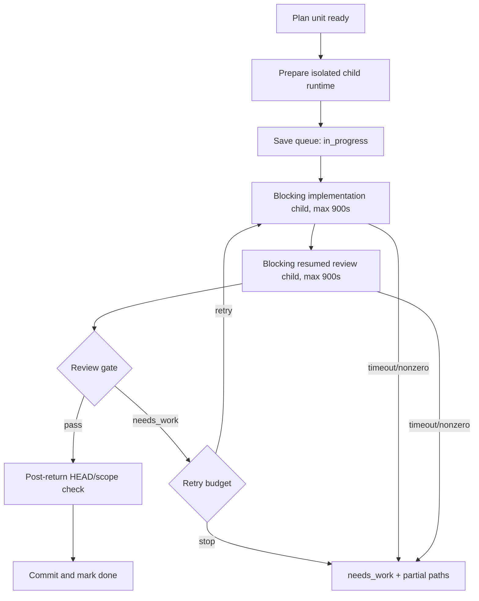

# Research — Implementation Commit Adaptive Execution

## Goal

Captionflow Issue #141에서 관측된 구현커밋/Codex Flow 지연을 실제 실행 기록과 현재 런타임 코드로 추적하고, 검증 강도를 낮추지 않으면서 불필요한 child 실행·중복 리뷰·무응답 대기·잘못된 repair·상태 오염을 제거할 구현 근거를 만든다.

조사 기준 HEAD는 `a2384f07ae61f3e7fc95fa5de93a4318a41f1d93`이다.

## Scope And Entry Points

조사 범위:

- `run-next` / `run-all`의 commit-unit 실행 경로
- child Codex implementation과 resumed review 실행
- post-unit `review-all-in-one` gate와 repair loop
- timeout, diagnostics, queue/log/handoff 상태
- execution worktree 및 `.codex-flow` 상태 위치
- Issue #141 실제 실행 시간선과 후행 PR/CI 구간
- repo mirror와 설치된 구현커밋 skill의 계약 정합성

주요 진입점:

```text
cli.py run-next/run-all
  -> runner.run_next()/run_all()
    -> runner.execute_unit()
      -> child runtime preparation + attestation
      -> CodexImplementerAgent.implement()
        -> run_codex_exec(implementation)
        -> run_codex_exec(resumed review)
      -> review gate parsing
      -> repair or commit
      -> queue/log/handoff update
```

## Relevant Files

- `codex_flow/cli.py`: 900초 기본 timeout과 기본 repair budget.
- `codex_flow/run_all.py`: unit 직렬 실행과 stop/finalize 흐름.
- `codex_flow/runner.py`: worktree 준비, child 실행, repair, HEAD/scope 확인, commit과 queue 전이.
- `codex_flow/implementer_agent.py`: 구현 child와 resumed review child의 한 attempt 직렬 구성.
- `codex_flow/reviewer_agent.py`: post-unit review evidence와 allowed-path 판정.
- `codex_flow/codex_cli.py`: Codex CLI argument, diagnostics와 timeout 처리.
- `codex_flow/git_ops.py`: `subprocess.run(..., capture_output=True)`와 HEAD/status/diff helpers.
- `codex_flow/state.py`: repo-local `.codex-flow` 상태 루트.
- `codex_flow/plans.py`: queue/log/handoff 작성.
- `codex_flow/plan_readiness.py`: log 기반 완료 판정과 next-unit 선택.
- `tests/test_codex_cli.py`: timeout/failure diagnostics 테스트.
- `tests/test_runner_brief.py`: review, repair, stash, timeout, 정상-return HEAD 이동 테스트.
- `tests/test_execution_worktree.py`: 별도 execution worktree와 cleanup guard 테스트.
- `README.md`, `skills/구현커밋/SKILL.md`: repo runtime 계약.
- `/Users/moonsoo/projects/codex-skills-user/구현커밋/SKILL.md`: 현재 설치된 사용자-facing 계약.
- `/Users/moonsoo/projects/codex-skills-user/review-all-in-one/SKILL.md`: 명시 호출·읽기 전용 review 계약.
- Issue #141 archived `queue.json`, `log.md`, `attempts/`: 실제 시각과 dangling attempt 근거.

## Current Behavior

### Confirmed facts

1. `run-next`와 `run-all`의 child timeout 기본값은 각각 900초다.
2. 한 attempt는 implementation child를 실행한 뒤 그 session을 resume하여 review child를 다시 실행한다. 두 호출에는 같은 timeout이 각각 적용된다.
3. child subprocess는 종료 또는 timeout 전까지 stdout/stderr를 `capture_output`으로 모으며, 실행 중 progress/heartbeat를 소비하거나 사용자에게 전달하는 경로가 없다.
4. 모든 executable unit의 review closure에 `review-all-in-one`이 강제로 들어가며 위험도·변경 종류에 따른 gate 차등이 없다.
5. 일반 `needs_work`는 기본적으로 retryable이며, repair는 review만 재개하지 않고 implementation과 review 전체를 새 session에서 다시 실행한다.
6. queue에는 `in_progress`와 갱신 시각만 있고 attempt lease, owner, heartbeat, expected HEAD, adoption 상태가 없다.
7. timeout/nonzero catch는 정상 종료 후 HEAD 검사보다 먼저 반환한다. child가 HEAD를 변경한 뒤 실패하면 정상-return HEAD guard가 실행되지 않는다.
8. stale `in_progress`는 `needs_work` repair context로 취급되지 않는다. 다음 auto-resolve에서 부분 변경이 unrelated dirty state로 stash될 수 있다.
9. queue JSON은 atomic temp-write/rename 또는 CAS가 아니라 직접 `write_text`로 갱신된다.
10. repo mirror `skills/구현커밋/SKILL.md`와 설치된 `/Users/moonsoo/projects/codex-skills-user/구현커밋/SKILL.md`가 현재 서로 다르다. repo mirror에는 managed child closure 계약이 있지만 설치본에는 더 오래된 child isolation 설명과 더 최신 task-worktree cleanup 설명이 혼재한다.

### Empirical Issue #141 timeline

| 구간 | 확인된 시간 | 성격 |
| --- | ---: | --- |
| route → queue done | 63분 46초 | 구현커밋 unit 실행 구간 |
| 완료된 implementation child | 30분 27초 | 실제 변경 작업 |
| 완료된 mandatory unit review | 12분 40초 | 구현커밋 제어/품질 gate |
| 출력 없는 Unit 2 retry windows | 4분 56초 | 확인된 비생산적 대기 |
| setup·unit 전환 간격 | 약 4분 05초 | 오케스트레이션 비용 |
| dangling Unit 3 review | 최대 약 11분 33초 | 미종료 review 및 수동 takeover 추정 |
| queue done → closeout merge | 54분 25초 | 독립 품질 수정, main sync, PR/CI/merge, closeout |
| route → closeout merge | 약 118분 11초 | 종료가 git timestamp라 전체값은 추론 |

구현커밋 제어 비용의 확인된 하한은 `21분 41초`이며 dangling Unit 3 review를 포함한 추정 상한은 `33분 14초`다. 약 118분 전체를 구현커밋 탓으로 돌릴 수 없지만 가장 큰 단일 구조적 병목인 것은 확인된다.

### Contract conflict

- 구현커밋은 모든 unit에 `review-all-in-one`을 자동 적용한다.
- review-all-in-one은 사용자 명시 호출 전용이며, review 중 자동 구현 재시작이나 파일 수정을 금지한다.
- 현재 generated review prompt는 같은 review pass에서 focused fix와 fresh verification까지 요구한다.
- 따라서 호출 조건, mutation authority, test ownership 세 계약이 충돌한다.

## Data Flow And Control Flow



문제의 causal chain:

1. implementation과 review가 각각 최대 900초인 직렬 child다.
2. capture-output 때문에 그 사이의 실제 진행과 stall을 구분할 수 없다.
3. 모든 unit이 동일한 full review를 받으며 대부분의 `needs_work`가 retryable이다.
4. repair는 실패 지점만 재실행하지 않고 implementation+review 전체를 반복한다.
5. 실패 경로는 정상-return HEAD 검사를 우회하고 transactional adoption을 하지 않는다.
6. stale `in_progress`, queue, log, handoff가 하나의 원자적 상태가 아니므로 수동 takeover 뒤 상태가 갈라진다.

## Existing Abstractions And Boundaries

보존하고 확장해야 할 기존 추상화:

- source repo와 분리된 disposable execution worktree
- child runtime preparation과 exact required-skill attestation
- attempt별 diagnostics directory
- 구조화된 `ReviewGate`와 `CommitUnitReview.retryable`
- allowed paths와 post-return HEAD guard
- partial changed paths와 repair context
- source drift gate
- non-force cleanup guard

새 구현은 이 경계를 우회하지 말고 supervisor, policy, ledger를 위에 결합해야 한다.

## Side Effects And Integration Points

- `run-next`, `run-all`, `open-pr/create-pr --auto-resolve`, merge auto-resolve가 같은 unit executor를 공유한다.
- timeout·review 정책 변경은 PR/merge finalize에도 그대로 전파된다.
- state root 변경은 dashboard, plan auto-discovery, handoff, archive/cleanup, legacy absolute plan path와 연결된다.
- review policy 변경은 child required-skill closure와 attestation hash를 바꾼다.
- repo mirror skill과 설치 skill이 동기화되지 않으면 실제 Codex routing은 새 runtime과 다른 계약으로 실행된다.
- evidence reuse는 repository의 exact-HEAD review/CI 정책을 약화하면 안 된다.

## Risk To Surrounding Systems

### Safety risks in the current system

- child가 commit 후 timeout/nonzero로 끝날 때 HEAD drift가 실패 catch에 가려질 수 있다.
- stale `in_progress`의 partial diff가 다음 auto-resolve에서 stash되어 원인 증거가 분리될 수 있다.
- queue direct write 도중 crash가 나면 state file이 부분 기록될 가능성이 있다.
- manual takeover가 code commit만 만들고 Flow review/adoption fields를 닫지 못할 수 있다.

### Risks of an over-aggressive optimization

- per-unit review를 전부 제거하면 high-risk auth/schema/native 변경의 early-stop gate가 사라진다.
- timeout만 짧게 만들면 정상적인 긴 테스트를 실패로 오판한다.
- state를 즉시 이동·삭제하면 legacy plan resume와 diagnostics 보존이 깨진다.
- evidence cache가 HEAD가 아니라 느슨한 command 문자열만 사용하면 stale green 결과를 재사용한다.

## Do Not Duplicate Or Bypass

- 별도 worktree manager를 새로 만들지 말고 `ExecutionWorktreeContext`와 cleanup guard를 재사용한다.
- review parser를 새로 중복하지 말고 `ReviewGate`를 위험도 정책에 맞게 일반화한다.
- diagnostics 파일 집합을 새로 만들지 말고 기존 attempt diagnostics에 `events.jsonl`, heartbeat, adoption metadata를 추가한다.
- `git status`, allowed path, HEAD helpers를 우회하지 않는다.
- child runtime attestation을 low-risk라는 이유로 제거하지 않는다. review skill closure만 정책에 따라 줄인다.
- final independent review와 repository CI는 evidence reuse 대상으로 약화하지 않는다.

## Open Questions

1. 새 state root의 장기 정본을 XDG/Codex state 아래에 둘지 Git common dir 아래에 둘지 구현 전 결정해야 한다. 추천 기본값은 `~/.codex/state/codex-flow/<repo-hash>/`이며 legacy repo-local state는 read/migrate-only로 유지한다.
2. low-risk path가 첫 릴리스에서 child implementation을 유지할지 parent-direct adoption까지 포함할지 결정해야 한다. 추천은 먼저 child implementation + lightweight unit gate로 안전하게 줄이고, transactional adoption이 검증된 뒤 parent-direct를 별도 opt-in으로 연다.
3. process activity를 무엇으로 stall oracle로 볼지 정해야 한다. child JSON event 부재만으로 즉시 kill하지 말고 supervisor heartbeat와 hard deadline을 분리해야 한다.

모두 안전한 기본값으로 계획에 잠글 수 있어 현재 Operator blocking question은 없다.

## Solution Options

### Option A — 기존 strict flow를 유지하고 heartbeat만 추가

- operating principle: 검증 구조를 건드리지 않고 진행 가시성만 개선한다.
- supporting evidence: blind wait는 해결하지만 mandatory review와 full repair 반복은 유지된다.
- fit conditions: 즉시 운영 불안을 줄이는 임시 mitigation.
- failure modes: confirmed control overhead 21~33분과 contract conflict, HEAD failure-path gap이 남는다.
- implementation implication: 작은 변경이지만 root-cause fit이 부족하다.
- adoption: `Reject as final`; supervisor의 일부만 채택.

### Option B — 구현커밋 child/review를 제거하고 메인 에이전트가 직접 구현

- operating principle: nested child와 duplicated context 비용을 제거한다.
- supporting evidence: child implementation 30분 27초와 review 제어비용을 크게 줄일 수 있다.
- fit conditions: 작고 되돌리기 쉬운 docs-only 작업.
- failure modes: child attestation, repeatable unit boundary, independent review, unattended run-all을 잃는다.
- implementation implication: transactional adoption API 없이 바로 적용하면 안전 경계를 우회한다.
- adoption: `Reject as default`; 후속 opt-in 실험 후보.

### Option C — Adaptive transactional supervisor

- operating principle: 위험도에 따라 unit gate를 차등 적용하되 모든 attempt를 streaming supervisor와 atomic ledger로 감싼다.
- supporting evidence: current safety abstractions을 재사용하면서 confirmed bottleneck과 failure-path gaps를 직접 겨냥한다.
- fit conditions: docs/contract/high-risk 작업을 하나의 runtime에서 다뤄야 할 때.
- failure modes: policy classification이 약하면 위험한 unit을 low로 내릴 수 있고, state migration이 legacy resume를 깨뜨릴 수 있다.
- implementation implication:
  - 안전한 lower-bound risk classifier와 default `standard`
  - low/standard의 lightweight unit gate, high의 full post-unit review
  - final cumulative `review-all-in-one` 유지
  - streaming event/heartbeat와 typed failure taxonomy
  - duplicate failure fingerprint 차단
  - expected-HEAD CAS adoption과 atomic state
  - legacy state read/migrate compatibility
- adoption: `Adopt`.

### Option D — 모든 unit을 strict하게 유지하되 하나의 persistent child session으로 묶기

- operating principle: 같은 plan의 context reload만 줄인다.
- supporting evidence: unit마다 새 child context를 만드는 비용은 줄일 수 있다.
- fit conditions: 같은 영역의 연속 unit.
- failure modes: scope bleed, stale assumptions, review contract conflict와 failure-path gap이 남는다.
- implementation implication: session ownership과 reset policy가 추가되지만 근본 해결 범위는 좁다.
- adoption: `Watch`; Option C의 후속 최적화로만 검토.

## Plan Implications

계획은 아래 순서여야 한다.

1. 먼저 typed execution policy와 failure taxonomy를 추가하고 default를 fail-safe `standard`로 둔다.
2. failure path에서도 expected HEAD와 process cleanup을 반드시 검사하도록 attempt supervisor를 만든다.
3. low/standard unit에서 `review-all-in-one` 자동 호출을 제거하고 machine-checkable unit gate로 대체하되 high-risk와 final cumulative review는 유지한다.
4. 같은 failure fingerprint와 scope mismatch는 재시도하지 않는다.
5. queue/log/handoff를 atomic attempt ledger에서 파생하고 manual takeover를 CAS adoption으로 닫는다.
6. 새 plan부터 state를 repo 밖에 두고 legacy `.codex-flow`는 보존·마이그레이션한다.
7. exact evidence key가 같은 focused verification만 재사용하고 final review/CI는 재사용하지 않는다.
8. repo mirror를 source of truth로 정하고 설치 skill drift를 검출·동기화하는 별도 phase를 둔다.

## Source Evaluation

- 외부 웹·커뮤니티 근거는 채택하지 않았다.
- 이유: 문제의 원인과 해결 표면이 현재 로컬 runtime 코드, 테스트, 실제 attempt 기록으로 충분히 닫혔다.
- evidence bar: `threshold intentionally narrowed`. 10-platform/20-evidence 조사는 이 로컬 오케스트레이터의 제어 흐름을 판단하는 데 불필요하며 오히려 구현 범위를 넓힌다.
- adoption basis: repository code `High`, empirical Issue #141 logs `High` for confirmed sub-intervals, full 118분 attribution `Medium` because 종료는 git timestamp 하나다.

## Evidence

### Repository evidence

- `/Users/moonsoo/projects/codex-flow/codex_flow/cli.py:82-108`
- `/Users/moonsoo/projects/codex-flow/codex_flow/implementer_agent.py:94-137`
- `/Users/moonsoo/projects/codex-flow/codex_flow/implementer_agent.py:197-218`
- `/Users/moonsoo/projects/codex-flow/codex_flow/git_ops.py:46-63`
- `/Users/moonsoo/projects/codex-flow/codex_flow/codex_cli.py:964-1072`
- `/Users/moonsoo/projects/codex-flow/codex_flow/runner.py:267-430`
- `/Users/moonsoo/projects/codex-flow/codex_flow/runner.py:503-552`
- `/Users/moonsoo/projects/codex-flow/codex_flow/plan_readiness.py:136`
- `/Users/moonsoo/projects/codex-flow/codex_flow/plans.py:404`
- `/Users/moonsoo/projects/codex-flow/codex_flow/plans.py:817`
- `/Users/moonsoo/projects/codex-flow/tests/test_runner_brief.py:582`
- `/Users/moonsoo/projects/codex-flow/tests/test_runner_brief.py:917`
- `/Users/moonsoo/projects/codex-flow/skills/구현커밋/SKILL.md`
- `/Users/moonsoo/projects/codex-skills-user/구현커밋/SKILL.md`
- `/Users/moonsoo/projects/codex-skills-user/review-all-in-one/SKILL.md`

### Empirical evidence

- `/Users/moonsoo/projects/크로니카/archives/chronika-platform-codex-flow/2026-07-20-branch-cleanup/issue-141-pr142/plans/implementation-plan-captionflow-team-ai-pilot-onboarding/queue.json`
- `/Users/moonsoo/projects/크로니카/archives/chronika-platform-codex-flow/2026-07-20-branch-cleanup/issue-141-pr142/plans/implementation-plan-captionflow-team-ai-pilot-onboarding/log.md`
- `/Users/moonsoo/projects/크로니카/archives/chronika-platform-codex-flow/2026-07-20-branch-cleanup/issue-141-pr142/plans/implementation-plan-captionflow-team-ai-pilot-onboarding/attempts/`
- Git commits: `72b1b8b`, `73e03ec`, `0bb1596`, `5328248`, `627525f`, `afbda65`, `e158216`, `4363ba7`

### Commands used

- `rg -n "timeout|repair_attempts|review-all-in-one|subprocess|heartbeat|progress" codex_flow tests`
- `git log --all --date=iso-strict --pretty=...`
- `jq` inspection of archived `queue.json` and attempt metadata
- targeted local Biome check of generated `.codex-flow` JSON: formatting failure confirmed without writes
- `diff -u skills/구현커밋/SKILL.md /Users/moonsoo/projects/codex-skills-user/구현커밋/SKILL.md`: installed-skill drift confirmed

## Research Brief

- Confirmed: 구현커밋의 직접 제어비용은 최소 21분 41초이며, 모든 unit에 full review를 강제하고 repair가 implementation+review 전체를 반복하는 구조가 핵심이다.
- Repeated observation: Issue #141에서 무출력 attempt, dangling review, 수동 takeover 후 queue 불일치가 함께 발생했다.
- Inference: 현재 failure path는 child가 HEAD를 바꾼 뒤 실패할 경우 정상-return HEAD guard를 우회할 수 있다.
- Recommendation: Option C, adaptive transactional supervisor를 구현한다.
- Open question: state root와 parent-direct opt-in은 계획의 안전한 기본값으로 잠그고, 첫 구현에서는 parent-direct를 열지 않는다.
- Insufficient evidence: child process descendant 전체 종료의 macOS/Linux 차이는 구현 시 fake process-tree test와 실제 subprocess smoke로 확인해야 한다.
