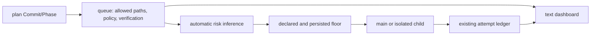

# Implementation Commit Risk And Status Follow-up

## Goal

완료된 main-first `구현커밋`의 안전 계약을 유지하면서, 문서·테스트 문구로 인한 불필요한 isolated-child 승격을 제거하고 기존 텍스트 dashboard에서 실행 상태를 바로 이해할 수 있게 한다.

## Requested Outcome

- 이미 완료된 개편은 반복하지 않는다.
- 필요한지 다시 입증된 위험도 오탐과 상태판 공백만 수정한다.
- 구현 전 두 단계의 읽기 전용 심사를 통과한 뒤 메인 에이전트가 순차 구현한다.
- 새 보조 에이전트 backend, 웹 UI, token telemetry, deploy는 만들지 않는다.

## Codebase Evidence

- `Confirmed`: docs/test fixture의 `deploy`·`authentication` 문구가 현재 `HIGH_RISK → ISOLATED_CHILD → PER_UNIT`로 승격된다.
- `Confirmed`: product-code risk text, high-risk path, declared/persisted `high_risk`는 계속 보호해야 한다.
- `Confirmed`: dashboard는 active queue를 읽지만 owner/phase/elapsed/progress/wait/verification을 출력하지 않는다.
- `Confirmed`: queue와 attempt ledger가 요청된 상태 정보의 대부분을 이미 보유한다.
- `Inferred`: path-scope absence oracle과 read-only projection만으로 두 결함을 닫을 수 있다.
- `Unverified`: 변경 후 전체 242개 이상 테스트와 실제 dashboard fixture 결과.

근거 문서: [research.md](research.md)

## System Visualization

- changed nodes: automatic inference precedence, dashboard read-only formatter.
- preserved nodes: queue schema/writers, ledger schema/writers, main/isolated adapters, supervisor, final gate.
- diagram notes: dashboard consumes state; it does not own or mutate runtime state.

## Related Files

- `codex_flow/execution_policy.py`: automatic inference owner and safety-floor composition.
- `tests/test_execution_policy.py`: false-positive/false-negative policy oracle.
- `codex_flow/dashboard.py`: active-plan status projection.
- `tests/test_crack_parity.py`: dashboard rendering regression surface.
- `tests/test_route_plan_first_source.py`: source-plan/dashboard integration surface.
- `codex_flow/attempt_ledger.py`: read-only ledger contract to reuse without schema changes.
- `codex_flow/main_unit.py`, `codex_flow/runner.py`, `codex_flow/attempt_supervisor.py`: existing fields consumed by dashboard; implementation targets only if evidence later proves a required field is absent.

## Current Behavior

Text keywords are evaluated before scope absence oracles, so quoted/example content can escalate harmless docs/tests. The dashboard reduces active state to counts and a next command, forcing operators to inspect queue, logs and attempts manually during waits.

## Change Map

- likely files to edit:
  - `codex_flow/execution_policy.py`
  - `tests/test_execution_policy.py`
  - `codex_flow/dashboard.py`
  - `tests/test_crack_parity.py`
- likely functions to touch:
  - `infer_profile_lower_bound()`
  - new narrow `is_test_scope_path()` helper
  - `render_dashboard()`
  - new read-only active-unit/ledger formatting helpers
- dependencies: queue unit fields, attempt ledger JSON, local ISO timestamps.
- side effects to preserve: explicit risk floors, backward-compatible dashboard rendering, no runtime writes.
- likely new production files: none.
- remaining narrow unknown: exact fallback wording for missing/corrupt ledger; default is explicit `not recorded`.

## Planned Changes

- Commit 1: scope-aware risk inference with safety regression matrix.
- Commit 2: existing-ledger dashboard projection with graceful fallback tests.
- Phase 3: final read-only review, focused/full verification, commit packaging and branch close; no deployment.

## Review Notes

- risk: a broad test oracle could hide product security work. Restrict it to paths rooted at `test/` or `tests/`.
- risk: naive separator stripping could turn `../tests/...` into a trusted test path. Reject absolute/traversal paths before root inspection.
- risk: docs precedence could lower persisted risk. Keep `classify_execution_policy()` safety-floor `max()` unchanged and test it.
- risk: corrupt live state could break dashboard. All ledger reads must be exception-safe and read-only.
- risk: raw `last_needs_work_reason` could contain sensitive or oversized diagnostics. Reuse bounded diagnostic redaction, collapse to one line and cap display length.
- assumption: queue `updated_at` represents current-state entry time for main-direct units.
- unanswered questions: none that block implementation.

## Plan Quality Check

- Alternative considered: natural-language quote parsing plus new persisted live-status fields.
- Why this plan: allowed paths and existing ledger are stronger deterministic evidence with a smaller blast radius.
- Tradeoff:
  - chosen: narrow scope oracles and derived status.
  - alternative: richer status schema/telemetry.
  - cost/risk: derived fallback can be less precise for legacy/missing ledgers.
  - why acceptable: it remains honest (`not recorded`) and avoids new synchronization bugs.
  - revisit when: a public machine-readable status API or aggregate token accounting becomes an independently approved requirement.
- What this plan may still miss: historical token totals cannot be reconstructed.
- When to stop and revise: any true high-risk regression, required queue/ledger schema migration, raw output exposure, or need to modify files beyond declared targets.

## Skill Routing Manifest

| Phase | Required skills | Optional skills | Evidence |
| --- | --- | --- | --- |
| Commit 1: Prevent scope-proven risk false positives | `plan-first-implementation` | 없음 | `execution_policy.py` precedence and focused policy tests |
| Commit 2: Project existing runtime state into the dashboard | `plan-first-implementation` | 없음 | queue/ledger fields and dashboard rendering tests |
| Phase 3: Final review and test packaging | `review-all-in-one`, `테스트` | 없음 | exact diff, focused tests and full suite |
| Final Gate | `review-all-in-one`, `테스트` | 없음 | blocker/important findings zero and fresh same-HEAD verification |

## Implementation Plan

### Commit 1: Prevent scope-proven risk false positives

- target files:
  - `codex_flow/execution_policy.py`
  - `tests/test_execution_policy.py`
- changes:
  - preserve exact docs-only absence oracle before free-text risk matching.
  - add a bounded test-scope oracle for paths rooted under `test/` or `tests/`; its inferred lower bound is `CONTRACT`, never `DOCS_ONLY`.
  - keep high-risk path/text inference for product scopes.
  - keep explicit declared profile, persisted effective-profile floor, explicit isolated adapter and explicit per-unit review unchanged.
- code snippets:
  - `infer_profile_lower_bound()`: `if paths and all(is_documentation_path(p) for p in paths): ...; if paths and all(is_test_scope_path(p) for p in paths): return CONTRACT, ...; then risk scan`.
  - `is_test_scope_path()`: reject absolute paths and `..` components, normalize separators and accept only first component `test` or `tests`; reject empty/outside paths.
- tradeoff:
  - chosen: deterministic path-scope precedence.
  - alternative: parse quoted/example language.
  - cost/risk: test-rooted product-like fixtures remain contract rather than high-risk.
  - why acceptable: tests cannot perform the product-side action; contract verification remains required and explicit/persisted floors still win.
  - revisit when: test execution itself gains external publish/deploy authority.
- verification:
  - `python3 -m pytest tests/test_execution_policy.py -q`: docs/test false positives are removed; product/high-risk paths and safety floors remain high-risk.
- success criteria:
  - docs-only exact paths with risk words remain docs-only when explicitly declared.
  - test-rooted paths with risk words remain contract/main/final-only.
  - product code, high-risk paths and explicit/persisted high-risk cases remain isolated/per-unit.
- stop conditions:
  - any existing broad-docs-glob guard weakens.
  - any explicit or persisted floor becomes lowerable.
  - implementation requires natural-language parsing or queue migration.

### Commit 2: Project existing runtime state into the dashboard

- target files:
  - `codex_flow/dashboard.py`
  - `tests/test_crack_parity.py`
- changes:
  - choose the first non-done queue unit as current.
  - derive owner from `execution_owner`, falling back to persisted executor adapter.
  - locate only the documented main or isolated attempt ledger paths and read them without mutation.
  - show phase/status, elapsed, last progress/update, wait reason and verification under each active plan.
  - render explicit fallbacks when no ledger exists or JSON is corrupt.
  - sanitize operator-facing wait reasons with existing diagnostic redaction, one-line normalization and a strict length cap.
  - leave the existing suggested command unchanged: current `run-all` is sequential and returns immediately at a main handoff, so changing its label is unrelated to this defect.
- code snippets:
  - `snapshot = read_active_attempt_snapshot(plan_dir, unit)` returning bounded display fields, never raw output.
  - dashboard lines: `Current owner`, `Current phase`, `Elapsed`, `Last progress`, `Waiting`, `Verification`.
- tradeoff:
  - chosen: read-only projection with legacy fallback.
  - alternative: add queue status writes at every runtime phase.
  - cost/risk: elapsed precision falls back to queue timestamp for main-direct or legacy units.
  - why acceptable: it is transparent about missing evidence and creates no competing state source.
  - revisit when: machine consumers require a versioned status API.
- verification:
  - `python3 -m pytest tests/test_crack_parity.py tests/test_route_plan_first_source.py -q`: existing dashboard behavior remains and new fields render for main, isolated and missing/corrupt state.
- success criteria:
  - active dashboard answers who, what phase, how long, last progress, why waiting and what verification is current.
  - no queue/ledger file is changed by rendering.
  - no prompt, diff, stdout/stderr, token or secret value is displayed.
- stop conditions:
  - requested fields require a new writer/schema/service.
  - rendering can mutate runtime state.
  - raw diagnostic content would be required.

### Phase 3: Final review and test packaging

- target:
  - exact branch diff and all touched code/tests/docs.
- work:
  - run `review-all-in-one` findings review against the implementation, regression matrix and scope exclusions.
  - run focused tests, full `python3 -m pytest -q`, CLI dashboard smoke and git diff/status inspection.
  - use canonical `테스트` packaging: coherent commits, normal configured-upstream push if available, merge into default branch and safe local branch deletion when all conditions pass.
  - do not deploy.
- code snippets:
  - not needed; verification and packaging phase.
- tradeoff:
  - chosen: same-branch full suite before merge.
  - alternative: focused tests only.
  - cost/risk: full suite adds runtime but protects the completed 4A–4D contracts.
  - why acceptable: this is a narrow one-time release gate, not per-unit AI review.
  - revisit when: CI supplies identical same-HEAD evidence.
- verification:
  - focused policy/dashboard tests: exact behavior matrix.
  - `python3 -m pytest -q`: repository regression suite.
  - `python3 scripts/codex_flow.py --repo <fixture-or-repo> dashboard`: operator-visible smoke output.
- success criteria:
  - blocker/important findings zero.
  - all relevant tests pass on exact committed HEAD.
  - branch is pushed/merged/closed when canonical safety conditions allow.
- stop conditions:
  - test failure, scope drift, dirty unrelated files, missing safe upstream/default evidence, or any need for deploy.

## Operator 결정 필요 사항

- 상태: 없음
- 결정 1: scope-aware inference and read-only status projection
  - 맥락: both defects are locally reproduced and the proposed change is narrow/reversible.
  - A: implement Option C now.
  - B: leave manual overrides and file inspection.
  - C: start a larger telemetry/backend project.
  - 추천안: A, because it directly fixes both causal chains without adding runtime ownership.
  - 기본값: A.
  - 보류 시 영향: false-positive child/review cost and black-box operator inspection remain.

## 검토용 결과물

- HTML: 해당 없음
- 테스트 링크:
  - Localhost: 해당 없음 — Python CLI/runtime change.
  - Deploy: 해당 없음 — deployment is out of scope.
- 상태: verified
- 실제 동작:
  - CLI policy classification and text dashboard output.
- Mock:
  - pytest fixtures only; no production mock service.

## 후행 실행

- 기본 실행: 구현커밋
- 계획 경로 처리: 구현커밋이 직전 대화, 계획 링크, active plan context에서 자동 탐지
- 모호할 때: 후보 목록을 보여주고 Operator에게 선택 요청

## HTML 생략 보고서

- 판정: 생략 가능
- 생략 사유:
  - backend/CLI policy and text dashboard change; no web interaction surface.
- 대체 검토물:
  - focused pytest output and CLI dashboard smoke output.
- 테스트 링크:
  - Localhost: 해당 없음.
  - Deploy: 해당 없음.
- 사용자가 바로 열어볼 링크:
  - [plan.md](plan.md)
  - [research.md](research.md)

## 구현 후 검토 리스트

- 회귀 확인:
  - product/high-risk paths and explicit/persisted floors remain non-lowerable.
  - broad `docs/**` remains unproven and contract-level.
  - legacy/missing/corrupt ledgers do not break dashboard.
  - no new execution adapter or runtime writer exists.
- 검증 확인:
  - focused policy tests, focused dashboard/integration tests, full suite, CLI smoke.
- 리뷰 관점:
  - false negatives, raw-data leakage, duplicate state, timestamp accuracy, backward compatibility.
- Operator 재확인:
  - no decision required unless pre-implementation gates find a blocker.

## Validation

- manual checks:
  - compare four classifier cases: docs example, test fixture, product deploy, persisted high-risk docs.
  - inspect one dashboard output with an active queue fixture.
- lint/build/test scope:
  - focused pytest modules then full pytest suite.
- scenario-to-surface checks:
  - Queue → inference → runtime selection edge.
  - Queue/ledger → dashboard read-only projection edge.

## Execution Result

- Commit 1: complete (`a0b1831`)
- Commit 2: complete (`351ccd4`)
- post-review hardening: complete (`949bb4f`)
- pre-implementation review: blocker 0; important findings incorporated
- strategy review: `적절`, High confidence
- focused verification: 75 passed
- full suite before documentation packaging: 253 passed
- CLI dashboard smoke: owner, phase/status, elapsed, last progress, waiting reason, verification and evidence source rendered from existing active plans
- deployment: not authorized; not attempted
