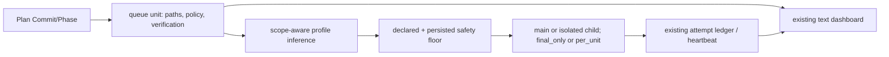

# Research — Implementation Commit Risk And Status Follow-up

## Goal

완료된 main-first `구현커밋` 구조를 다시 열지 않고, 남은 두 제안인 위험도 오탐 방지와 기존 상태판의 최소 보강이 실제 결함을 직접 해결하는지 확인한다.

조사 기준은 `/Users/moonsoo/projects/codex-flow`의 `main` HEAD `2f86ce28`이며, source prompt는 `docs/request-refiner-artifacts/2026-07-21-implementation-commit-risk-status-followup-refined-request.md`다.

## Scope And Entry Points

- policy entry: `plans.queue_from_source_tickets()` → `execution_policy.classify_execution_policy()` → `infer_profile_lower_bound()`
- runtime effect: effective `HIGH_RISK` → `ISOLATED_CHILD` + `FULL` unit gate + `PER_UNIT` review
- status entry: `dashboard.render_dashboard()` → active queue → plan readiness and recent log
- existing runtime evidence: queue unit fields, main-unit ledger, isolated attempt ledger, supervisor heartbeat/event fields
- excluded: new executor backend, new web UI, token telemetry, canonical skill edits, deployment

## Relevant Files

- `codex_flow/execution_policy.py`: profile ordering, text/path risk regex, docs-only oracle, persisted safety floor.
- `tests/test_execution_policy.py`: existing safety matrix; currently asserts that docs paths titled “Deploy service” or “External publish” are high-risk.
- `codex_flow/plans.py`: source-plan extraction, queue unit policy persistence, queue timestamps and verification list.
- `codex_flow/dashboard.py`: current text dashboard; shows plan counts, progress, next unit, source drift, suggested command and recent log only.
- `codex_flow/main_unit.py`: records `execution_owner`, main ledger path/revision, status and recovery class.
- `codex_flow/attempt_ledger.py`: atomic ledger snapshot plus bounded event fields.
- `codex_flow/attempt_supervisor.py`: existing `phase`, `status`, `last_event`, `heartbeat_elapsed_ms`, `child_output_age_ms`, final `elapsed_ms`.
- `codex_flow/runner.py`: deterministic isolated attempt directory and queue fields such as `repair_attempts`, `last_needs_work_reason`, `diagnostic_path`.
- `tests/test_crack_parity.py`, `tests/test_route_plan_first_source.py`: current dashboard regression surfaces.
- `docs/plans/implementation-commit-adaptive-execution/research.md`: prior root-cause and architecture evidence reused as completed baseline.
- `docs/plans/implementation-commit-adaptive-execution/plan.md`: completed main-first/final-only/atomic final-gate decisions reused without re-planning.

## Current Behavior

### Confirmed classifier false positives

`infer_profile_lower_bound()` concatenates title, content and allowed paths, then applies `_HIGH_RISK_TEXT` before the documentation oracle. A local probe produced:

| Unit | Scope | Effective result |
| --- | --- | --- |
| “Document deployment procedure” / “deploy service” | `docs/runbook.md`, declared `docs_only` | `high_risk`, `isolated_child`, `per_unit` |
| “Add fixture” / “authentication failed” | `tests/fixtures/auth_case.json`, declared `contract` | `high_risk`, `isolated_child`, `per_unit` |
| “Deploy service” / product release change | `src/release.py`, declared `contract` | `high_risk`, `isolated_child`, `per_unit` |

The first two are false positives because the matched words describe documentation or test data, not a product-side auth/deploy action. The third is a true positive and must remain high-risk.

An explicit persisted `effective_profile: high_risk` still raises a docs unit through the outer `max()` safety floor. Therefore automatic inference can become scope-aware without weakening explicit or persisted risk.

### Confirmed dashboard gap

`render_dashboard()` knows every active queue unit but currently prints only counts, progress, next unit, source drift, a `run-all` suggestion and three log lines. It does not print:

- current execution owner
- current runtime phase/status
- elapsed time
- last progress signal
- wait/hold reason
- current verification contract

The data already exists:

- owner: `unit.execution_owner` or persisted `execution_policy.executor_adapter`
- phase/status: active unit status plus `AttemptLedger.record.phase/status`
- elapsed/progress: ledger `heartbeat_elapsed_ms`, `elapsed_ms`, `last_event`, `child_output_age_ms`; main-direct fallback from queue `updated_at`
- wait reason: `last_needs_work_reason`, `failure_class`, or ledger status/reason
- verification: `unit.verification`

No new daemon, subprocess protocol or prompt/token capture is required.

## Data Flow And Control Flow

Changed nodes: `Infer`, `Dashboard` projection and focused tests. Preserved nodes: queue schema, ledger schema, runtime adapters, supervisor, final gate and canonical skill.

## Existing Abstractions And Boundaries

- `classify_execution_policy()` owns explicit declarations and non-lowerable persisted safety floors. The patch must not move this responsibility into callers.
- `infer_profile_lower_bound()` owns automatic inference only. False-positive handling belongs here.
- docs safety uses `is_documentation_path()` and intentionally rejects broad globs such as `docs/**`; that contract must remain unchanged.
- attempt ledgers are the source of truth for live child/main transactions. Dashboard code may read them but must not write or create replacement state.
- dashboard is a read-only formatter. It must degrade to `unknown`/queue timestamps on missing or corrupt ledger data rather than changing runtime behavior.

## Side Effects And Integration Points

- A lower inferred profile changes execution adapter and review policy, so a false negative could remove isolation. Explicit high-risk paths, product-code risk text, declared `high_risk`, persisted `high_risk`, explicit isolated adapter and explicit per-unit review must remain protected.
- Dashboard formatting affects CLI output and the refreshed `.codex-flow/dashboard.md`; it must not mutate queue or ledger state.
- Existing active plans can lack newer fields, so rendering needs backward-compatible fallbacks.

## Risk To Surrounding Systems

- Over-broad “test” detection could treat product fixtures or security code as harmless. Limit the absence oracle to paths rooted under `test/` or `tests/`; do not classify arbitrary `fixtures/` directories as test-only.
- Reordering docs before all risk checks could hide an explicitly persisted high-risk decision. Keep the outer safety-floor `max()` unchanged and test it.
- Parsing attempt data can make dashboard rendering brittle. Treat missing/corrupt ledgers as unavailable evidence and continue rendering.
- Showing raw reasons may leak subprocess output. Only show queue-owned bounded reason text already intended for operator state; do not display prompt, diff, raw stdout/stderr or secrets.

## Do Not Duplicate Or Bypass

- Do not add a third subprocess or subagent execution mode.
- Do not duplicate supervisor events into a new telemetry store.
- Do not write live status back into queue from dashboard reads.
- Do not parse raw child stdout to infer progress; use ledger fields.
- Do not weaken declared/persisted safety floors or explicit adapter/review choices.
- Do not change broad `docs/**` rejection in `is_documentation_path()`.

## Open Questions

- None that changes the scoped plan. Exact presentation wording and fallback labels are reversible implementation details.
- Actual token reduction remains a later canary observation. This patch can prove fewer false-positive child/review selections but cannot reconstruct model token usage that was never recorded.

## Solution Options

### Option A — Keep policy and dashboard unchanged; document operator overrides

- operating principle: operators manually lower false positives and inspect queue/diagnostic files.
- supporting evidence: all required data is technically accessible.
- fit conditions: temporary workaround only.
- failure modes: causal defects remain; users still experience unnecessary isolation and black-box waits.
- implementation implication: no code change, but recurring human cost.
- adoption: Reject.

### Option B — Add quote parsing and persist new live-status fields throughout runtime

- operating principle: parse natural-language context and update queue on every runtime transition.
- supporting evidence: could distinguish quoted risk words and make dashboard reads simple.
- fit conditions: only if path scope is unavailable and a durable public status API is required.
- failure modes: fragile language parsing, duplicated state, more writes and larger regression surface.
- implementation implication: changes policy parser, queue schema and multiple runner paths.
- adoption: Reject for this follow-up.

### Option C — Scope-aware absence oracles plus read-only status projection

- operating principle: when all allowed paths are proven docs-only or rooted in tests, treat risk words as content rather than product action; preserve explicit/persisted floors. Read existing queue/ledger state in the dashboard.
- supporting evidence: both false-positive cases are separated from the true product-code case by allowed-path scope; all requested status data already exists.
- fit conditions: exact or safely rooted allowed paths are present, as required by Codex Flow execution.
- failure modes: missing paths stay contract/high-risk by text; corrupt ledger yields reduced status detail.
- implementation implication: two small helpers, focused tests, no schema migration.
- adoption: Adopt.

### Option D — New orchestration backend and full token/status service

- operating principle: move worker choice and telemetry into a new Codex Flow subsystem.
- supporting evidence: could provide richer analytics.
- fit conditions: a separately approved product-scale observability project.
- failure modes: recreates the black box and coordination overhead this rewrite removed.
- implementation implication: new processes, storage, UI and security contracts.
- adoption: Reject.

## Plan Implications

1. Add regression tests that first demonstrate docs/test false positives while preserving true positives and safety floors.
2. Implement a narrow test-scope oracle inside automatic inference; keep docs helper and profile `max()` unchanged.
3. Add dashboard tests for main-direct, isolated-ledger and missing/corrupt-ledger fallbacks.
4. Implement one read-only active-unit status projection in `dashboard.py`; do not alter runtime writers or schemas.
5. Run focused tests, full suite, final diff review and test packaging. No deploy.

## Source Evaluation

- strongest source: current production code and executable local probes at HEAD `2f86ce28`.
- supporting source: existing regression tests and completed adaptive-execution plan/research.
- external evidence: not used.
- evidence breadth: `threshold intentionally narrowed`. The issue is a repository-local precedence and formatting defect whose mechanism is fully defined by current code; 10-platform/20-item external research would not change the safe patch.
- adoption confidence: High for Option C, subject to focused regression tests and full-suite verification.

## Evidence

- `python3` probe invoking `classify_execution_policy()` for docs, tests, product code and persisted-floor cases on 2026-07-21.
- `sed`/`rg` inspection of the files listed under `Relevant Files` on 2026-07-21.
- current HEAD/status before research: `main...origin/main`, clean, `2f86ce28`.
- prior evidence: `docs/plans/implementation-commit-adaptive-execution/research.md` and `plan.md`.
